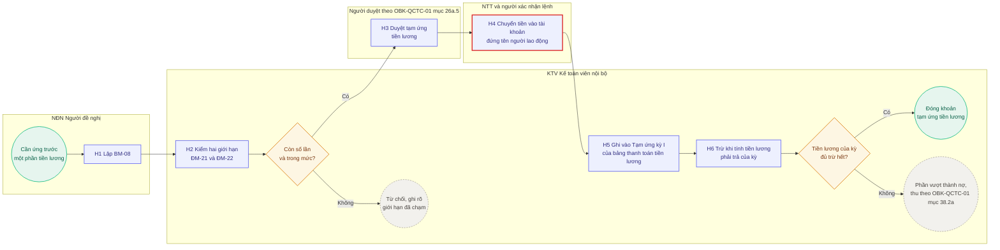

# OBK-SOP-NB-04. Công và tiền lương nội bộ

## Thông tin phiên bản

| Hạng mục | Nội dung |
| --- | --- |
| Mã tài liệu | OBK-SOP-NB-04 |
| Tên tài liệu | Quy trình công và tiền lương nội bộ |
| Cấp tài liệu | Cấp 3, hướng dẫn nghiệp vụ. Thi hành Chương 5 của [[OBK-QCTC-01_Quy_che_tai_chinh_noi_bo\|OBK-QCTC-01]] Quy chế tài chính nội bộ và [[07_Chinh_sach_cong_chuan_va_cham_cong\|OBK-QCNS-07]] Chính sách công chuẩn và chấm công |
| Phiên bản | R.2.0.1, đang áp dụng |
| Ngày biên soạn | 30/09/2026 |
| Mốc pháp luật áp dụng | Pháp luật có hiệu lực tại ngày 23/09/2026 |
| Người biên soạn | CEO (Lê Trọng Tuấn) |
| Người soát | CEO (Lê Trọng Tuấn) |
| Người phê duyệt | CEO (Lê Trọng Tuấn) |
| Văn bản cấp trên | [[06_OBK-SOP-NB-00_Chuan_van_hanh_noi_bo\|OBK-SOP-NB-00]] Chuẩn vận hành nội bộ |
| Bộ tài liệu | OBK-SOP-NB, Sổ tay quy trình nội bộ oBacker |
| Tài liệu song hành | [[OBK-SOP-NB-01_Mua_sam_va_thanh_toan_noi_bo\|OBK-SOP-NB-01]] mua sắm và thanh toán; [[OBK-SOP-NB-02_Thu_tien_va_cong_no_phai_thu\|OBK-SOP-NB-02]] thu tiền và công nợ phải thu; [[OBK-SOP-NB-03_Quan_ly_tien\|OBK-SOP-NB-03]] quản lý tiền |
| Lần rà soát tiếp theo | Không quá 12 tháng kể từ ngày ban hành; rà soát đột xuất khi [[07_Chinh_sach_cong_chuan_va_cham_cong\|OBK-QCNS-07]] thay đổi, hoặc khi có văn bản mới về tiền lương hoặc bảo hiểm xã hội |
| Phạm vi phát hành | Nội bộ oBacker. Không phát hành cho khách hàng. |

---

## CẢNH BÁO MỞ ĐẦU

> [!note] VĂN BẢN NÀY KHÔNG PHỦ HỒ SƠ CỦA KHÁCH HÀNG
> Việc oBacker tính lương và làm bảo hiểm xã hội CHO khách thuộc mảng dịch vụ, tại [[05_OBK-SOP-LD_Lao_dong_va_tien_luong|OBK-SOP-LD]]. Văn bản này chỉ nói về công, tiền lương và nghĩa vụ người sử dụng lao động CỦA CHÍNH oBacker.

> [!warning] KHÔNG ĐƯỢC TỰ QUYẾT
> KHÔNG TRỪ KHOẢN TRẢ THỪA VÀO TIỀN LƯƠNG KỲ SAU
> Bảng công chốt theo hướng không trả thừa. Phần chênh chỉ được trả bù thêm ở kỳ sau. Khoản trả thừa, nếu vẫn phát sinh, là một khoản nợ và xử lý theo OBK-QCTC-01 mục 26a.7 và mục 38.2a. Xem mục 5.5.

> [!note] CON SỐ NẰM Ở OBK-QCNS-07
> Chu kỳ tính công, mẫu số tính tiền lương ngày, hệ số hưởng lương, kỳ nối và mọi công thức nằm tại [[07_Chinh_sach_cong_chuan_va_cham_cong|OBK-QCNS-07]]. Văn bản này đặt danh mục Job, trình tự bước, vai trò, lịch và điểm kiểm soát. Khi hai văn bản khác nhau về một con số thì lấy [[07_Chinh_sach_cong_chuan_va_cham_cong|OBK-QCNS-07]]; khi khác nhau về vai trò hoặc trình tự bước thì lấy văn bản này.

---

## 1. Mục đích

Đặt một trình tự duy nhất cho việc tổng hợp, xác nhận, chốt và duyệt bảng công; tính, duyệt và chi tiền lương; tạm ứng tiền lương; và các nghĩa vụ của oBacker với tư cách người sử dụng lao động. Ba kết quả phải đạt cùng lúc: tiền lương của kỳ chi xong trong ngày làm việc cuối cùng của tháng; oBacker không trả thừa tiền lương cho người lao động; và mỗi nghĩa vụ pháp luật của oBacker với tư cách người sử dụng lao động có một Job đăng ký tại OBK-SOP-NB-00 mục 5.

Chu trình LƯƠNG là chu trình thứ tư của mảng nội bộ có SOP, theo [[06_OBK-SOP-NB-00_Chuan_van_hanh_noi_bo|OBK-SOP-NB-00]] mục 4. Chu trình này cùng loại với chu trình CHI tại [[OBK-SOP-NB-01_Mua_sam_va_thanh_toan_noi_bo|OBK-SOP-NB-01]], chu trình THU tại [[OBK-SOP-NB-02_Thu_tien_va_cong_no_phai_thu|OBK-SOP-NB-02]] và chu trình TIỀN tại [[OBK-SOP-NB-03_Quan_ly_tien|OBK-SOP-NB-03]].

### 1.1. BẢNG MỐC THỜI GIAN TỔNG HỢP

| Bước | Thời hạn | Người chịu trách nhiệm nếu chậm |
| --- | --- | --- |
| Chi thưởng doanh thu tháng trước và thưởng không định kỳ | Ngày 15 | KTV |
| Gửi bảng công tạm | Ngày 16 | HR |
| Xác nhận bảng công tạm hoặc phản hồi lệch | Từ ngày 16 đến ngày 19 | Từng người lao động |
| Cộng công từ ngày 16 đến ngày 20, chốt bảng công, rà soát giờ làm thêm | Ngày 20 | HR |
| Chốt phần nhân viên bộ phận mình | Ngày 21 | TL |
| Chốt phần các TL | Ngày 21 | BOM |
| Duyệt toàn bảng công, BM-09 | Ngày 22 | CEO |
| Tính lương, duyệt bảng lương, lập lệnh và xác nhận lệnh | Từ ngày 23 | KTV, TGĐ, NTT |
| Chi lương xong | Ngày làm việc cuối cùng của tháng | NTT |
| Báo giảm lao động khi chấm dứt hợp đồng lao động | Trong tháng chấm dứt hợp đồng | HR |
| Báo cáo tình hình sử dụng lao động 06 tháng đầu năm | Theo thời hạn pháp luật tại mục 5.7 | HR |
| Báo cáo tình hình sử dụng lao động cả năm | Theo thời hạn pháp luật tại mục 5.7 | HR |
| Tổng hợp và nộp tiền bảo hiểm xã hội | Theo thời hạn pháp luật tại mục 5.7 | HR |

## 2. Phạm vi áp dụng

Áp dụng cho toàn bộ người lao động của oBacker, kể cả người giữ vai trò `TL` và thành viên `BOM`.

**Trong phạm vi:** tổng hợp, xác nhận, chốt và duyệt bảng công của từng kỳ; xét đơn nghỉ phép, đơn cập nhật công, đơn làm việc từ xa; tính lương và lập Bảng thanh toán tiền lương; duyệt bảng lương, lập lệnh, xác nhận lệnh và chi lương; bù phần chênh của kỳ trước; tạm ứng tiền lương; mười nghĩa vụ của oBacker với tư cách người sử dụng lao động tại mục 5.7.

**Ngoài phạm vi:** công việc lao động, tiền lương và bảo hiểm xã hội làm cho khách, thuộc [[01_OBK-SOP-00_Chuan_van_hanh_dich_vu|OBK-SOP-00]] và [[05_OBK-SOP-LD_Lao_dong_va_tien_luong|OBK-SOP-LD]]; quy tắc công, con số, hệ số, chu kỳ và công thức, thuộc [[07_Chinh_sach_cong_chuan_va_cham_cong|OBK-QCNS-07]]; điều kiện thuế của các khoản chi cho người lao động, thuộc [[OBK-QCTC-01_Quy_che_tai_chinh_noi_bo|OBK-QCTC-01]] Chương 5; biểu mẫu chứng từ, thuộc [[OBK-QCTC-03_Quy_che_hach_toan_ke_toan|OBK-QCTC-03]]; việc chi tiền khác, thuộc [[OBK-SOP-NB-01_Mua_sam_va_thanh_toan_noi_bo|OBK-SOP-NB-01]]; quỹ và tài khoản ngân hàng, thuộc [[OBK-SOP-NB-03_Quan_ly_tien|OBK-SOP-NB-03]].

**Quan hệ với mảng dịch vụ.** Tiền lương của người lao động oBacker là nghĩa vụ của oBacker, nên thuộc mảng nội bộ theo quy tắc phân mảng tại OBK-SOP-NB-00 mục 2.2. Mười nghĩa vụ tại mục 5.7 lấy nội dung nghiệp vụ từ bảng Job của OBK-SOP-LD, vì nghĩa vụ đó giống nhau bất kể người sử dụng lao động là ai. Người làm ở mảng nội bộ là vai trò của mảng nội bộ, không phải `TL-LD` hay `CV-LD` của mảng dịch vụ.

> [!note] RANH GIỚI VỚI MẢNG DỊCH VỤ
> Mảng dịch vụ đặt ranh giới là bộ phận Lao động tính và chốt bảng lương, bộ phận Kế toán hạch toán và làm thuế thu nhập cá nhân từ bảng lương đã chốt, theo [[05_OBK-SOP-LD_Lao_dong_va_tien_luong|OBK-SOP-LD]] mục 1.3. Ranh giới đó tạo một lớp đối chiếu độc lập giữa người tính và người ghi sổ.
>
> Ở mảng nội bộ, quy mô không cho phép tách hai người theo cách đó. Lớp đối chiếu chuyển thành tách người lập với người duyệt, tại điểm kiểm soát `KS-NB-L1` mục 6.

## 3. Vai trò và trách nhiệm

### 3.1. Vai trò

Ký hiệu vai trò của mảng nội bộ lấy từ [[06_OBK-SOP-NB-00_Chuan_van_hanh_noi_bo|OBK-SOP-NB-00]] mục 3.1. Ký hiệu `CEO` và `BOM` thuộc miền điều hành, lấy từ [[PL_Tu_dien_vai|OBK-QCTC-02-PL-A]] mục 3. Văn bản này không đặt vai trò mới.

| Ký hiệu | Vai trò | Nguồn ký hiệu | Việc trong chu trình này |
| --- | --- | --- | --- |
| `HR` | Nhân sự nội bộ | [[06_OBK-SOP-NB-00_Chuan_van_hanh_noi_bo\|OBK-SOP-NB-00]] mục 3.1 | Tổng hợp và gửi bảng công tạm; cộng công từ ngày 16 đến ngày 20 và chốt bảng công; lập bảng chấm công `BM-09`; lập và nộp hồ sơ bảo hiểm xã hội của chính oBacker; lập và cập nhật sổ quản lý lao động; lập báo cáo tình hình sử dụng lao động; rà soát giờ làm thêm và mức lương tối thiểu vùng |
| `TL` | Team Lead, chủ dòng ngân sách | [[06_OBK-SOP-NB-00_Chuan_van_hanh_noi_bo\|OBK-SOP-NB-00]] mục 3.1 | Chốt phần bảng công của nhân viên bộ phận mình |
| `BOM` | Ban điều hành, gồm đúng ba thành viên `CEO`, `COO`, `CMO` | [[PL_Tu_dien_vai\|OBK-QCTC-02-PL-A]] mục 3 | Chốt phần bảng công của các `TL` |
| `CEO` | Tổng giám đốc, dùng trong nội bộ | [[PL_Tu_dien_vai\|OBK-QCTC-02-PL-A]] mục 3 | Duyệt toàn bảng công; người duyệt trên `BM-09` |
| `TGĐ` | Tổng giám đốc, dùng trên văn bản pháp lý | [[06_OBK-SOP-NB-00_Chuan_van_hanh_noi_bo\|OBK-SOP-NB-00]] mục 3.1 | Duyệt bảng lương; duyệt tạm ứng tiền lương theo [[OBK-QCTC-01_Quy_che_tai_chinh_noi_bo\|OBK-QCTC-01]] mục 26a.5; xác nhận lệnh theo [[OBK-QCTC-01_Quy_che_tai_chinh_noi_bo\|OBK-QCTC-01]] mục 35.1a |
| `KTV` | Kế toán viên nội bộ | [[06_OBK-SOP-NB-00_Chuan_van_hanh_noi_bo\|OBK-SOP-NB-00]] mục 3.1 | Tính lương và lập Bảng thanh toán tiền lương; tính phần bù của kỳ trước; kiểm, ghi và trừ khoản tạm ứng tiền lương |
| `KTT` | Kế toán trưởng nội bộ | [[06_OBK-SOP-NB-00_Chuan_van_hanh_noi_bo\|OBK-SOP-NB-00]] mục 3.1 | Ký Bảng thanh toán tiền lương mẫu 01-LĐTL với chức danh Kế toán trưởng theo mục 5.4.2. Soát bước H6 của Luồng H tại mục 5.6.2 |
| `NTT` | Người thực hiện thanh toán | [[06_OBK-SOP-NB-00_Chuan_van_hanh_noi_bo\|OBK-SOP-NB-00]] mục 3.1 | Lập lệnh chuyển tiền lương; tạo lệnh chuyển tiền tạm ứng tiền lương |
| `NĐN` | Người đề nghị | [[06_OBK-SOP-NB-00_Chuan_van_hanh_noi_bo\|OBK-SOP-NB-00]] mục 3.1 | Lập đề nghị tạm ứng tiền lương `BM-08` |
| `HĐQT` | Hội đồng quản trị | [[PL_Tu_dien_vai\|OBK-QCTC-02-PL-A]] mục 2 | Duyệt tạm ứng tiền lương khi người đề nghị là `TGĐ` hoặc người quản lý khác do `HĐQT` bổ nhiệm |
| `Chủ tịch HĐQT` | Chủ tịch Hội đồng quản trị | [[PL_Tu_dien_vai\|OBK-QCTC-02-PL-A]] mục 2, ký hiệu `CTHĐQT` | Xác nhận lệnh theo [[OBK-QCTC-01_Quy_che_tai_chinh_noi_bo\|OBK-QCTC-01]] mục 35.1a |
| Người lao động | Từng người có tên trong bảng công | Không có ký hiệu | Xác nhận bảng công tạm hoặc phản hồi lệch |

> [!note] NGUYÊN TẮC QUY ƯỚC KÝ HIỆU VAI TRÒ
> **`CEO` và `TGĐ` là cùng một người** theo [[PL_Tu_dien_vai|OBK-QCTC-02-PL-A]] mục 3. Văn bản này dùng `CEO` ở việc duyệt bảng công, theo [[OBK-QCTC-03_Quy_che_hach_toan_ke_toan|OBK-QCTC-03]] mục 6.6b; dùng `TGĐ` ở việc duyệt bảng lương, duyệt tạm ứng tiền lương và xác nhận lệnh, theo [[OBK-QCTC-01_Quy_che_tai_chinh_noi_bo|OBK-QCTC-01]].
>
> **Ký hiệu vai trò `HR` khác nhãn đơn vị Nhân sự.** Quy tắc phân định tại [[PL_Tu_dien_vai|OBK-QCTC-02-PL-A]] mục 6. Người kiêm nhiệm Office Admin và HR Generalist làm các việc về bảo hiểm xã hội của chính oBacker với tư cách HR Generalist, theo [[OBK-QCTC-02_Quy_che_to_chuc_va_phan_quyen|OBK-QCTC-02]].
>
> **`KTV` và `KTT` mang nghĩa nội bộ** theo [[06_OBK-SOP-NB-00_Chuan_van_hanh_noi_bo|OBK-SOP-NB-00]] mục 3.2; `TL` theo mục 3.1 của văn bản đó. Khi trích chéo sang mảng dịch vụ thì ghi rõ nguồn của ký hiệu.

Khi người có thẩm quyền duyệt bảng công, duyệt bảng lương hoặc xét đơn vắng mặt, thẩm quyền chuyển theo quy tắc ủy quyền tại [[06_OBK-SOP-NB-00_Chuan_van_hanh_noi_bo|OBK-SOP-NB-00]] mục 8.1.

### 3.2. Phân công theo Job

| Job | Tên Job | Người làm | Người chốt hoặc duyệt đầu ra |
| --- | --- | --- | --- |
| NB-32 | Tạm ứng tiền lương | `NĐN` lập `BM-08` ở bước H1; `KTV` kiểm ở bước H2, ghi ở bước H5, trừ ở bước H6; `NTT` tạo lệnh ở bước H4 | `TGĐ` hoặc `HĐQT` duyệt ở bước H3; `TGĐ` hoặc `Chủ tịch HĐQT` xác nhận lệnh ở bước H4; `KTT` soát ở bước H6 |
| NB-33 | Tổng hợp bảng công tạm và gửi xác nhận | `HR` tổng hợp và gửi | Từng người lao động xác nhận hoặc phản hồi lệch |
| NB-34 | Chốt bảng công của kỳ | `HR` cộng công từ ngày 16 đến ngày 20 và chốt bảng công | `TL` chốt phần nhân viên của bộ phận mình; `BOM` chốt phần các `TL` |
| NB-35 | Duyệt toàn bảng công | `CEO` | `CEO` |
| NB-36 | Tính lương, lập Bảng thanh toán tiền lương, và tính phần bù của kỳ trước | `KTV` | `TGĐ` duyệt bảng lương tại Job NB-37 |
| NB-37 | Duyệt bảng lương, lập lệnh, xác nhận lệnh và chi lương | `NTT` lập lệnh | `TGĐ` duyệt bảng lương; `TGĐ` hoặc `Chủ tịch HĐQT` xác nhận lệnh theo [[OBK-QCTC-01_Quy_che_tai_chinh_noi_bo\|OBK-QCTC-01]] mục 35.1a |
| NB-38 | Xét đơn nghỉ phép, đơn cập nhật công, đơn làm việc từ xa, đăng ký làm thêm giờ | Người lao động lập đơn hoặc đăng ký | Đơn nghỉ phép: quản lý trực tiếp, theo [[Noi_quy_lao_dong\|OBK-NQLD]] Điều 7.5.2; đơn làm việc từ xa: Tổng giám đốc hoặc người được ủy quyền, theo [[Noi_quy_lao_dong\|OBK-NQLD]] Điều 11.2; đơn cập nhật công: quản lý trực tiếp; đăng ký làm thêm giờ: quản lý trực tiếp khi lũy kế tháng dưới 10 giờ; từ 10 giờ trở lên: `COO` hoặc `CEO` theo nhánh quản lý của bộ phận |
| NB-39 | Đăng ký mã bảo hiểm xã hội lần đầu cho người lao động của oBacker | `HR` | Không có bước duyệt riêng |
| NB-40 | Báo tăng lao động | `HR` | Không có bước duyệt riêng |
| NB-41 | Báo giảm lao động | `HR` | Không có bước duyệt riêng |
| NB-42 | Tổng hợp và nộp tiền bảo hiểm xã hội | `HR` lập hồ sơ; khoản nộp tiền thực hiện theo chu trình CHI, nhóm N6 tại [[OBK-SOP-NB-01_Mua_sam_va_thanh_toan_noi_bo\|OBK-SOP-NB-01]] mục 5.1 | Khoản nộp tiền được duyệt theo [[OBK-SOP-NB-01_Mua_sam_va_thanh_toan_noi_bo\|OBK-SOP-NB-01]] mục 5.5 |
| NB-43 | Chốt sổ bảo hiểm xã hội khi người lao động nghỉ việc | `HR` | Không có bước duyệt riêng |
| NB-44 | Lập và cập nhật sổ quản lý lao động | `HR` | Không có bước duyệt riêng |
| NB-45 | Báo cáo tình hình sử dụng lao động 06 tháng đầu năm | `HR` | Không có bước duyệt riêng |
| NB-46 | Báo cáo tình hình sử dụng lao động cả năm | `HR` | Không có bước duyệt riêng |
| NB-47 | Rà soát giới hạn giờ làm thêm | `HR` | Không có bước duyệt riêng |
| NB-48 | Rà soát mức lương tối thiểu vùng | `HR` | Không có bước duyệt riêng |

## 4. Đầu vào bắt buộc

Một Job không bắt đầu khi thiếu đầu vào của Job đó.

| # | Đầu vào | Job dùng đầu vào | Nguồn quy tắc |
| --- | --- | --- | --- |
| 1 | Dữ liệu ghi nhận thời điểm vào ca và ra ca của từng người lao động, lưu trên hệ thống, từ ngày 21 tháng trước đến ngày 15 | NB-33 | [[07_Chinh_sach_cong_chuan_va_cham_cong\|OBK-QCNS-07]] mục 2 |
| 2 | Đơn đã được chấp thuận trong kỳ, ghi nhận trên hệ thống | NB-33 | [[07_Chinh_sach_cong_chuan_va_cham_cong\|OBK-QCNS-07]] mục 7 |
| 3 | Bản ghi thời điểm gửi bảng công tạm và thời hạn xác nhận, lưu trên hệ thống | NB-34 | Điểm kiểm soát `KS-NB-L4` tại mục 7 |
| 4 | Xác nhận hoặc phản hồi lệch của người lao động, nếu có | NB-34 | Mục 5.2 |
| 5 | Dữ liệu hệ thống từ ngày 16 đến ngày 20 | NB-34 | Mục 5.1 |
| 6 | Bảng công của kỳ đã chốt đủ phần nhân viên và phần các `TL` | NB-35 | Mục 5.2 |
| 7 | Bảng chấm công `BM-09` của kỳ đã qua bước duyệt của `CEO` | NB-36 | Điểm kiểm soát `KS-NB-L3` tại mục 7 |
| 8 | Khoản tạm ứng tiền lương của kỳ đã ghi theo Job NB-32 | NB-36 | Mục 5.6.2 bước H5 |
| 9 | Phần chênh của kỳ trước, nếu có | NB-36 | Mục 5.5 |
| 10 | Khoản thưởng đã chi ngày 15 của tháng | NB-36 | [[01_Khung_nhan_su_tong_hop\|OBK-QCNS-01]] mục III.3; [[06_Chinh_sach_thuong_khong_dinh_ky\|OBK-QCNS-06]] mục 3.2 |
| 11 | Bảng thanh toán tiền lương đã lập | NB-37 | Mục 5.4 |
| 12 | Đề nghị `BM-08`, và số lần đã tạm ứng tiền lương của người đề nghị trong quý và trong nửa năm | NB-32 | [[OBK-QCTC-01_Quy_che_tai_chinh_noi_bo\|OBK-QCTC-01]] mục 26a.10 |
| 13 | Đầu vào của Job NB-39 tới NB-48 | NB-39 tới NB-48 | Hàng Job tương ứng tại [[06_OBK-SOP-NB-00_Chuan_van_hanh_noi_bo\|OBK-SOP-NB-00]] mục 5 |

## 5. Các bước thực hiện

### 5.1. LỊCH KỲ CHUẨN

Chu kỳ tính công và ngày trả lương theo [[07_Chinh_sach_cong_chuan_va_cham_cong|OBK-QCNS-07]] mục 1.2. Ngày trả lương là ngày làm việc cuối cùng của tháng.

| Ngày | Việc | Người | Job |
| --- | --- | --- | --- |
| Ngày 15 | Chi thưởng doanh thu tháng trước và thưởng không định kỳ đã phê duyệt trong tháng trước, theo [[01_Khung_nhan_su_tong_hop\|OBK-QCNS-01]] mục III.3 và [[06_Chinh_sach_thuong_khong_dinh_ky\|OBK-QCNS-06]] mục 3.2. Ngày chi thưởng tách khỏi ngày trả lương | `KTV` | không có |
| Ngày 16 | Gửi bảng công tạm, dữ liệu từ ngày 21 tháng trước đến ngày 15, cho từng người lao động xác nhận | `HR` | NB-33 |
| Từ ngày 16 đến ngày 19 | Xác nhận bảng công tạm hoặc phản hồi lệch | Từng người lao động | NB-33 |
| Ngày 20 | Cộng công từ ngày 16 đến ngày 20 theo dữ liệu hệ thống; chốt bảng công; rà soát giới hạn giờ làm thêm của kỳ | `HR` | NB-34, NB-47 |
| Ngày 21 | Chốt phần nhân viên và chốt phần các `TL`, hai việc chạy song song | `TL`, `BOM` | NB-34 |
| Ngày 22 | Duyệt toàn bảng công | `CEO` | NB-35 |
| Từ ngày 23 đến ngày làm việc cuối cùng của tháng | Tính lương và lập Bảng thanh toán tiền lương; duyệt bảng lương; lập lệnh và xác nhận lệnh; chi lương | `KTV`, `TGĐ`, `NTT` | NB-36, NB-37 |

**Cơ chế mặc định.** Hết ngày 19 mà người lao động không phản hồi thì bảng công tạm được xác định là đã xác nhận. Cơ chế đó chỉ có cơ sở khi hệ thống lưu được thời điểm gửi bảng công tạm và thời hạn xác nhận, theo điểm kiểm soát `KS-NB-L4` tại mục 6.

**Mốc rơi vào ngày nghỉ.** Khi một mốc của lịch trên rơi vào ngày nghỉ hằng tuần hoặc ngày nghỉ lễ, tết thì việc của mốc đó làm xong vào ngày làm việc liền trước. Ngày trả lương giữ nguyên là ngày làm việc cuối cùng của tháng.

**Năm ngày cuối kỳ.** Năm ngày cuối kỳ, từ ngày 16 đến ngày 20, không đi qua bước xác nhận riêng. Lệch ở năm ngày đó xử lý theo mục 5.5.

**Kỳ đầu áp dụng.** Lịch tại mục này áp dụng từ kỳ lương tháng 10 năm 2026. Kỳ lương tháng 10 năm 2026 là kỳ nối theo OBK-QCNS-07 mục 1.2a; với kỳ nối, dữ liệu của bảng công tạm bắt đầu từ mốc đầu của kỳ nối ghi tại mục đó.

### 5.2. TỔNG HỢP, XÁC NHẬN VÀ CHỐT BẢNG CÔNG

Mục này thực hiện Job NB-33, NB-34 và NB-35.

#### 5.2.1. Phân định các hành vi ghi nhận công

| Hành vi | Đối tượng | Tần suất | Người | Mục |
| --- | --- | --- | --- | --- |
| Xét | Đơn nghỉ phép, đơn cập nhật công, đơn làm việc từ xa | Nhiều lần trong kỳ | Theo mục 5.3 | 5.3, Job NB-38 |
| Chốt | Bảng công của kỳ | Một lần trong kỳ, ngày 20 và ngày 21 | `HR`, `TL`, `BOM` | 5.2.2, Job NB-34 |
| Duyệt | Toàn bảng công của kỳ; Bảng thanh toán tiền lương | Một lần trong kỳ cho mỗi đối tượng | `CEO` duyệt toàn bảng công; `TGĐ` duyệt bảng lương | 5.2.2 bước L6, Job NB-35; 5.4, Job NB-37 |

Trong mục 5.2 tới mục 5.4, ba từ "xét", "chốt" và "duyệt" chỉ đúng ba hành vi ở bảng trên.

#### 5.2.2. Trình tự các bước chốt bảng công

| Bước | Việc | Người làm | Đầu ra | Thời hạn |
| --- | --- | --- | --- | --- |
| L1 | Tổng hợp bảng công tạm từ dữ liệu ghi nhận thời điểm vào ca và ra ca, từ ngày 21 tháng trước đến ngày 15, cùng các đơn đã được chấp thuận trong kỳ; gửi bảng công tạm cho từng người lao động xác nhận | `HR` | Bảng công tạm đã gửi; bản ghi thời điểm gửi và thời hạn xác nhận, lưu trên hệ thống | Ngày 16 |
| L2 | Xác nhận bảng công tạm hoặc phản hồi lệch | Từng người lao động | Xác nhận hoặc phản hồi lệch, lưu trên hệ thống | Từ ngày 16 đến ngày 19 |
| L3 | Cộng công từ ngày 16 đến ngày 20 theo dữ liệu hệ thống; chốt bảng công của kỳ trên cơ sở bảng công tạm, phản hồi lệch nếu có, và dữ liệu từ ngày 16 đến ngày 20 | `HR` | Bảng công của kỳ đã chốt ở bước L3 | Ngày 20 |
| L4 | Chốt phần bảng công của nhân viên bộ phận mình | `TL` | Phần nhân viên đã chốt | Ngày 21 |
| L5 | Chốt phần bảng công của các `TL` | `BOM` | Phần các `TL` đã chốt | Ngày 21, song song với bước L4 |
| L6 | Duyệt toàn bảng công | `CEO` | Bảng chấm công `BM-09` của kỳ đã duyệt, là đầu vào bắt buộc của Job NB-36 | Ngày 22 |

Khi chốt bảng công ở bước L3, L4 và L5, một ngày công còn chưa rõ được tính theo số thấp hơn, theo mục 5.5.

#### 5.2.3. Bảng chấm công là chứng từ oBacker tự thiết kế

Bảng chấm công mang mã `BM-09`. Nội dung tự thiết kế, chữ ký và nội dung tối thiểu của `BM-09` ghi tại OBK-QCTC-03 Điều 5 và mục 6.6b.

| Người trên chứng từ | Vai trò | Căn cứ |
| --- | --- | --- |
| Người lập | `HR` | Luật Kế toán 41/VBHN-VPQH Đ.16 k.1 đ.g; [[OBK-QCTC-03_Quy_che_hach_toan_ke_toan\|OBK-QCTC-03]] mục 6.6b |
| Người duyệt | `CEO` | Luật Kế toán 41/VBHN-VPQH Đ.16 k.1 đ.g; [[OBK-QCTC-03_Quy_che_hach_toan_ke_toan\|OBK-QCTC-03]] mục 6.6b |

`BM-09` là chứng từ điện tử. Hình thức ký là chữ ký điện tử hoặc hình thức xác nhận khác bằng phương tiện điện tử, theo Luật Kế toán 41/VBHN-VPQH Đ.19 k.4.

Xác nhận của người lao động ở bước L2 là điểm kiểm soát nội bộ và là bằng chứng khi có khiếu nại. Xác nhận đó không phải chữ ký trên chứng từ, và không phải yếu tố hiệu lực của `BM-09`.

Im lặng không phải một hình thức xác nhận. Vì vậy im lặng không thay được chữ ký trên chứng từ. Cơ chế mặc định tại mục 5.1 vẫn áp dụng được, vì người lao động không phải người ký trên bảng chấm công.

#### 5.2.4. Quy trình đối chiếu và chốt công song song

`TL` chốt nhân viên của bộ phận mình, `BOM` chốt các `TL`. Hai tập người khác nhau, nên hai việc chạy song song ở ngày 21. Bước `CEO` duyệt toàn bảng công ở ngày 22 là bước nối tiếp sau hai việc chốt đó.

Công của `CEO` nằm trong bảng công toàn công ty và đi qua chữ ký duyệt của `CEO` ở bước L6.

### 5.3. XÉT ĐƠN TRONG KỲ

Mục này thực hiện Job NB-38.

| Nội dung | Quy tắc | Nguồn |
| --- | --- | --- |
| Bốn loại đơn | Đơn xin nghỉ phép, đơn đề nghị cập nhật công, đơn xin làm việc từ xa, đăng ký làm thêm giờ | [[07_Chinh_sach_cong_chuan_va_cham_cong\|OBK-QCNS-07]] mục 7 |
| Điều kiện chấp thuận | Đơn chỉ được chấp thuận khi đơn được ghi nhận trên hệ thống | [[07_Chinh_sach_cong_chuan_va_cham_cong\|OBK-QCNS-07]] mục 7 |
| Người xét đơn nghỉ phép | Quản lý trực tiếp | [[Noi_quy_lao_dong\|OBK-NQLD]] Điều 7.5.2 |
| Người xét đơn làm việc từ xa | Tổng giám đốc hoặc người được ủy quyền | [[Noi_quy_lao_dong\|OBK-NQLD]] Điều 11.2 |
| Người duyệt đăng ký làm thêm giờ | Lũy kế giờ làm thêm của tháng dưới 10 giờ: quản lý trực tiếp; từ 10 giờ trở lên: `COO` (hoặc `CEO`, theo nhánh quản lý của bộ phận) | [[07_Chinh_sach_cong_chuan_va_cham_cong\|OBK-QCNS-07]] mục 5.2 |
| Người xét đơn cập nhật công | Quản lý trực tiếp | [[06_OBK-SOP-NB-00_Chuan_van_hanh_noi_bo\|OBK-SOP-NB-00]] mục 5, Job NB-38 |
| Quy tắc nghỉ phép, nghỉ không phép, làm thêm giờ | Theo [[07_Chinh_sach_cong_chuan_va_cham_cong\|OBK-QCNS-07]] mục 5 và mục 6, và [[Noi_quy_lao_dong\|OBK-NQLD]] | [[07_Chinh_sach_cong_chuan_va_cham_cong\|OBK-QCNS-07]] |
| Đầu ra | Đơn đã được chấp thuận hoặc bị từ chối, ghi nhận trên hệ thống. Đơn đã chấp thuận trong kỳ là đầu vào của bước L1 | [[06_OBK-SOP-NB-00_Chuan_van_hanh_noi_bo\|OBK-SOP-NB-00]] mục 5, Job NB-33 và NB-38 |

### 5.4. TÍNH LƯƠNG, DUYỆT BẢNG LƯƠNG VÀ CHI LƯƠNG

Mục này thực hiện Job NB-36 và NB-37.

#### 5.4.1. Trình tự các bước tính và duyệt chi lương

| Bước | Việc | Người làm | Đầu ra | Thời hạn |
| --- | --- | --- | --- | --- |
| L7 | Tính lương từ bảng chấm công `BM-09` đã duyệt ở bước L6; lập Bảng thanh toán tiền lương mẫu số 01-LĐTL; đưa khoản thưởng đã chi ngày 15 của tháng vào Bảng thanh toán tiền lương để tính thuế thu nhập cá nhân; trừ khoản tạm ứng tiền lương đã ghi theo Job NB-32; tính phần bù của kỳ trước theo mục 5.5 | `KTV` | Bảng thanh toán tiền lương của kỳ đã lập, gồm phần bù của kỳ trước | Từ ngày 23 |
| L8 | Duyệt bảng lương | `TGĐ` | Bảng thanh toán tiền lương đã duyệt | Từ ngày 23 đến ngày làm việc cuối cùng của tháng |
| L9 | Lập lệnh chuyển tiền lương | `NTT` | Lệnh chuyển tiền lương đã lập | Từ ngày 23 đến ngày làm việc cuối cùng của tháng |
| L10 | Xác nhận lệnh chuyển tiền lương | `TGĐ` hoặc `Chủ tịch HĐQT`, theo [[OBK-QCTC-01_Quy_che_tai_chinh_noi_bo\|OBK-QCTC-01]] mục 35.1a | Lệnh đã xác nhận; tiền lương của kỳ đã chi | Chi xong trong ngày làm việc cuối cùng của tháng |

#### 5.4.2. Quy tắc bắt buộc

1. `KTV` chỉ tính lương từ bảng công đã qua bước duyệt của `CEO` ở bước L6. Đây là điểm kiểm soát `KS-NB-L3`.
2. Người lập bảng lương khác người duyệt bảng lương: `KTV` lập ở bước L7, `TGĐ` duyệt ở bước L8. Đây là điểm kiểm soát `KS-NB-L1`.
3. Lập lệnh và xác nhận lệnh theo OBK-QCTC-01 Điều 35: hai thao tác do hai người khác nhau thực hiện, trên hai tài khoản người dùng khác nhau. Người xác nhận lệnh kiểm chứng từ đã có phê duyệt; việc xác nhận lệnh là thao tác thực hiện, không phải một lần phê duyệt thêm, theo OBK-QCTC-01 mục 35.1a.
4. Tiền lương ngày và mẫu số tính tiền lương ngày theo [[07_Chinh_sach_cong_chuan_va_cham_cong|OBK-QCNS-07]] mục 1.2. Tiền lương của kỳ nối theo [[07_Chinh_sach_cong_chuan_va_cham_cong|OBK-QCNS-07]] mục 1.2a. Văn bản này không chép công thức.
5. Bảng thanh toán tiền lương áp nguyên bản mẫu 01-LĐTL, giữ ba chữ ký theo chức danh của mẫu, theo [[OBK-QCTC-03_Quy_che_hach_toan_ke_toan|OBK-QCTC-03]] Điều 4. Ba chữ ký đó là người lập bảng `KTV`, Kế toán trưởng `KTT` và Giám đốc `TGĐ`.
6. Trường "Tạm ứng kỳ I" của mẫu 01-LĐTL đứng tách khỏi nhóm trường "Các khoản phải khấu trừ vào lương". Hai nhóm trường đó giữ tách nhau khi lập bảng lương, theo OBK-QCTC-03 mục 4.3.
7. Thuế thu nhập cá nhân khấu trừ đúng một lần khi tính tiền lương của tháng, trên tổng thu nhập tính thuế của tháng đó, gồm tiền lương và khoản thưởng đã chi ngày 15 của tháng, theo OBK-QCTC-01 mục 26a.8. Khoản thưởng chi đủ vào ngày 15, không khấu trừ riêng. Người không ký hợp đồng hoặc ký hợp đồng lao động dưới 03 tháng khấu trừ theo mục 26a.8 đoạn cuối.
8. Áp dụng cơ chế miễn thuế thu nhập cá nhân trong 05 năm (từ tháng 12/2025 đến hết tháng 11/2030) cho toàn bộ nhân sự tham gia phát triển, vận hành, cung cấp dịch vụ trên nền tảng phần mềm oBacker. Căn cứ: Nghị quyết số 136/2024/QH15 Điều 14 khoản 1 điểm b; Nghị quyết số 53/2024/NQ-HĐND và Nghị quyết số 24/2026/NQ-HĐND của HĐND thành phố Đà Nẵng. Kèm theo: Văn bản xác nhận Doanh nghiệp Khởi nghiệp sáng tạo ngày 29/12/2025 của Sở Khoa học và Công nghệ thành phố Đà Nẵng (miễn thuế TNCN 05 năm từ ngày có văn bản xác nhận cho nhân sự khởi nghiệp đổi mới sáng tạo Đà Nẵng; điều khoản chuyển tiếp cho phép tiếp tục hưởng ưu đãi với văn bản xác nhận được cấp trước). Mức thuế thu nhập cá nhân khấu trừ bằng 0 đồng. Tiền lương thực nhận của nhân sự không bị khấu trừ thuế thu nhập cá nhân đối với thu nhập từ tiền lương, tiền công được miễn.

### 5.5. BÙ PHẦN CHÊNH Ở KỲ SAU

> [!warning] KHÔNG ĐƯỢC TỰ QUYẾT
> OBACKER KHÔNG BAO GIỜ TRẢ THỪA TIỀN LƯƠNG
> Bảng công chốt theo hướng không trả thừa. Cơ chế bù chỉ chạy một chiều: bù thêm ở kỳ sau.

| Quy tắc | Nội dung |
| --- | --- |
| Ngày công chưa rõ | Khi chốt bảng công, một ngày công còn chưa rõ được tính theo số thấp hơn |
| Phần chênh | Phần chênh trả bù ở kỳ sau. Phần chênh của kỳ trước là đầu vào của Job NB-36 kỳ sau, và `KTV` tính phần bù ở bước L7 của kỳ đó |
| Chiều bù | Chỉ bù thêm |
| Năm ngày cuối kỳ | Lệch ở năm ngày từ ngày 16 đến ngày 20 xử lý theo đúng các quy tắc của mục này |
| Căn cứ | CC-LD-65, tức Bộ luật Lao động 18/VBHN-VPQH Đ.102 k.1, viết theo nghĩa loại trừ: người sử dụng lao động chỉ được khấu trừ tiền lương để bồi thường thiệt hại do làm hư hỏng dụng cụ, thiết bị, tài sản theo Điều 129. Trừ khoản trả thừa của kỳ trước vào tiền lương kỳ sau nằm ngoài trường hợp đó |
| Khoản trả thừa vẫn phát sinh | Khoản trả thừa là một khoản nợ của người lao động, xử lý theo [[OBK-QCTC-01_Quy_che_tai_chinh_noi_bo\|OBK-QCTC-01]] mục 26a.7 và mục 38.2a. Khoản đó không trừ vào tiền lương kỳ sau |

Cùng ranh giới đó áp cho khoản tạm ứng tiền lương tại mục 5.6: phần đã ứng vượt quá tiền lương thực tế của kỳ là một khoản nợ, thu hồi theo bốn cách tại [[OBK-QCTC-01_Quy_che_tai_chinh_noi_bo|OBK-QCTC-01]] mục 38.2a.

### 5.6. TẠM ỨNG TIỀN LƯƠNG, LUỒNG H

Mục này thực hiện Job NB-32.

> [!note] LUỒNG H KHÁC LUỒNG C
> ĐỌC RANH GIỚI TRƯỚC
> Luồng C tại [[OBK-SOP-NB-01_Mua_sam_va_thanh_toan_noi_bo|OBK-SOP-NB-01]] mục 5.7 là khoản tiền giao trước để thực hiện một nhiệm vụ, hạch toán vào Tài khoản 141, hoàn ứng bằng chứng từ chi thực tế. Luồng H là khoản tiền lương trả trước cho người lao động, hạch toán vào bên Nợ Tài khoản 334, thu hồi bằng cách trừ khi tính tiền lương của chính kỳ đó. Điều kiện của Luồng H nằm tại [[OBK-QCTC-01_Quy_che_tai_chinh_noi_bo|OBK-QCTC-01]] Điều 26a, không nằm ở Chương 7 của quy chế đó.
>
> Khoản đi Luồng H nằm ngoài sáu nhóm khoản chi tại [[OBK-SOP-NB-01_Mua_sam_va_thanh_toan_noi_bo|OBK-SOP-NB-01]] mục 5.1, vì khoản đó là một phần nghĩa vụ trả lương đã có.

#### 5.6.1. Nguyên tắc

- Tạm ứng tiền lương chỉ cấp cho người đang làm việc theo hợp đồng lao động còn hiệu lực với oBacker, và không trong thời gian tạm hoãn thực hiện hợp đồng lao động, theo [[OBK-QCTC-01_Quy_che_tai_chinh_noi_bo|OBK-QCTC-01]] mục 26a.3.
- Ba trường hợp tại OBK-QCTC-01 mục 26a.1 là nghĩa vụ theo pháp luật lao động: oBacker phải cho tạm ứng tiền lương. Hai giới hạn dưới đây chỉ áp dụng cho trường hợp theo thỏa thuận.
- Hai giới hạn của trường hợp theo thỏa thuận, phải thỏa mãn đồng thời: mức tối đa một lần là 50% tiền lương theo hợp đồng lao động của tháng lập đề nghị theo ĐM-21; số lần tối đa là 02 lần một quý và 03 lần một nửa năm theo ĐM-22. Cách đếm tại OBK-QCTC-01 mục 26a.2a.
- Tiền chuyển vào tài khoản ngân hàng đứng tên chính người lao động. Không chi bằng tiền mặt.
- Không tính lãi trên khoản tạm ứng tiền lương `[Bộ luật Lao động 18/VBHN-VPQH Đ.101 k.1]`.
- Người đề nghị còn một khoản tạm ứng tiền lương chưa được trừ hết thì đề nghị tiếp theo bị từ chối.

> [!warning] KHÔNG ĐƯỢC TỰ QUYẾT
> KHÔNG TRỪ KHOẢN TẠM ỨNG TIỀN LƯƠNG SANG KỲ LƯƠNG SAU
> Khoản tạm ứng tiền lương được trừ đúng một lần, tại kỳ lương mà khoản đó thuộc về. Khi tiền lương thực tế của kỳ nhỏ hơn số đã tạm ứng thì phần chênh lệch thành một khoản nợ, thu hồi theo bốn cách tại OBK-QCTC-01 mục 38.2a. Khoản đó không trừ tiếp vào tiền lương của kỳ sau: trừ phần vượt vào kỳ sau thì đúng là khấu trừ tiền lương để bồi thường thiệt hại do làm hư hỏng dụng cụ, thiết bị, tài sản. Ba căn cứ của ranh giới này nằm tại OBK-QCTC-01 mục 26a.6.

#### 5.6.2. Trình tự thực hiện thủ tục tạm ứng tiền lương

| Bước | Việc | Người làm | Biểu mẫu |
| --- | --- | --- | --- |
| H1 | Lập đề nghị tạm ứng tiền lương, ghi rõ thuộc trường hợp bắt buộc nào tại [[OBK-QCTC-01_Quy_che_tai_chinh_noi_bo\|OBK-QCTC-01]] mục 26a.1 hay là trường hợp theo thỏa thuận | NĐN | **BM-08** |
| H2 | Kiểm điều kiện của người đề nghị và kiểm hai giới hạn ĐM-21 và ĐM-22, ghi số lần đã dùng trong quý và trong nửa năm | KTV | BM-08 đã kiểm |
| H3 | Duyệt tạm ứng tiền lương theo [[OBK-QCTC-01_Quy_che_tai_chinh_noi_bo\|OBK-QCTC-01]] mục 26a.5. Người đề nghị là người lao động hoặc người quản lý do `TGĐ` bổ nhiệm thì `TGĐ` duyệt; người đề nghị là `TGĐ` hoặc người quản lý khác do `HĐQT` bổ nhiệm thì `HĐQT` duyệt | `TGĐ` hoặc `HĐQT` | BM-08 đã duyệt |
| H4 | Chuyển tiền vào tài khoản đứng tên người lao động. `NTT` tạo lệnh; `TGĐ` hoặc `Chủ tịch HĐQT` xác nhận trên hệ thống ngân hàng | NTT tạo; `TGĐ` hoặc `Chủ tịch HĐQT` xác nhận | Ủy nhiệm chi |
| H5 | Ghi số tiền đã chuyển vào trường "Tạm ứng kỳ I" của Bảng thanh toán tiền lương mẫu số 01-LĐTL của kỳ lương tương ứng | KTV | Bảng thanh toán tiền lương |
| H6 | Trừ khoản đã tạm ứng khi tính số tiền lương còn phải trả của kỳ. Phần vượt, nếu có, xử lý theo [[OBK-QCTC-01_Quy_che_tai_chinh_noi_bo\|OBK-QCTC-01]] mục 26a.7 | KTV lập, KTT soát | Bảng thanh toán tiền lương đã duyệt |

> [!warning] KHÔNG ĐƯỢC TỰ QUYẾT
> NGƯỜI ĐỀ NGHỊ KHÔNG ĐƯỢC TỰ DUYỆT VÀ KHÔNG ĐƯỢC TỰ XÁC NHẬN LỆNH CHUYỂN TIỀN CHO CHÍNH MÌNH
> Khi `TGĐ` là người đề nghị thì `HĐQT` duyệt ở bước H3 và `Chủ tịch HĐQT` xác nhận lệnh ở bước H4. Khi `Chủ tịch HĐQT` là người đề nghị thì `TGĐ` xác nhận lệnh ở bước H4. Đây là bốn quy tắc tách quyền tại OBK-QCTC-01 Điều 47 áp vào luồng này, không phải một cấp phê duyệt thêm.

> [!bug] LỖI THƯỜNG GẶP
> Trả tạm ứng tiền lương bằng tiền mặt cho nhanh. Cách làm này vi phạm OBK-QCTC-01 mục 26a.4, và trong lúc oBacker chưa gán người giữ vai trò `TQ` thì oBacker chưa xuất quỹ tiền mặt được, xem OBK-QCTC-03 mục 4.1. Phiếu chi đủ chữ ký theo chức danh là chứng từ của khoản tiền mặt ra khỏi quỹ.

#### 5.6.3. Sơ đồ Luồng H, tạm ứng tiền lương

Sơ đồ là bản tóm tắt; khi sơ đồ và phần chữ khác nhau thì **lấy phần chữ**.

Bước `H4` là lần duy nhất tiền rời khỏi tài khoản oBacker trong luồng này. `HE0` và `HE1` là hai kết thúc không đạt: `HE0` đề nghị bị từ chối vì chạm giới hạn; `HE1` tiền lương của kỳ không đủ trừ hết nên phần vượt thành một khoản nợ.

### 5.7. NGHĨA VỤ CỦA OBACKER VỚI TƯ CÁCH NGƯỜI SỬ DỤNG LAO ĐỘNG

Mười việc dưới đây là nghĩa vụ pháp luật của chính oBacker, có thời hạn theo pháp luật. Nội dung nghiệp vụ lấy từ bảng Job của OBK-SOP-LD, vì nghĩa vụ giống nhau bất kể người sử dụng lao động là ai.

**Thời hạn theo pháp luật và căn cứ của từng nghĩa vụ ghi tại hàng Job tương ứng của OBK-SOP-NB-00 mục 5, không ghi lại ở đây.**

| Job | Việc | Job tương ứng tại [[05_OBK-SOP-LD_Lao_dong_va_tien_luong\|OBK-SOP-LD]] | Người làm |
| --- | --- | --- | --- |
| NB-39 | Đăng ký mã bảo hiểm xã hội lần đầu cho người lao động của oBacker | LD-04 | `HR` |
| NB-40 | Báo tăng lao động | LD-05 | `HR` |
| NB-41 | Báo giảm lao động | LD-06 | `HR` |
| NB-42 | Tổng hợp và nộp tiền bảo hiểm xã hội | LD-09 | `HR` lập hồ sơ; khoản nộp tiền thực hiện theo chu trình CHI, nhóm N6 tại [[OBK-SOP-NB-01_Mua_sam_va_thanh_toan_noi_bo\|OBK-SOP-NB-01]] mục 5.1 |
| NB-43 | Chốt sổ bảo hiểm xã hội khi người lao động nghỉ việc | LD-11 | `HR` |
| NB-44 | Lập và cập nhật sổ quản lý lao động | LD-14 | `HR` |
| NB-45 | Báo cáo tình hình sử dụng lao động 06 tháng đầu năm | LD-15 | `HR` |
| NB-46 | Báo cáo tình hình sử dụng lao động cả năm | LD-16 | `HR` |
| NB-47 | Rà soát giới hạn giờ làm thêm | LD-19 | `HR` |
| NB-48 | Rà soát mức lương tối thiểu vùng | LD-20 | `HR` |

> [!note] NGUYÊN TẮC THỰC HIỆN CÁC NGHĨA VỤ LAO ĐỘNG ĐỊNH KỲ
> Báo giảm lao động tại Job NB-41 và chốt sổ bảo hiểm xã hội tại Job NB-43 thực hiện theo đúng trình tự pháp luật và hướng dẫn tại [[05_OBK-SOP-LD_Lao_dong_va_tien_luong|OBK-SOP-LD]] mục 9.2.
>
> Về nghiệp vụ thực tế: `HR` phải lập và nộp hồ sơ báo giảm ngay trong tháng người lao động chấm dứt hợp đồng lao động (trước ngày cuối cùng của tháng đó) để oBacker không phát sinh nghĩa vụ nộp thẻ BHYT của tháng kế tiếp. Đồng thời tuân thủ quy định phân định chậm đóng và trốn đóng bảo hiểm xã hội theo Nghị định 274/2025/NĐ-CP và Nghị định 283/2026/NĐ-CP (đăng ký lương đóng BHXH thấp hơn thực trả bị xếp vào trốn đóng ngay). Mọi đợt làm thêm giờ phải lập Bảng kê chi tiết theo kỳ để bảo vệ quyền miễn thuế TNCN tiền làm thêm giờ theo OBK-QCNS-07 mục 5.3.

### 5.8. QUY TẮC TÍNH LƯƠNG VÀ BẢO HIỂM

Bảng tra quy tắc tính lương và bảo hiểm theo pháp luật nằm tại OBK-SOP-LD mục 8: lương tối thiểu vùng, lương làm thêm giờ, lương làm ban đêm, mức tối đa giờ làm thêm; ngày nghỉ lễ tết và phép năm, tỷ lệ đóng bảo hiểm xã hội, tiền lương làm căn cứ đóng bảo hiểm xã hội, tiền chậm đóng, mức khấu trừ lương tối đa, trợ cấp thôi việc và trợ cấp mất việc. Văn bản này không chép lại con số của bảng tra đó.

Quy tắc công, hệ số hưởng lương, làm thêm giờ và nghỉ phép riêng của oBacker nằm tại [[07_Chinh_sach_cong_chuan_va_cham_cong|OBK-QCNS-07]].

### 5.9. BẢNG MỐC, VÍ DỤ VÀ TRƯỜNG HỢP PHÁT SINH

#### 5.9.1. Ví dụ

Kỳ lương tháng 10 năm 2026, 20 người lao động gồm 3 TL:

- Ngày 15: KTV chi thưởng doanh thu tháng 9 đã được phê duyệt.
- Ngày 16: HR gửi bảng công tạm, dữ liệu từ ngày 21 tháng 9 đến ngày 15 tháng 10, cho từng người lao động; hệ thống lưu thời điểm gửi.
- Từ ngày 16 đến ngày 19: từng người lao động xác nhận trên hệ thống. Nhân viên B phản hồi lệch 01 ngày, bảng công được điều chỉnh; 19 người còn lại không phản hồi trước hết ngày 19 thì được xác định là đã xác nhận theo cơ chế mặc định.
- Ngày 20: HR cộng công từ ngày 16 đến ngày 20, chốt bảng công, rà soát giới hạn giờ làm thêm.
- Ngày 21: các TL chốt phần nhân viên bộ phận mình; BOM chốt phần 3 TL, chạy song song.
- Ngày 22: CEO duyệt toàn bảng công; BM-09 đã duyệt là đầu vào bắt buộc của bước tính lương.
- Ngày 23: KTV tính lương từ BM-09, lập Bảng thanh toán tiền lương mẫu 01-LĐTL, trừ khoản tạm ứng tiền lương của tháng 10 và tính phần bù chênh của tháng 9; KTT ký, TGĐ duyệt; NTT lập lệnh chuyển tiền lương; TGĐ xác nhận lệnh trên hệ thống ngân hàng.
- Ngày làm việc cuối cùng của tháng: tiền lương của kỳ đã chi xong.

#### 5.9.2. Trường hợp phát sinh

| Nếu | Thì |
| --- | --- |
| Hết ngày 19 mà người lao động không phản hồi | Bảng công tạm được xác định là đã xác nhận, theo cơ chế mặc định tại mục 5.1 |
| Một ngày công chưa rõ tại thời điểm chốt | Tính theo số thấp hơn; phần chênh trả bù ở kỳ sau, mục 5.5 |
| Tiền lương thực tế của kỳ nhỏ hơn số đã tạm ứng | Phần vượt thành khoản nợ, thu hồi theo bốn cách tại mục 38.2a của [[OBK-QCTC-01_Quy_che_tai_chinh_noi_bo\|OBK-QCTC-01]]; không trừ vào lương kỳ sau, mục 5.6.1 |
| Người đề nghị còn khoản tạm ứng tiền lương chưa trừ hết | Đề nghị tiếp theo bị từ chối, mục 5.6.1 |
| Người đề nghị chạm giới hạn 02 lần một quý hoặc 03 lần một nửa năm | Không cấp tạm ứng, giới hạn ĐM-22, mục 5.6.1 |
| Người đề nghị là TGĐ hoặc người quản lý do HĐQT bổ nhiệm | HĐQT duyệt tạm ứng ở bước H3; Chủ tịch HĐQT xác nhận lệnh ở bước H4, mục 5.6.2 |
| Mốc của lịch rơi vào ngày nghỉ hằng tuần hoặc lễ, tết | Việc của mốc đó làm xong vào ngày làm việc liền trước; ngày trả lương giữ nguyên là ngày làm việc cuối cùng của tháng, mục 5.1 |
| Người lao động chấm dứt hợp đồng lao động | HR lập và nộp hồ sơ báo giảm trong tháng chấm dứt; chốt sổ bảo hiểm xã hội theo Job NB-43, mục 5.7 |

## 6. Điểm kiểm soát bắt buộc

| Mã | Điểm kiểm soát | Nội dung | Áp tại bước |
| --- | --- | --- | --- |
| `KS-NB-L1` | Tách người lập và người duyệt | Người lập bảng lương khác người duyệt bảng lương. Cơ chế lập lệnh và xác nhận lệnh theo [[OBK-QCTC-01_Quy_che_tai_chinh_noi_bo\|OBK-QCTC-01]] Điều 35 | L7, L8, L9, L10 |
| `KS-NB-L2` | Không trả thừa | Khi một ngày công chưa rõ thì tính theo số thấp hơn. Phần chênh trả bù ở kỳ sau | L3, L4, L5, L7 |
| `KS-NB-L3` | Bảng công đã duyệt là đầu vào bắt buộc | `KTV` không tính lương từ dữ liệu chưa qua bước duyệt của `CEO` | L7 |
| `KS-NB-L4` | Bằng chứng gửi | Hệ thống lưu được thời điểm gửi bảng công tạm và thời hạn xác nhận. Thiếu bằng chứng gửi thì cơ chế mặc định tại mục 5.1 không có cơ sở | L1, L3 |

Điểm kiểm soát `KS-NB-L1` thay cho lớp đối chiếu giữa người tính và người ghi sổ của mảng dịch vụ, theo ghi chú ranh giới tại mục 2.

## 7. Lỗi thường gặp và cách xử lý

| # | Lỗi thường gặp | Hậu quả | Cách xử lý |
| --- | --- | --- | --- |
| 1 | Trừ khoản trả thừa của kỳ trước vào tiền lương kỳ sau | Khấu trừ tiền lương ngoài trường hợp duy nhất mà CC-LD-65 cho phép | Xử lý khoản trả thừa như một khoản nợ theo [[OBK-QCTC-01_Quy_che_tai_chinh_noi_bo\|OBK-QCTC-01]] mục 26a.7 và mục 38.2a; xem mục 5.5 |
| 2 | Tính ngày công chưa rõ theo số cao hơn | Phát sinh khoản trả thừa | Tính theo số thấp hơn, trả bù phần chênh ở kỳ sau; điểm kiểm soát `KS-NB-L2` |
| 3 | Tính lương từ bảng công chưa qua bước duyệt của `CEO` | Bảng lương dựa trên số liệu chưa duyệt | Điểm kiểm soát `KS-NB-L3`; bước L7 bắt đầu sau bước L6 |
| 4 | Coi bảng công tạm là đã xác nhận khi hệ thống không lưu thời điểm gửi hoặc thời hạn xác nhận | Cơ chế mặc định không có cơ sở | Điểm kiểm soát `KS-NB-L4` |
| 5 | Dùng một mẫu số cố định cho mọi kỳ khi tính tiền lương ngày | Tiền lương ngày và đơn giá làm thêm giờ sai ở kỳ có số ngày làm việc khác | Lấy mẫu số theo [[07_Chinh_sach_cong_chuan_va_cham_cong\|OBK-QCNS-07]] mục 1.2 cho từng kỳ |
| 6 | Gộp trường "Tạm ứng kỳ I" vào nhóm trường "Các khoản phải khấu trừ vào lương" | Mất một trong ba căn cứ của kết luận tại [[OBK-QCTC-01_Quy_che_tai_chinh_noi_bo\|OBK-QCTC-01]] mục 26a.6 | Giữ hai nhóm trường tách nhau, theo [[OBK-QCTC-03_Quy_che_hach_toan_ke_toan\|OBK-QCTC-03]] mục 4.3 |
| 7 | Trả tạm ứng tiền lương bằng tiền mặt | Vi phạm [[OBK-QCTC-01_Quy_che_tai_chinh_noi_bo\|OBK-QCTC-01]] mục 26a.4 | Chuyển vào tài khoản đứng tên người lao động; xem mục 5.6.2 |
| 8 | Đơn không được ghi nhận trên hệ thống | Đơn không được chấp thuận, theo [[07_Chinh_sach_cong_chuan_va_cham_cong\|OBK-QCNS-07]] mục 7 | Ghi nhận đơn trên hệ thống trước khi xét |
| 9 | Người kiêm nhiệm Office Admin và HR Generalist làm việc bảo hiểm xã hội với tư cách Office Admin | Trái mục Không có quyền của Office Admin tại [[OBK-QCTC-02_Quy_che_to_chuc_va_phan_quyen\|OBK-QCTC-02]] | Làm Job NB-39 tới NB-43 với tư cách HR Generalist |

## 8. Đầu ra và nơi lưu

| Đầu ra | Người tạo | Nơi lưu |
| --- | --- | --- |
| Bảng công tạm đã gửi, kèm bản ghi thời điểm gửi và thời hạn xác nhận | `HR` | Hệ thống |
| Xác nhận hoặc phản hồi lệch của người lao động | Người lao động | Hệ thống |
| Đơn đã được chấp thuận hoặc bị từ chối | Người xét đơn theo mục 5.3 | Hệ thống |
| Bảng chấm công `BM-09` của kỳ đã chốt và đã duyệt | `HR` lập, `CEO` duyệt | Hệ thống |
| Bảng thanh toán tiền lương mẫu số 01-LĐTL đã duyệt | `KTV` lập, `KTT` ký, `TGĐ` duyệt | Hồ sơ kế toán nội bộ của kỳ lương |
| Ủy nhiệm chi của lệnh chuyển tiền lương đã xác nhận | `NTT` | Hồ sơ kế toán nội bộ của kỳ lương |
| BM-08 Đề nghị tạm ứng tiền lương đã duyệt | NĐN | Thư mục đề nghị; thời hạn lưu 10 năm |
| Ủy nhiệm chi của khoản tạm ứng tiền lương | `NTT` | Hồ sơ kế toán nội bộ của kỳ lương |
| Hồ sơ bảo hiểm xã hội đã nộp và xác nhận của cơ quan bảo hiểm xã hội, Job NB-39 tới NB-43 | `HR` | Hồ sơ lao động của oBacker |
| Sổ quản lý lao động của oBacker | `HR` | Hồ sơ lao động của oBacker |
| Báo cáo tình hình sử dụng lao động, Job NB-45 và NB-46 | `HR` | Hồ sơ lao động của oBacker |
| Bảng rà soát giờ làm thêm, Job NB-47 | `HR` | Hồ sơ lao động của oBacker |
| Danh sách người lao động dưới mức lương tối thiểu vùng và đề xuất điều chỉnh, Job NB-48 | `HR` | Hồ sơ lao động của oBacker |

## 9. Chỉ số theo dõi

| # | Chỉ số | Nguồn số | Tần suất |
| --- | --- | --- | --- |
| 1 | Số kỳ tiền lương chi xong sau ngày làm việc cuối cùng của tháng | Job NB-37 | Hằng tháng |
| 2 | Số người lao động có khoản trả thừa phát sinh trong kỳ | Job NB-36, điểm kiểm soát `KS-NB-L2` | Hằng tháng |
| 3 | Số người lao động có phần bù của kỳ trước | Job NB-36 | Hằng tháng |
| 4 | Số phản hồi lệch trong thời gian xác nhận | Job NB-33 | Hằng tháng |
| 5 | Số người lao động được xác định là đã xác nhận theo cơ chế mặc định | Job NB-33 | Hằng tháng |
| 6 | Số bảng công tạm đã gửi mà hệ thống không lưu thời điểm gửi hoặc thời hạn xác nhận | Điểm kiểm soát `KS-NB-L4` | Hằng tháng |
| 7 | Số lần bảng lương lập trước khi bảng công được duyệt | Điểm kiểm soát `KS-NB-L3` | Hằng tháng |
| 8 | Số đơn trong kỳ, theo từng loại đơn | Job NB-38 | Hằng tháng |
| 9 | Số lần tạm ứng tiền lương trong kỳ, và số khoản phần vượt thành nợ | Job NB-32 | Hằng tháng |
| 10 | Số nghĩa vụ tại mục 5.7 hoàn thành sau thời hạn theo pháp luật | Job NB-39 tới NB-48 | Hằng tháng |

## Liên kết với tài liệu khác

| Tài liệu | Quan hệ |
| --- | --- |
| [[07_Chinh_sach_cong_chuan_va_cham_cong\|OBK-QCNS-07]] | Bản gốc của chu kỳ tính công, mẫu số tiền lương ngày, kỳ nối, hệ số, làm thêm giờ, nghỉ phép và điều kiện chấp thuận đơn |
| [[OBK-QCTC-01_Quy_che_tai_chinh_noi_bo\|OBK-QCTC-01]] Chương 5 | Điều kiện thuế của các khoản chi cho người lao động; Điều 26a tạm ứng tiền lương |
| [[OBK-QCTC-01_Quy_che_tai_chinh_noi_bo\|OBK-QCTC-01]] Điều 35 và mục 38.2a | Lập lệnh và xác nhận lệnh; bốn cách thu hồi khoản nợ |
| [[OBK-QCTC-03_Quy_che_hach_toan_ke_toan\|OBK-QCTC-03]] Điều 4, mục 4.3, Điều 5 và mục 6.6b | Mẫu 01-LĐTL; `BM-09` Bảng chấm công |
| [[06_OBK-SOP-NB-00_Chuan_van_hanh_noi_bo\|OBK-SOP-NB-00]] mục 3.1 và mục 5 | Bộ vai trò nội bộ; danh mục Job `NB-32` tới `NB-48` và thời hạn theo pháp luật |
| [[OBK-SOP-NB-01_Mua_sam_va_thanh_toan_noi_bo\|OBK-SOP-NB-01]] | Chu trình CHI, gồm khoản nộp tiền bảo hiểm xã hội của Job NB-42 theo nhóm N6 tại mục 5.1; Luồng C tạm ứng và hoàn ứng tại mục 5.7 |
| [[OBK-SOP-NB-03_Quan_ly_tien\|OBK-SOP-NB-03]] | Chu trình TIỀN: quỹ tiền mặt, tài khoản ngân hàng, lập lệnh và xác nhận lệnh |
| [[05_OBK-SOP-LD_Lao_dong_va_tien_luong\|OBK-SOP-LD]] | Bảng Job LD-04 tới LD-20 làm nguồn nội dung nghiệp vụ của mục 5.7; bảng tra quy tắc tính lương và bảo hiểm tại mục 7 |
| [[PL_Tu_dien_vai\|OBK-QCTC-02-PL-A]] | Ký hiệu `CEO`, `BOM` của miền điều hành, và ký hiệu `HR` |
| [[OBK-QCTC-02_Quy_che_to_chuc_va_phan_quyen\|OBK-QCTC-02]] | Vị trí HR Generalist và quyền của vị trí đó |

---

## NHẬT KÝ SỬA

| Ngày | Bản | Nội dung |
| --- | --- | --- |
| 02/10/2026 | R.2.0.0 | Chuỗi duyệt đăng ký làm thêm giờ: lũy kế giờ làm thêm tháng dưới 10 giờ do quản lý trực tiếp duyệt, từ 10 giờ trở lên do COO hoặc CEO theo nhánh quản lý của bộ phận; cập nhật Job NB-38 |
| 04/10/2026 | R.2.0.1 | Chuẩn hóa văn phong hành chính, bỏ số đếm ở tiêu đề và callout, chuẩn hóa quy trình chấm công và tính lương |
