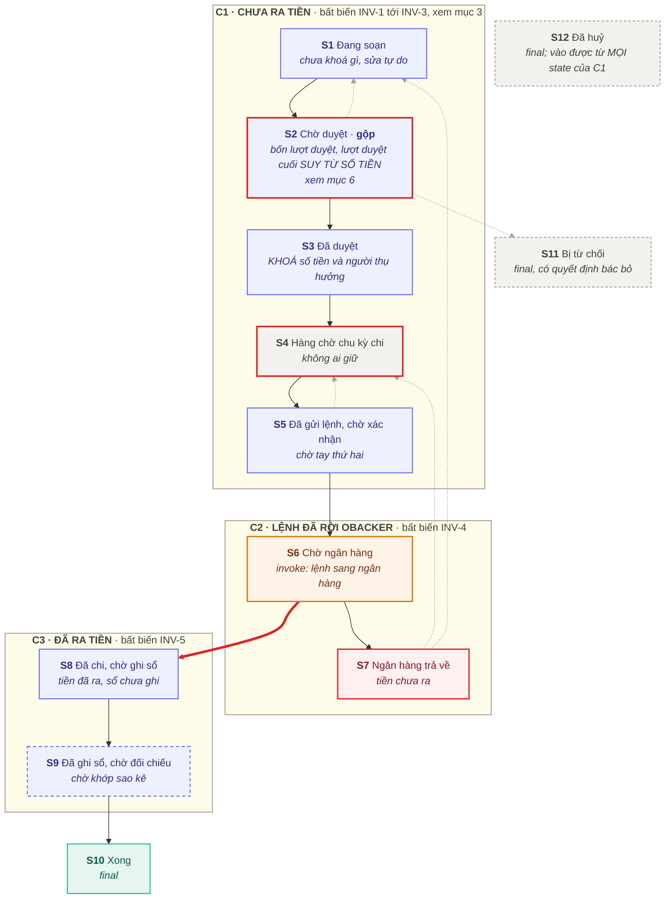
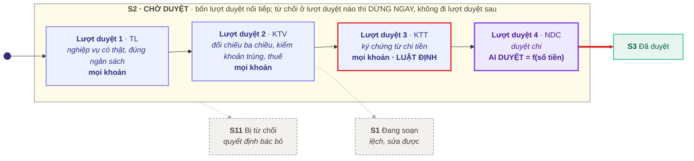
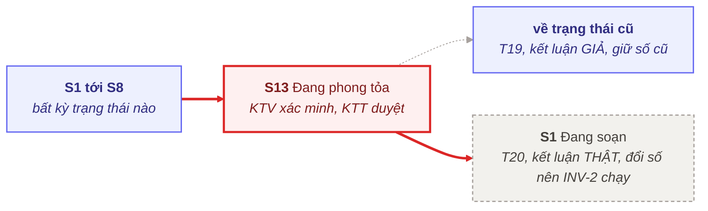

# Phụ lục ĐT. Đặc tả mô hình trạng thái của hồ sơ chi tiền

## Thông tin phiên bản

| Hạng mục | Nội dung |
| --- | --- |
| Mã tài liệu | OBK-SOP-NB-PL-DT |
| Tên phụ lục | Đặc tả mô hình trạng thái của hồ sơ chi tiền |
| Cấp tài liệu | Phụ lục đặc tả của [[OBK-SOP-NB-01_Mua_sam_va_thanh_toan_noi_bo\|OBK-SOP-NB-01]]. Không phải quy trình, không dùng để hướng dẫn người vận hành |
| Phiên bản | R.1.0.0, đang áp dụng |
| Ngày biên soạn | 07/09/2026 |
| Mốc pháp luật áp dụng | Pháp luật có hiệu lực tại ngày 07/09/2026 |
| Người biên soạn | (để trống) |
| Người soát | (để trống) |
| Người phê duyệt | (để trống) |
| Văn bản cấp trên | [[06_OBK-SOP-NB-00_Chuan_van_hanh_noi_bo\|OBK-SOP-NB-00]] Chuẩn vận hành nội bộ |
| Tài liệu nguồn | [[OBK-SOP-NB-01_Mua_sam_va_thanh_toan_noi_bo\|OBK-SOP-NB-01]] Mua sắm nội bộ và đề nghị thanh toán, mục 6.0a |
| Phụ lục song hành | `PL_DM_Mo_hinh_trang_thai_mua_sam.md`, đặc tả của chủ thể thứ hai |
| Chuẩn mô hình hóa | `04_MO_HINH_VAN_HANH` mục 16 |
| Người đọc | Người chọn hoặc người xây `[HỆ THỐNG NỘP ĐỀ NGHỊ]` tại Phụ lục 2 của [[OBK-SOP-NB-01_Mua_sam_va_thanh_toan_noi_bo\|OBK-SOP-NB-01]] |
| Lần rà soát tiếp theo | Cùng lượt với [[OBK-SOP-NB-01_Mua_sam_va_thanh_toan_noi_bo\|OBK-SOP-NB-01]] |
| Phạm vi phát hành | Nội bộ oBacker. Không phát hành cho khách hàng. |

---

## CẢNH BÁO MỞ ĐẦU

> [!note] TỆP NÀY KHÔNG PHẢI QUY TRÌNH
> Người vận hành đọc [[OBK-SOP-NB-01_Mua_sam_va_thanh_toan_noi_bo|OBK-SOP-NB-01]] mục 6.5 cho các bước và mục 6.0a cho bảng tra trạng thái. Tệp này là bản đặc tả kỹ thuật để **chọn hoặc xây công cụ**: đặc tả trường thông tin, điều kiện chuyển trạng thái và luồng luân chuyển hồ sơ.
>
> **Quan hệ với tài liệu quy trình:** Bảng luật chuyển ở mục 9 của tệp này là bản gốc về **thứ tự và điều kiện**. Bảng tra trạng thái ở [[OBK-SOP-NB-01_Mua_sam_va_thanh_toan_noi_bo|OBK-SOP-NB-01]] mục 6.0a.1 là bản gốc về **cách gọi trạng thái bằng tiếng Việt thường**. Nội dung của từng điều kiện bắt buộc thực hiện theo tài liệu viện dẫn tại cột Nguồn của mục 8.

---

## 1. Xác định chủ thể

**Chủ thể là `Đề nghị chi`**, một hồ sơ có một mã số duy nhất. Tiêu chí xác định chủ thể:

| # | Câu kiểm | Đề nghị chi | Ví dụ KHÔNG đạt trong cùng quy trình |
| --- | --- | --- | --- |
| 1 | Là danh từ, hỏi được tiến độ xử lý | Đạt | "Việc lấy báo giá" hỏi được "ai đang làm", không hỏi được "hồ sơ đó tới đâu" |
| 2 | Có vòng đời rõ ràng | Đạt, `S1` tới `S10` | "Chu kỳ chi" lặp theo lịch, không sinh, cũng không kết thúc |
| 3 | Tình trạng có tính chất kiểm soát | Đạt, xem các điều kiện bắt buộc ở mục 8 | "Mức độ ưu tiên" không chặn việc gì |
| 4 | Có ít nhất hai bên cùng tham gia theo dõi | Đạt: `NĐN`, `KTV`, `NDC` và hệ thống | Ghi chú riêng của một cá nhân |

**`Đề nghị mua sắm` là một chủ thể độc lập:** Một lần mua sắm có thể sinh nhiều lần chi khi hợp đồng thanh toán nhiều đợt. Điểm bàn giao là bước `A7` của [[OBK-SOP-NB-01_Mua_sam_va_thanh_toan_noi_bo|OBK-SOP-NB-01]] mục 6.3.1 (nghiệm thu).

---

## 2. Phân chia khối theo bất biến

| Khối | Tên | Gồm | Ý nghĩa |
| --- | --- | --- | --- |
| `C1` | CHƯA RA TIỀN | `S1` tới `S5` | Sửa được, huỷ được, chưa sinh bút toán kế toán |
| `C2` | LỆNH ĐÃ RỜI OBACKER | `S6`, `S7` | Lệnh đã gửi sang ngân hàng, chờ phản hồi kết quả |
| `C3` | ĐÃ RA TIỀN | `S8`, `S9` | Tiền đã chuyển, không hủy được; xử lý sai lệch bằng thu hồi hoặc bút toán điều chỉnh |

Tiêu chí phân chia là **tiền đã ra khỏi tài khoản hay chưa**, tức thời điểm thay đổi quyền định đoạt đối với khoản tiền.

`S13` Phong tỏa nằm ngoài cả ba khối, áp dụng khi phát hiện nghi vấn gian lận.

---

## 3. Các bất biến vận hành

| Mã | Khối | Bất biến | Căn cứ |
| --- | --- | --- | --- |
| `INV-1` | `C1` | Tiền chưa rời tài khoản, có thể huỷ ở mọi trạng thái và không phát sinh bút toán | Thiết kế nội bộ |
| `INV-2` | `C1` | **Đổi số tiền hoặc đổi người thụ hưởng thì mọi chữ ký đã có bị huỷ và hồ sơ về `S1`** | [[OBK-QCTC-01_Quy_che_tai_chinh_noi_bo\|OBK-QCTC-01]] mục 12.3b |
| `INV-3` | `C1`, từ `S3` | Số tiền và người thụ hưởng bị khoá; muốn đổi thì chỉ có một đường là `INV-2` | Hệ quả của `INV-2` |
| `INV-4` | `C2` | oBacker không huỷ được bằng quyết định nội bộ; kết quả do ngân hàng trả lời | Cơ chế hệ thống ngân hàng |
| `INV-5` | `C3` | Tiền đã ra, không huỷ; sai thì xử bằng thu hồi hoặc bút toán điều chỉnh | `[Luật Kế toán 41/VBHN-VPQH Đ.18 k.1]` |

> [!note] NGUYÊN TẮC HỦY HIỆU LỰC CHỮ KÝ THEO BẤT BIẾN INV-2
> Việc điều chỉnh số tiền hoặc thay đổi người thụ hưởng (gồm số tài khoản) làm mất hiệu lực toàn bộ các chữ ký đã duyệt trước đó theo [[OBK-QCTC-01_Quy_che_tai_chinh_noi_bo|OBK-QCTC-01]] mục 12.3b. Hồ sơ phải quay về trạng thái Soạn thảo (`S1`) để thực hiện lại chuỗi phê duyệt từ đầu. Hệ thống công cụ phải cấu hình cơ chế tự động hủy hiệu lực chữ ký khi trường trọng yếu thay đổi.

---

## 3a. TRƯỜNG TRỌNG YẾU, và cách chữ ký hết hiệu lực

Quy định chuẩn: `04_MO_HINH_VAN_HANH` mục 2.6a.

| Trường trọng yếu | Căn cứ |
| --- | --- |
| Số tiền | `02_NoiBo/OBK-QCTC-01` mục 12.3b |
| Người thụ hưởng, gồm cả số tài khoản người nhận | `02_NoiBo/OBK-QCTC-01` mục 12.3b |

**Cơ chế kiểm soát:** Mỗi lần ký, hệ thống lưu kèm chữ ký giá trị của hai trường trọng yếu tại thời điểm ký. Chữ ký chỉ giữ hiệu lực khi giá trị hai trường trọng yếu hiện tại trùng khớp hoàn toàn với giá trị đã lưu.

**Các trường hợp thay đổi trường trọng yếu:**

1. Người đề nghị hoặc phê duyệt điều chỉnh số tiền hoặc người thụ hưởng trong nội bộ.
2. Nhà cung cấp thông báo đổi số tài khoản người thụ hưởng (kích hoạt quy trình phong tỏa tại mục 10 và cập nhật lại BM-05).

**Nguyên tắc xử lý khi thay đổi trường trọng yếu:** Hệ thống không xóa dữ liệu lịch sử chữ ký mà chỉ đánh dấu trạng thái hết hiệu lực, bảo lưu toàn bộ dấu vết kiểm toán.

## 4. Danh mục trạng thái

Cột "Tên tiếng Việt" phải khớp bảng tra tại [[OBK-SOP-NB-01_Mua_sam_va_thanh_toan_noi_bo|OBK-SOP-NB-01]] mục 6.0a.1, và bảng đó là bản gốc của cách gọi.

| Mã | Khối | Tên tiếng Việt | Điều kiện của hồ sơ | Ai đang giữ |
| --- | --- | --- | --- | --- |
| `S1` | `C1` | Đang soạn | Chưa khoá gì, sửa tự do | `NĐN` |
| `S2` | `C1` | Chờ duyệt | Đang đi qua bốn lượt duyệt, xem mục 6 | Theo lượt duyệt đang mở |
| `S3` | `C1` | Đã duyệt, chờ tới ngày chi | Số tiền và người thụ hưởng đã khoá | `KTV` |
| `S4` | `C1` | Trong hàng chờ chu kỳ chi | Đủ điều kiện, chờ tới lịch | Không ai giữ |
| `S5` | `C1` | Đã gửi lệnh, chờ xác nhận | Lệnh đã TẠO trên hệ thống ngân hàng | `TGĐ` hoặc `Chủ tịch HĐQT` |
| `S6` | `C2` | Chờ ngân hàng | `invoke` lệnh sang ngân hàng, chờ hồi đáp | Ngân hàng |
| `S7` | `C2` | Ngân hàng trả về | Tiền chưa ra, phải xác định nguyên nhân | `KTV` |
| `S8` | `C3` | Đã chi, chờ ghi sổ | Tiền đã ra, sổ chưa ghi | `KTV` |
| `S9` | `C3` | Đã ghi sổ, chờ đối chiếu | Chờ khớp sao kê | `AD-KT` |
| `S10` | kết | Xong | Đã khớp sao kê, hồ sơ đã lưu đúng thư mục | Đóng |
| `S11` | kết | Bị từ chối | Có quyết định bác bỏ của một lượt duyệt | Đóng |
| `S12` | kết | Đã huỷ | `NĐN` rút, hoặc `TL` thu hồi | Đóng |
| `S13` | khẩn | Đang phong tỏa | Nghi gian lận; mọi lệnh chi cho bên nhận này dừng | `KTV` xác minh, `KTT` duyệt kết quả |

> [!note] CỘT "AI ĐANG GIỮ" LÀ MỘT CỘT CỦA BẢNG, KHÔNG PHẢI MỘT PHẦN CỦA TÊN TRẠNG THÁI
> Tên trạng thái được chuẩn hóa theo tiến trình khách quan của hồ sơ. Cột "Ai đang giữ" xác định trách nhiệm xử lý hiện tại, giúp tách biệt tên trạng thái với thẩm quyền của từng vị trí trong từng giai đoạn.

> [!note] PHÂN BIỆT CÁC TRẠNG THÁI KẾT THÚC
> Mô hình trạng thái phân định rõ ba trạng thái kết thúc: Hoàn tất (`S10` - giao dịch thành công), Bị từ chối (`S11` - có quyết định bác bỏ của cấp có thẩm quyền), và Đã hủy (`S12` - người đề nghị hoặc quản lý chủ động rút đề nghị trước khi phê duyệt).

---

## 5. Sơ đồ trạng thái

Chú giải ký hiệu theo `04_MO_HINH_VAN_HANH` mục 15.2, không chép lại ở đây. Ba thứ đáng nhìn trước: ô viền đỏ là chỗ điều kiện bắt buộc LUẬT ĐỊNH `G4` chặn đường ra; ô cam là chỗ oBacker hết quyền quyết; **mũi tên đỏ đậm `T09` là dòng duy nhất mà tiền thật rời khỏi tài khoản.**

**Ba mũi tên `mermaid` không vẽ được**, vì công cụ không vẽ được đường đi ra từ một khung gộp: `T16` từ mọi trạng thái của `C1` sang `S12`; `T17` từ `S2` tới `S5` về `S1` khi `INV-2` chạy; `T18` từ `S1` tới `S8` sang `S13`. Ba đường này chỉ có ở bảng mục 9.

---

## 6. Cơ chế phân luồng phê duyệt tại trạng thái S2

**Ô tím đậm là ô duy nhất phụ thuộc số tiền.** Ba lượt duyệt đầu áp cho mọi khoản. Lượt duyệt thứ tư không ghi tên ai, mà ghi một hàm:

**`người duyệt chi = f(bậc)`**, trong đó **`bậc = g(số tiền)`**. Bảng của `f` là [[OBK-SOP-NB-01_Mua_sam_va_thanh_toan_noi_bo|OBK-SOP-NB-01]] mục 6.2.1 cột "Người duyệt chi". Bảng của `g` là [[OBK-QCTC-01_Quy_che_tai_chinh_noi_bo|OBK-QCTC-01]] mục 12.3 cộng mức tối đa của bậc B4 tại mục 12.3a. Năm trường hợp nâng một bậc tại mục 6.2.2 là phần chỉnh của `g`; giao dịch với người có liên quan thì `g` không áp, chuyển sang [[OBK-QCTC-01_Quy_che_tai_chinh_noi_bo|OBK-QCTC-01]] Điều 12a.

Cấu trúc phê duyệt dạng hàm toán học cho phép linh hoạt điều chỉnh ngưỡng giá trị mà không làm phá vỡ mô hình trạng thái cơ sở.

**Bảng chuyển trong `S2`:**

| # | Đang ở | Sự kiện | Điều kiện bắt buộc | Tới |
| --- | --- | --- | --- | --- |
| `K01` | vào `S2` | `E01` | không | Lượt duyệt 1 |
| `K02` | Lượt duyệt 1 | `E02` | không | Lượt duyệt 2 |
| `K03` | Lượt duyệt 2 | `E03` | `G1` và `G2` và `G3` | Lượt duyệt 3 |
| `K04` | Lượt duyệt 3 | `E05` | `G4` | Lượt duyệt 4 |
| `K05` | Lượt duyệt 4 | `E06` | `G5` | ra `S3` |
| `K06` | Lượt duyệt 2 | `E04` | không | ra `S1`, hồ sơ lệch |
| `K07` | **bất kỳ lượt duyệt nào** | `E07` | không | ra `S11`, DỪNG NGAY |

> [!note] NGUYÊN TẮC DỪNG QUY TRÌNH KHI BỊ TỪ CHỐI
> Lượt duyệt nào bác bỏ thì hồ sơ dừng ngay và chuyển sang trạng thái Bị từ chối (`S11`), không luân chuyển sang các lượt duyệt tiếp theo. Cấp phê duyệt cao hơn không được bỏ qua kết luận từ chối của cấp thẩm định trước đó.

> [!note] PHÂN BIỆT CHỮ KÝ LUẬT ĐỊNH VÀ PHÊ DUYỆT HẠN MỨC
> Chữ ký của `KTT` tại Lượt duyệt 3 là **điều kiện hợp pháp của chứng từ chi tiền** theo quy định tại `[Luật Kế toán 41/VBHN-VPQH Đ.19 k.3]`, áp dụng bắt buộc cho mọi khoản chi. Chữ ký của `NDC` tại Lượt duyệt 4 là **thẩm quyền phê duyệt khoản chi** theo hạn mức tài chính.

> [!note] PHÂN BIỆT DUYỆT NHU CẦU VÀ KÝ CHỨNG TỪ CHI
> Tại bậc B4, việc KTT duyệt nhu cầu mua sắm thuộc quy trình Luồng A (phê duyệt chủ trương mua). Chữ ký của KTT tại Lượt duyệt 3 thuộc Luồng B (ký chứng từ chi tiền trước khi thực hiện giao dịch theo luật kế toán). Hai trách nhiệm này độc lập và áp dụng trên hai chứng từ khác nhau.

---

## 7. Danh mục sự kiện

| Mã | Nguồn | Nội dung |
| --- | --- | --- |
| `E01` | nội bộ | `NĐN` nộp `BM-02` kèm chứng từ |
| `E02` | nội bộ | Lượt duyệt 1: `TL` xác nhận nghiệp vụ và ngân sách |
| `E03` | nội bộ | Lượt duyệt 2: `KTV` kết luận kiểm ĐẠT trên `BM-07` |
| `E04` | nội bộ | Lượt duyệt 2: `KTV` kết luận kiểm KHÔNG ĐẠT, hồ sơ lệch |
| `E05` | nội bộ | Lượt duyệt 3: `KTT` ký chứng từ chi tiền |
| `E06` | nội bộ | Lượt duyệt 4: `NDC` duyệt chi theo bậc |
| `E07` | nội bộ | Bất kỳ lượt duyệt nào TỪ CHỐI, có quyết định bác bỏ |
| `E08` | nội bộ | `NĐN` rút đề nghị, hoặc `TL` thu hồi |
| `E09` | nội bộ | **Đổi số tiền hoặc đổi người thụ hưởng** |
| `E10` | nội bộ | `KTV` đưa hồ sơ vào hàng chờ chu kỳ chi |
| `E11` | nội bộ | `KTV` hoặc `KTT` TẠO lệnh trên hệ thống ngân hàng |
| `E12` | nội bộ | `TGĐ` hoặc `Chủ tịch HĐQT` XÁC NHẬN lệnh |
| `E13` | nội bộ | Người xác nhận lệnh TỪ CHỐI xác nhận, lệnh bị huỷ trên hệ thống |
| `E14` | bên ngoài | Ngân hàng báo giao dịch THÀNH CÔNG |
| `E15` | bên ngoài | Ngân hàng báo giao dịch THẤT BẠI |
| `E16` | nội bộ | `KTV` kết luận nguyên nhân lệnh bị trả về |
| `E17` | nội bộ | `KTV` hạch toán xong |
| `E18` | nội bộ | `AD-KT` đối chiếu sao kê KHỚP sổ, hồ sơ đã lưu |
| `E19` | nội bộ | `AD-KT` phát hiện chênh lệch giữa sao kê và sổ |
| `E20` | bên ngoài | Nhận thông báo đổi số tài khoản nhà cung cấp |
| `E21` | nội bộ | Phát hiện trùng theo bộ ba mã số thuế, số hóa đơn, số tiền |
| `E22` | nội bộ | Gọi số gốc, kết luận thông báo đổi tài khoản là GIẢ |
| `E23` | nội bộ | Gọi số gốc, kết luận là thật; `KTT` duyệt sửa thông tin |

> [!note] SỰ KIỆN PHẢN HỒI TỪ HỆ THỐNG NGÂN HÀNG
> Các sự kiện `E14` (thành công) và `E15` (thất bại) là phản hồi tự động từ hệ thống ngân hàng. Trạng thái có phát sinh tương tác giao dịch bên ngoài bắt buộc phải có đầy đủ hai nhánh kịch bản xử lý.

---

## 8. Điều kiện chuyển trạng thái bắt buộc

Cột Nguồn chỉ tới nơi giữ **nội dung** của từng điều kiện. Bảng này chỉ là mục lục; không chép nội dung về đây.

| Mã | Điều kiện bắt buộc | Nguồn | Chặn chuyển nào | Loại |
| --- | --- | --- | --- | --- |
| `G1` | Nhà cung cấp mới đã xác minh đủ sáu nội dung | `NB-01` mục 6.4.1 | Lượt duyệt 2 ra | Nội bộ |
| `G2` | Đối chiếu ba chiều khớp và không trùng | `NB-01` mục 6.5.3, 6.5.4 | Lượt duyệt 2 ra | Nội bộ |
| `G3` | Bộ điều kiện thuế đều ĐẠT | `NB-01` mục 6.6 | Lượt duyệt 2 ra | Rủi ro tiền thật |
| `G4` | Chữ ký `KTT` có mặt trước khi tiền ra | `NB-01` mục 6.5.1 bước B4; `[Luật Kế toán 41/VBHN-VPQH Đ.19 k.3]` | Lượt duyệt 3 ra và `S4` ra | **LUẬT ĐỊNH, không có ngoại lệ** |
| `G5` | Người duyệt đúng bậc theo giá trị, đã tính năm trường hợp nâng bậc | `NB-01` mục 6.2.1, 6.2.2; [[OBK-QCTC-01_Quy_che_tai_chinh_noi_bo\|OBK-QCTC-01]] mục 12.3 và 12.3a | Lượt duyệt 4 ra | Vượt thẩm quyền |
| `G6` | Bốn điều kiện lệnh chi đủ | `NB-01` mục 6.5.5 | `S4` ra | Nội bộ |
| `G7` | Bên nhận không ở trạng thái phong tỏa | `NB-01` mục 6.4.2 | `S4` ra | Mất tiền |
| `G8` | **Người XÁC NHẬN lệnh khác người TẠO lệnh** | [[OBK-QCTC-01_Quy_che_tai_chinh_noi_bo\|OBK-QCTC-01]] mục 35.1a, 47.2 | `S5` ra | Tách quyền |
| `G9` | **Người đối chiếu sao kê không phải người tạo lệnh của hồ sơ đó** | [[OBK-QCTC-01_Quy_che_tai_chinh_noi_bo\|OBK-QCTC-01]] mục 34.3, 47.3a kiểm soát bù số 1 | `S9` ra | Tách quyền |
| `G10` | Nguyên nhân lệnh bị trả về **không liên quan số tài khoản người thụ hưởng** | `NB-01` mục 6.4.2 | `S7` ra | Mất tiền |

> [!note] DẪN CHIẾU ĐỐI ỨNG VỚI QUY CHẾ TÀI CHÍNH
> Các điều kiện `G8`, `G9` viện dẫn trực tiếp nguyên tắc phân tách kiểm soát tại [[OBK-QCTC-01_Quy_che_tai_chinh_noi_bo|OBK-QCTC-01]] mục 34.3, 35.1a, 47.2 và 47.3a.

> [!note] KIỂM TRA CHỮ KÝ KẾ TOÁN TRƯỞNG TRƯỚC KHI CHI TIỀN
> Điều kiện `G4` kiểm soát tại Lượt duyệt 3 (thời điểm ký chứng từ) và tiếp tục kiểm soát tại đường ra của trạng thái `S4` ngay trước khi tạo lệnh chuyển tiền nhằm bảo đảm chứng từ chi tiền có đủ chữ ký của KTT trước khi thực hiện giao dịch theo `[Luật Kế toán 41/VBHN-VPQH Đ.19 k.3]`.

> [!note] PHÂN ĐỊNH XỬ LÝ LỆNH CHI BỊ TRẢ VỀ THEO G10
> Khi lệnh chi bị trả về do lỗi kỹ thuật (thiếu số dư, lỗi đường truyền) thỏa mãn điều kiện `G10`, hồ sơ được xếp lại vào hàng chờ `S4`. Trường hợp lệnh bị trả về do sai thông tin người thụ hưởng (không thỏa `G10`), hồ sơ bị hủy bỏ chữ ký theo `INV-2` và chuyển về `S1` để xác minh lại theo quy định.

---

## 9. Bảng luật chuyển. ĐÂY LÀ BẢN GỐC VỀ THỨ TỰ VÀ ĐIỀU KIỆN

| # | Đang ở | Sự kiện | Điều kiện bắt buộc | Hành động | Tới |
| --- | --- | --- | --- | --- | --- | --- |
| `T01` | `S1` | `E01` | không | Vào `S2`, mở lượt duyệt 1 | `S2` |
| `T02` | `S2` | `E06` | `G1` tới `G5`, xem mục 6 | **KHOÁ số tiền và người thụ hưởng** | `S3` |
| `T03` | `S2` | `E04` | không | Ghi lý do lệch vào `BM-07`, báo `NĐN`, xoá chữ ký của các lượt duyệt đã qua | `S1` |
| `T04` | `S2` | `E07` | không | Ghi lý do bác bỏ, báo `NĐN`, đóng vụ việc | `S11` |
| `T05` | `S3` | `E10` | không | Đưa vào hàng chờ chu kỳ chi | `S4` |
| `T06` | `S4` | `E11` | `G4` và `G6` và `G7` | Lệnh đã TẠO; sinh việc xác nhận cho `TGĐ` hoặc `Chủ tịch HĐQT` | `S5` |
| `T07` | `S5` | `E12` | `G8` | Lệnh đi sang ngân hàng | `S6` |
| `T08` | `S5` | `E13` | không | Huỷ lệnh trên hệ thống, ghi lý do, trả hồ sơ về hàng chờ | `S4` |
| `T09` | `S6` | `E14` | không | **TIỀN RA KHỎI TÀI KHOẢN**; sinh việc hạch toán cho `KTV` | `S8` |
| `T10` | `S6` | `E15` | không | Ghi mã lỗi của ngân hàng vào hồ sơ; tiền không ra | `S7` |
| `T11` | `S7` | `E16` | `G10` | Sửa nguyên nhân, giữ nguyên chữ ký, trả về hàng chờ | `S4` |
| `T12` | `S7` | `E16` | **không** `G10` | **`INV-2` chạy: XOÁ MỌI CHỮ KÝ**, sửa số tài khoản theo `NB-01` mục 6.4.2 | `S1` |
| `T13` | `S8` | `E17` | không | Sinh việc đối chiếu cho `AD-KT` | `S9` |
| `T14` | `S9` | `E18` | `G9` | Lưu hồ sơ đúng thư mục, đóng vụ việc | `S10` |
| `T15` | `S9` | `E19` | không | Báo `TGĐ` NGAY trong ngày phát hiện, không qua `KTV`, cũng không qua `KTT`; mở sự cố | `S9`, **giữ nguyên** |
| `T16` | **mọi trạng thái của `C1`** | `E08` | không | Xoá mọi chữ ký, ghi lý do, đóng vụ việc | `S12` |
| `T17` | `S2` tới `S5` | `E09` | không | **`INV-2` chạy: XOÁ MỌI CHỮ KÝ ĐÃ CÓ**; nếu đang ở `S5` thì huỷ lệnh trên hệ thống trước | `S1` |
| `T18` | `S1` tới `S8` | `E20` | không | **Phong tỏa NGAY**, sinh việc xác minh cho `KTV` | `S13` |
| `T19` | `S13` | `E22` | không | Ghi sổ sự cố, báo `KTT`, giữ số tài khoản cũ | về trạng thái trước khi phong tỏa |
| `T20` | `S13` | `E23` | không | `KTV` sửa thông tin, `KTT` duyệt, lưu `BM-05` cập nhật; **việc sửa này là đổi người thụ hưởng nên `INV-2` chạy** | `S1` |
| `T21` | `S2` tới `S8` | `E21` | không | Dừng, điều tra trùng | `S1` hoặc `S11` |

Hai mươi mốt dòng là hết Luồng B. Sửa quy trình thì sửa bảng này trước, sửa phần chữ sau.

> [!note] CÁC ĐIỂM KIỂM SOÁT ĐẶC THÙ TRONG BẢNG LUẬT CHUYỂN
>
> **Thời điểm xuất quỹ (`T09`):** Đường chuyển trạng thái `T09` là thời điểm tiền chính thức ra khỏi tài khoản ngân hàng; toàn bộ điều kiện kiểm soát tiền chi và phân tách trách nhiệm nhằm bảo đảm giao dịch chỉ diễn ra khi đã đủ chữ ký hợp lệ.
>
> **Bảo toàn tính toàn vẹn khi sửa số tiền (`T17`):** Mọi thay đổi về số tiền hoặc người thụ hưởng tại các bước trước khi chi đều kích hoạt `INV-2` để đưa hồ sơ về `S1` duyệt lại từ đầu.
>
> **Xử lý sau phong tỏa (`T19`, `T20`):** Sau khi xác minh thông tin, nếu thông báo đổi số tài khoản là giả (`T19`) thì giữ nguyên tài khoản cũ và đưa hồ sơ về trạng thái trước phong tỏa; nếu là thật (`T20`) thì cập nhật BM-05 và đưa hồ sơ về `S1` ký lại do thay đổi thông tin người thụ hưởng.
>
> **`T15` là một dòng quay lại chính trạng thái đó, và đó là cố ý.** Chênh lệch sao kê không đổi trạng thái: hồ sơ vẫn đang chờ đối chiếu, chỉ có một sự cố được mở kèm theo. Tiền đã ra rồi nên `INV-5` không cho phép hồ sơ về vùng sửa được. Giữ hồ sơ ở `S9` còn làm cho chỉ số "số hồ sơ nằm ở `S9` quá `N` ngày" bắt được sự cố này mà không cần thêm sổ theo dõi.

---

## 10. Trạng thái khẩn `S13` Phong tỏa

`T18` vào `S13` được từ **tám** trạng thái và **không có điều kiện bắt buộc nào**. Thông báo đổi số tài khoản luôn phong tỏa trước, xác minh sau. Không có ngoại lệ nào cho phép chuyển tiền trong lúc đang xác minh.

---

## 11. Luồng G chạy trên CÙNG mô hình trạng thái

[[OBK-SOP-NB-01_Mua_sam_va_thanh_toan_noi_bo|OBK-SOP-NB-01]] mục 6.5a.4 tuyên bố Luồng G cắt số lần mở phiếu chứ không cắt số lớp kiểm soát. Bảng này kiểm được tuyên bố đó: nếu Luồng G bỏ mất một lượt duyệt hoặc một trạng thái nào thì tuyên bố đó sai.

| Lượt duyệt hoặc trạng thái | Luồng B đầy đủ | Luồng G nhánh G-2 |
| --- | --- | --- |
| `S2` lượt duyệt 1, xác nhận nghiệp vụ | `TL` ký trên `BM-01` và `BM-02` | `TL` xác nhận trên `BM-G`, ô thứ hai |
| `S2` lượt duyệt 2, kiểm chứng từ | `KTV` chạy `BM-07` riêng | Ba câu hỏi loại trừ tại mục 6.5a.6, ngay trên `BM-G` |
| `S2` lượt duyệt 3, ký kế toán | `KTT` ký chứng từ chi tiền | `KTT` xác nhận trên `BM-G`, ô thứ ba. **Không cắt, vì `G4` là luật định** |
| `S2` lượt duyệt 4, duyệt chi | `NDC` duyệt trên `BM-02` | `NDC` xác nhận trên `BM-G`, ô thứ tư |
| `S5` xác nhận lệnh | `TGĐ` hoặc `Chủ tịch HĐQT` | **Y nguyên, không cắt** |
| `S9` đối chiếu | `AD-KT` | **Y nguyên, không cắt** |
| `INV-2` | Áp | **Y nguyên, không cắt** |

**Kết luận đọc được từ bảng:** Luồng G đi qua đúng cùng bốn lượt duyệt, cùng bộ điều kiện bắt buộc và cùng bộ bất biến. Cái được cắt là số **phiếu** phải mở, từ bốn xuống một; cái không được cắt là số **lượt duyệt** hồ sơ phải qua.

Cấp `G-1` khác về đơn vị: hồ sơ không phải một khoản mà là một **bảng kê theo kỳ** trên `BM-K`. Cả bảng kê đi qua cùng mô hình trạng thái một lần, thay cho từng khoản đi một lần. `INV-2` áp cho cả bảng kê: đổi một dòng số tiền trong bảng kê thì cả bảng kê về `S1`.

---

## 12. YÊU CẦU TỐI THIỂU VỚI CÔNG CỤ. ĐÂY LÀ PHẦN DÙNG ĐƯỢC NGAY

Dùng bảng này khi chọn công cụ hoặc khi viết yêu cầu cho `OBK`. Mỗi dòng là một phép kiểm mà công cụ phải làm được, hoặc oBacker phải bù bằng một chốt thủ công.

| # | Công cụ phải làm được | Từ đâu ra | Bù thủ công nếu không làm được |
| --- | --- | --- | --- |
| 1 | Mỗi hồ sơ có đúng một trạng thái trong mười ba trạng thái ở mục 4 | Mục 4 | Sổ theo dõi riêng, và sổ đó sẽ lệch |
| 2 | **Xoá mọi chữ ký khi trường số tiền hoặc trường số tài khoản người nhận thay đổi** | `INV-2` | `KTV` kiểm lại số tiền và số tài khoản trên chứng từ so với trên lệnh, trước khi tạo lệnh |
| 3 | Khoá trường số tiền và trường người thụ hưởng từ khi hồ sơ vào `S3` | `INV-3` | Không bù được bằng thủ công, chỉ còn cách kiểm ở điểm 2 |
| 4 | Chặn huỷ hồ sơ khi hồ sơ đã ở `C2` hoặc `C3` | `INV-4`, `INV-5` | Quy tắc viết trong quy trình, không có chốt kỹ thuật |
| 5 | Tính bậc từ số tiền, rồi chỉ cho người đúng bậc bấm duyệt ở lượt duyệt 4 | `G5` | `KTV` đối chiếu bảng 6.2.1 bằng tay ở mỗi hồ sơ |
| 6 | Chặn hồ sơ ra khỏi lượt duyệt 3 và ra khỏi `S4` khi chưa có chữ ký `KTT` | `G4`, **luật định** | Không được phép bù: đây là điều luật, không phải quy tắc nội bộ |
| 7 | Chặn cùng một người vừa TẠO vừa XÁC NHẬN một lệnh | `G8` | Phân quyền hai tài khoản trên ngân hàng điện tử |
| 8 | Chặn người tạo lệnh của một hồ sơ làm người đối chiếu sao kê của hồ sơ đó | `G9` | `TGĐ` kiểm lại bảng đối chiếu mỗi kỳ |
| 9 | Có trạng thái cho lệnh bị ngân hàng trả về, và hai đường ra theo nguyên nhân | `S7`, `G10` | Ghi vào sổ sự cố, và `KTT` quyết từng lần |
| 10 | Chặn mọi lệnh chi tới một bên nhận đang ở trạng thái phong tỏa | `G7` | Danh sách phong tỏa để ngoài, `KTV` tra bằng tay trước khi tạo lệnh |
| 11 | Sinh việc cho đúng vai trò khi hồ sơ vào một trạng thái, theo cột Hành động ở mục 9 | Mục 9 | Nhắc bằng tay, và việc chưa xong sẽ không ai biết |
| 12 | Đếm được số hồ sơ theo trạng thái và đo được thời gian nằm trong từng trạng thái | Mục 4 | Không đo được, tức mười chỉ số ở `NB-01` mục 10 không có số |

**Điểm 2 là điểm khó nhất.** Phần lớn công cụ quản lý công việc chỉ ghi lịch sử sửa, không xoá chữ ký. Khi đánh giá một công cụ, hỏi đúng câu này trước.

**Điểm 6 không có ô bù.** Nếu công cụ không chặn được thì quy trình phải chặn bằng thứ tự bước, và không được cho phép tạo lệnh trước khi có chữ ký.

---

## 13. Việc còn nợ

| # | Việc | Vì sao | Ai |
| --- | --- | --- | --- |
| 4a | Dựng bản đặc tả mô hình trạng thái cho công cụ, cho hai chủ thể của chu trình THU | Hai bảng tra ở [[OBK-SOP-NB-02_Thu_tien_va_cong_no_phai_thu\|OBK-SOP-NB-02]] mục 6.0 là bảng tra cho người vận hành, chưa có bản đặc tả cho công cụ | **CÒN NỢ**, làm khi oBacker chọn công cụ; cùng khuôn với tệp này và `PL_DM` |
| 5 | Thêm phiếu vàng cho `G8`, `G9`, `G10`, và một bộ phiếu cho chín điều kiện bắt buộc của chu trình mua sắm | Bộ phiếu hiện có chưa phủ các điều kiện bắt buộc đó | **CÒN NỢ** |

---

## Liên kết với tài liệu khác

| Tài liệu | Quan hệ |
| --- | --- |
| [[OBK-SOP-NB-01_Mua_sam_va_thanh_toan_noi_bo\|OBK-SOP-NB-01]] mục 6.0a | Bảng tra trạng thái bằng tiếng Việt thường, và các quy tắc bắt buộc. Bản gốc của cách gọi trạng thái |
| [[OBK-SOP-NB-01_Mua_sam_va_thanh_toan_noi_bo\|OBK-SOP-NB-01]] mục 6.5 | Các bước của Luồng B. Bản gốc của thứ tự việc mà người vận hành làm |
| [[OBK-SOP-NB-01_Mua_sam_va_thanh_toan_noi_bo\|OBK-SOP-NB-01]] Phụ lục 2 | Danh mục placeholder công cụ. Tệp này là đặc tả cho `[HỆ THỐNG NỘP ĐỀ NGHỊ]` |
| [[OBK-QCTC-01_Quy_che_tai_chinh_noi_bo\|OBK-QCTC-01]] mục 12.3, 12.3a, 12.3b | Bản gốc của thẩm quyền duyệt chi và của `INV-2` |
| [[OBK-QCTC-01_Quy_che_tai_chinh_noi_bo\|OBK-QCTC-01]] mục 34.3, 35.1a, 47.2, 47.3a | Bản gốc của `G8` và `G9` |
| `04_MO_HINH_VAN_HANH` mục 15 và 16 | Chuẩn vẽ sơ đồ và chuẩn phân rã mô hình |

---

## NHẬT KÝ SỬA

| Ngày | Bản | Nội dung |
| --- | --- | --- |
| 21/09/2026 | R.1.0.0 | Ban hành. |
