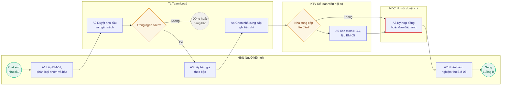
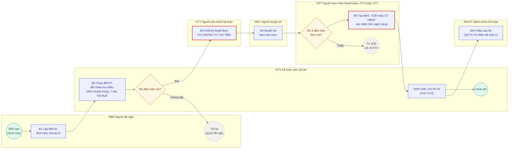
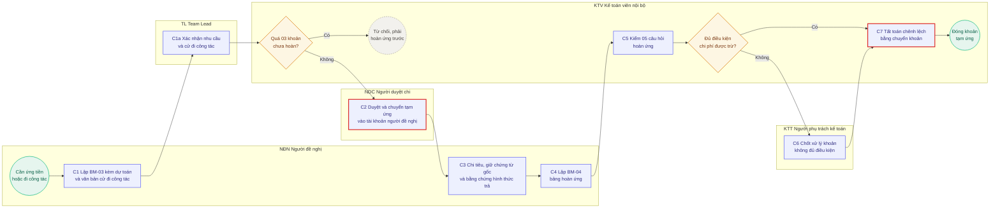

# OBK-SOP-NB-01. Mua sắm nội bộ và đề nghị thanh toán

## Thông tin phiên bản

| Hạng mục | Nội dung |
| --- | --- |
| Mã tài liệu | OBK-SOP-NB-01 |
| Tên tài liệu | Quy trình mua sắm nội bộ và đề nghị thanh toán |
| Cấp tài liệu | Cấp 3, hướng dẫn nghiệp vụ. Thi hành Chương 4 và Chương 7 của [[OBK-QCTC-01_Quy_che_tai_chinh_noi_bo\|OBK-QCTC-01]] Quy chế tài chính nội bộ |
| Phiên bản | V4.0.2, thư viện tham khảo |
| Phát hành | R.26.10.08.1 |
| Ngày biên soạn | 04/10/2026 |
| Mốc pháp luật áp dụng | Pháp luật có hiệu lực tại ngày 01/10/2026 |
| Người biên soạn | CEO (Lê Trọng Tuấn) |
| Người soát | CEO (Lê Trọng Tuấn) |
| Người phê duyệt | CEO (Lê Trọng Tuấn) |
| Văn bản cấp trên | [[OBK-MSR_Quy_tac_so_cai\|OBK-MSR]] Chuẩn vận hành nội bộ |
| Bộ tài liệu | OBK-SOP-NB, Sổ tay quy trình nội bộ oBacker |
| Lần rà soát tiếp theo | Không quá 12 tháng kể từ ngày ban hành; rà soát đột xuất khi có văn bản mới theo Chương 21 của Handbook Kế toán |
| Phạm vi phát hành | Nội bộ oBacker. Không phát hành cho khách hàng. |

---

## CẢNH BÁO MỞ ĐẦU

> [!info] ĐỌC TRƯỚC
> TÀI LIỆU NÀY CÓ HAI LOẠI NỘI DUNG, KHÔNG ĐƯỢC LẪN
>
> **Loại 1, nội dung có căn cứ pháp luật.** Toàn bộ điều kiện để một khoản chi được tính vào chi phí được trừ, được khấu trừ thuế giá trị gia tăng đầu vào, và toàn bộ nghĩa vụ khấu trừ thuế khi trả tiền cho cá nhân hoặc cho nhà cung cấp nước ngoài.>
> **Loại 2, nội dung là lựa chọn quản trị của oBacker.** Hạn mức phê duyệt, số cấp duyệt, số báo giá tối thiểu, chu kỳ chi, danh mục ngoại lệ. Phần này không có căn cứ pháp luật, là do oBacker tự quyết. **Giá trị đã chốt ghi tại chính điều khoản đặt ra con số**, phần lớn ở OBK-QCTC-01 theo quy tắc một con số chỉ ghi ở một tài liệu.

> [!danger] RỦI RO BỊ XỬ PHẠT
> Mọi khoản mua hàng hóa, dịch vụ và mọi khoản thanh toán khác **từng lần từ 05 triệu đồng trở lên, đã bao gồm thuế giá trị gia tăng**, bắt buộc phải thanh toán không dùng tiền mặt; nếu không thì mất quyền khấu trừ thuế giá trị gia tăng đầu vào `[Văn bản hợp nhất 18/VBHN-BTC ngày 04/06/2026 Đ.26]` và mất quyền tính vào chi phí được trừ `[Văn bản hợp nhất 19/VBHN-BTC Đ.9 k.1 đ.c]`. Ai đang dùng một con số khác thì mở bản gốc đối chiếu trước khi chi.

> [!warning] KHÔNG ĐƯỢC TỰ QUYẾT
> LUẬT KẾ TOÁN CẤM NGƯỜI ĐIỀU HÀNH KIÊM THỦ QUỸ
>
> Nguyên văn của điều cấm: "Người có trách nhiệm quản lý, điều hành đơn vị kế toán kiêm làm kế toán, thủ kho, thủ quỹ, trừ doanh nghiệp tư nhân và công ty trách nhiệm hữu hạn do một cá nhân làm chủ sở hữu" `[Luật Kế toán 41/VBHN-VPQH Đ.13 k.7]`. Đây là hành vi bị nghiêm cấm. oBacker là công ty cổ phần, không thuộc trường hợp loại trừ. Hệ quả trực tiếp: người điều hành không được đồng thời là người giữ tài khoản ngân hàng và bấm lệnh chuyển tiền. Nếu hiện trạng đang như vậy thì phải tách vai trò trước khi ban hành tài liệu này. Xem mục 3.3.

> [!note] CĂN CỨ TỶ LỆ THUẾ NHÀ THẦU NƯỚC NGOÀI
> Nghĩa vụ khấu trừ nộp thay khi thanh toán cho tổ chức nước ngoài không có cơ sở thường trú tại Việt Nam thực hiện theo `[Luật Thuế GTGT 114/VBHN-VPQH Đ.4 k.3, k.4]` và `[Văn bản hợp nhất 18/VBHN-BTC ngày 04/06/2026 Đ.13]`. Tỷ lệ thuế GTGT áp dụng theo Thông tư 69/2025/TT-BTC Điều 9 khoản 6 và Phụ lục I (5% đối với nhóm dịch vụ không gắn với hàng hóa; 3% đối với nhóm dịch vụ gắn với hàng hóa, vận tải). Trước mỗi lần thanh toán ra nước ngoài, KTT xác định đúng nhóm dịch vụ và tỷ lệ thuế áp dụng trước khi ký phê duyệt lệnh chi.

---

## 1. Mục đích

1.1. Bảo đảm mọi đồng tiền chi ra khỏi oBacker đều có người đề nghị, có người duyệt đúng thẩm quyền, và có chứng từ chứng minh trước khi chi, không phải sau khi chi.

1.2. Bảo đảm mọi khoản chi phục vụ hoạt động kinh doanh của oBacker đều đủ điều kiện tính vào chi phí được trừ và đủ điều kiện khấu trừ thuế giá trị gia tăng đầu vào.

1.3. Thiết lập hệ thống kiểm soát nội bộ đối với chi tiêu, đúng yêu cầu tại `[Luật Kế toán 41/VBHN-VPQH Đ.39 k.2]`: tài sản được bảo đảm an toàn, tránh sử dụng sai mục đích; các nghiệp vụ được phê duyệt đúng thẩm quyền và được ghi chép đầy đủ.

1.4. Tách quyền giữa đề nghị, duyệt, chi tiền và ghi sổ, để không một cá nhân nào tự mình hoàn tất được một khoản chi từ đầu tới cuối.

### 1.1. TRA NHANH KÝ HIỆU VAI TRÒ

| Ký hiệu | Nghĩa |
| --- | --- |
| NĐN | Người đề nghị, phát sinh nhu cầu |
| TL | Team Lead, trưởng bộ phận quản lý dòng ngân sách |
| KTV | Kế toán viên nội bộ, kiểm chứng từ và tạo lệnh chi |
| KTT | Người phụ trách kế toán của oBacker, chốt kỹ thuật và ký chứng từ chi tiền |
| NDC | Người duyệt chi theo bậc |
| NTT | Người thực hiện thanh toán, do KTV và KTT cùng giữ |
| AD-KT | Hành chính Kế toán, đối chiếu sao kê ngân hàng |

Bảng đầy đủ và RACI tại mục 3.

### 1.2. BẢNG TỔNG HỢP MỐC THỜI GIAN

| Bước | Thời hạn | Người chịu trách nhiệm nếu chậm |
| --- | --- | --- |
| Duyệt nhu cầu và ngân sách, bước A2 | 02 ngày làm việc | TL |
| Lấy báo giá theo bậc, bước A3 | 05 ngày làm việc | NĐN |
| Xác minh nhà cung cấp, bước A5 | 01 ngày (tra cứu) / 03 ngày (BM-05) | KTV |
| Nghiệm thu hoặc nhận hàng, bước A7 | Trong 02 ngày kể từ khi nhận | NĐN |
| Nộp hồ sơ chi thường xuyên, chu kỳ thứ Ba và thứ Sáu | Trước 16h00 ngày làm việc liền trước | NĐN |
| Hóa đơn của chi định kỳ theo hợp đồng | Về trước 03 ngày làm việc | NCC, KTV theo dõi |
| Nộp ngân sách nhà nước | Trước hạn nộp 02 ngày làm việc | KTV |
| Truy nguyên giao dịch sao kê không khớp | Trong 24 giờ | AD-KT |
| Hoàn ứng tạm ứng công tác | 05 ngày làm việc kể từ ngày kết thúc chuyến | NĐN |
| Hoàn ứng tạm ứng mua sắm | 10 ngày làm việc kể từ ngày chi khoản cuối cùng | NĐN |
| Hoàn ứng tạm ứng khác | 15 ngày làm việc kể từ ngày hoàn thành nhiệm vụ | NĐN |
| Hóa đơn về trễ so với mốc quy định | 07 ngày nhắc bằng văn bản, 15 ngày dừng kỳ tiếp theo | KTV |
| Rà soát sổ theo dõi thanh toán định kỳ | Mỗi quý | KTV |
| Đối chiếu sao kê ngân hàng với sổ kế toán | Mỗi 02 tuần và hằng tháng | AD-KT |
| Báo cáo số lần chi khẩn | Cuối tháng | KTV |
| Rà soát danh mục ngoại lệ | Mỗi 06 tháng | TGĐ |
| Đưa tài liệu kế toán vào lưu trữ | Trong 12 tháng kể từ ngày kết thúc kỳ kế toán năm | KTV |
| Lưu báo giá, biên bản so sánh, phiếu xác minh nhà cung cấp | 05 năm | KTV |
| Lưu chứng từ kế toán ghi sổ, sổ kế toán, báo cáo tài chính năm | 10 năm | KTV |
| Lưu BM-05 sau khi chấm dứt quan hệ với nhà cung cấp | 05 năm | KTV |
| Lưu bản chốt cuối năm của danh mục và sổ theo dõi | 10 năm (danh mục), 05 năm (sổ) | KTV |

Bảng tổng hợp; khi bảng và phần chữ khác nhau thì lấy phần chữ.
---

## 2. Phạm vi áp dụng

2.1. Áp dụng cho toàn bộ hoạt động mua sắm hàng hóa, dịch vụ, tài sản phục vụ hoạt động của oBacker, tại cả hai văn phòng Đà Nẵng và Thành phố Hồ Chí Minh.

2.2. Áp dụng cho toàn bộ đề nghị thanh toán ra bên ngoài, gồm các nhóm tại mục 5.1: nhà cung cấp trong nước, nhà cung cấp nước ngoài, cá nhân và hộ kinh doanh; thanh toán định kỳ, hoàn ứng cho người lao động, và các khoản chi bắt buộc theo quy định pháp luật.

2.3. Áp dụng cho mọi nhân sự oBacker, không phân biệt cấp bậc. Người đại diện theo pháp luật cũng phải đi qua quy trình này khi đề nghị một khoản chi.

2.4. Không áp dụng cho: chi trả lương kỳ và các khoản theo lương cho người lao động có hợp đồng lao động, kể cả tạm ứng tiền lương, do OBK-SOP-NB-04 Công và tiền lương nội bộ điều chỉnh; chi hộ khách hàng bằng tiền của khách hàng, do quy trình dịch vụ điều chỉnh. Khoản nộp thuế, khoản nộp bảo hiểm xã hội và các khoản nộp ngân sách của chính oBacker có thời hạn theo lịch tuân thủ, và đi nhóm N6 tại mục 5.1 qua bước duyệt chi tại mục 5.5.

2.5. Quy chế tài chính khung của oBacker là OBK-QCTC-01 Quy chế tài chính nội bộ. Tài liệu này thực thi Chương 4 và Chương 7 của OBK-QCTC-01. Khi tài liệu này trái với OBK-QCTC-01 thì áp dụng OBK-QCTC-01.

2.6. Ý nghĩa pháp lý của việc phân cấp trên: pháp luật thuế đặt điều kiện cho khoản do người lao động chi hộ của doanh nghiệp. Điều kiện với chi phí được trừ: doanh nghiệp có quy chế tài chính hoặc quy chế nội bộ hoặc quyết định cho phép việc chi hộ đó `[Văn bản hợp nhất 19/VBHN-BTC Đ.9 k.1 đ.c2]`. Quyền khấu trừ thuế giá trị gia tăng đầu vào cũng đặt điều kiện tương tự `[Văn bản hợp nhất 18/VBHN-BTC ngày 04/06/2026 Đ.26 k.2 đ.i]`. Điều khoản ủy quyền đáp ứng hai căn cứ này nằm tại **Điều 19 của OBK-QCTC-01**, không nằm ở tài liệu này. Mục 5.8 dưới đây chỉ hướng dẫn cách kiểm và cách lập hồ sơ; mục 5.8 không thay thế được điều khoản ủy quyền tại quy chế khung. Nếu OBK-QCTC-01 chưa được ban hành thì khoản nhân viên ứng tiền cá nhân mua hộ từ 05 triệu đồng trở lên vẫn có rủi ro bị loại.

---

## 3. Vai trò và trách nhiệm

### 3.1. Vai trò

| Ký hiệu | Vai trò | Một câu định nghĩa |
| --- | --- | --- |
| **NĐN** | Người đề nghị | Người phát sinh nhu cầu. Bất kỳ nhân sự nào. Chịu trách nhiệm về tính có thật của nhu cầu và tính đầy đủ của hồ sơ nộp lên. |
| **TL** | Team Lead | Trưởng bộ phận quản lý dòng ngân sách chứa khoản chi. Người xác nhận nhu cầu là cần thiết và nằm trong ngân sách do CEO phân bổ. |
| **KTV** | Kế toán viên nội bộ | Người KIỂM. Kiểm tính hợp lệ của chứng từ, kiểm điều kiện thuế, kiểm khoản trùng, TẠO lệnh chi, hạch toán, lưu hồ sơ. **không phê duyệt chi, không xác nhận lệnh trên hệ thống ngân hàng, không là người đối chiếu sao kê, không giữ quỹ tiền mặt.** Việc `KTV` được TẠO lệnh nằm trong cấu trúc hai khóa tại [[OBK-QCTC-01_Quy_che_tai_chinh_noi_bo\|OBK-QCTC-01]] mục 35.1a, quy tắc tách quyền tại mục 47.2. |
| **KTT** | Người phụ trách kế toán của oBacker | Người CHỐT KỸ THUẬT. Ký chứng từ chi tiền theo `[Luật Kế toán 41/VBHN-VPQH Đ.19 k.3]`. Quyết định cách xử lý khi hồ sơ có vấn đề về thuế hoặc kế toán. Cũng là một trong hai người TẠO lệnh chi. không xác nhận lệnh trên hệ thống ngân hàng và không phê duyệt chi ở bất kỳ bậc nào, xem [[OBK-QCTC-01_Quy_che_tai_chinh_noi_bo\|OBK-QCTC-01]] mục 12.3. |
| **NDC** | Người duyệt chi | Người có thẩm quyền **phê duyệt trong quy trình** theo ma trận tại [[OBK-QCTC-01_Quy_che_tai_chinh_noi_bo\|OBK-QCTC-01]] mục 12.3. Tùy bậc là `TL` ở B1 (khi `TL` vắng mặt, `CEO` là người dự phòng duyệt); `TGĐ` ở B3 (ngoại lệ luật định từ 35% tổng tài sản do `HĐQT` và `ĐHĐCĐ` quyết định, hoặc theo Điều 12a đối với người có liên quan). **`KTT` không phải NDC khi tự mình lập đề nghị hoặc tạo lệnh chi**, và một người vừa duyệt chi vừa tạo lệnh là vi phạm [[OBK-QCTC-01_Quy_che_tai_chinh_noi_bo\|OBK-QCTC-01]] mục 47.2. Việc xác nhận lệnh trên hệ thống ngân hàng điện tử không phải một lần phê duyệt riêng; đó là thao tác thực hiện, xem mục 5.5.1 bước B5. |
| **NTT** | Người thực hiện thanh toán | Người TẠO lệnh chuyển tiền hoặc chi tiền mặt. Chỉ thực hiện, không được sửa nội dung lệnh, và không phê duyệt. Vai trò này do `KTV` và `KTT` cùng giữ, mỗi người một tài khoản người dùng riêng trên hệ thống ngân hàng điện tử. Người xác nhận lệnh trên hệ thống là `TGĐ` hoặc `Chủ tịch HĐQT`, một trong hai là đủ; đó là thao tác, không phải một lần phê duyệt riêng. Xem [[OBK-QCTC-01_Quy_che_tai_chinh_noi_bo\|OBK-QCTC-01]] mục 35.1a. |
| **AD-KT** | Hành chính Kế toán | Người ĐỐI CHIẾU. Đối chiếu sao kê ngân hàng với sổ kế toán theo chốt số 1 tại [[OBK-QCTC-01_Quy_che_tai_chinh_noi_bo\|OBK-QCTC-01]] Điều 48. không hạch toán sổ nội bộ và không có quyền nào trên hệ thống ngân hàng điện tử. Đây là lớp kiểm soát độc lập theo [[OBK-QCTC-01_Quy_che_tai_chinh_noi_bo\|OBK-QCTC-01]] mục 47.2. |

> [!note] QUY ƯỚC KÝ HIỆU VAI TRÒ
>
> **Ký hiệu `KTV` trong tài liệu này khác với `KTV` trong Handbook Kế toán dịch vụ.** Ở Handbook Kế toán, `KTV` là kế toán viên vận hành hồ sơ CỦA KHÁCH HÀNG. Ở tài liệu này, `KTV` là kế toán viên xử lý sổ sách CỦA CHÍNH oBacker. Khi trích dẫn chéo giữa hai bộ tài liệu, ghi rõ nguồn: "KTV theo OBK-SOP-NB-01" hoặc "KTV theo Handbook Kế toán".
>
> **`TL` là Team Lead, không là người quyết ngân sách.** Việc quyết định và phân bổ ngân sách thuộc CEO, `TL` nhận thông báo. Hai chức năng gộp làm một: xác nhận nhu cầu là thật và cần thiết về mặt chuyên môn, và xác nhận khoản chi nằm trong ngân sách do CEO phân bổ. Nếu ở một bộ phận mà hai chức năng này thuộc hai người khác nhau thì phải ghi rõ trong Phụ lục 1 và cả hai cùng ký.

### 3.2. Bảng RACI theo bước

| Bước | NĐN | TL | KTV | KTT | NDC | NTT | AD-KT |
| --- | --- | --- | --- | --- | --- | --- | --- |
| Lập đề nghị mua sắm | R | C | I | | | | |
| Duyệt nhu cầu và ngân sách | | R/A | I | | | | |
| Lấy báo giá, chọn nhà cung cấp | R | A | C | | | | |
| Xác minh nhà cung cấp mới | C | | R | C | A | | |
| Ký hợp đồng hoặc đơn đặt hàng | C | C | C | C | A | | |
| Nghiệm thu hàng hóa, dịch vụ | R/A | C | I | | | | |
| Lập đề nghị thanh toán | R | C | I | | | | |
| Kiểm chứng từ và điều kiện thuế | | | R | A | | | |
| Ký chứng từ chi tiền theo Luật Kế toán Đ.19 k.3 | | | C | R/A | C | | |
| Duyệt chi | | C | C | C | R/A | | |
| Tạo và xác nhận lệnh chuyển tiền trên ngân hàng | | | R | R | A | R | |
| Hạch toán và lưu hồ sơ | | | R/A | C | | | |
| Đối chiếu sao kê ngân hàng với sổ kế toán | | | I | I | | I | R |

R là người làm, A là người chịu trách nhiệm cuối, C là người được hỏi ý kiến, I là người được thông báo.

> [!note] NGUYÊN TẮC ÁP DỤNG HẠN MỨC PHÊ DUYỆT
>
> **Dòng "Tạo và xác nhận lệnh chuyển tiền trên ngân hàng"** có cả `KTV` và `KTT` là R, vì cả hai đều tạo được lệnh; ai tạo lệnh nào là do phân công công việc, không chia theo bậc giá trị. Vai trò `NTT` là hai người này. Ô A thuộc `NDC` vì trách nhiệm cuối về khoản chi nằm ở lần phê duyệt tại bước B5, không nằm ở thao tác trên hệ thống ngân hàng.
>
> **`KTT` không có mặt ở dòng "Duyệt chi".** `KTT` tạo được lệnh, nên nếu `KTT` cũng duyệt chi thì vi phạm quy tắc 47.2. Người phê duyệt theo bậc là `TL`, `TGĐ`, rồi `HĐQT` cùng `ĐHĐCĐ`, theo OBK-QCTC-01 mục 12.3.
>
> **Việc đối chiếu sao kê thuộc `AD-KT`, người duyệt là `TGĐ`.** `KTV` và `KTT` đều tạo lệnh, nên người tạo lệnh không đối chiếu chính lệnh mình tạo. Xem [[OBK-QCTC-01_Quy_che_tai_chinh_noi_bo|OBK-QCTC-01]] Điều 48 chốt số 1.
>
> **Dòng ký chứng từ chi tiền là bước duy nhất của toàn quy trình có căn cứ pháp luật trực tiếp `[Luật Kế toán 41/VBHN-VPQH Đ.19 k.3]`.**
>
> **Bảng này không phủ Luồng C.** Tạm ứng và hoàn ứng có bảng người làm riêng tại mục 5.7.2.

### 3.3. Quy tắc tách quyền

> [!warning] KHÔNG ĐƯỢC TỰ QUYẾT
> Các quy tắc dưới đây không có ngoại lệ, kể cả khi gấp, kể cả khi thiếu người

3.3.1. **Người đề nghị không được là người duyệt chi cho chính đề nghị của mình.** Khi NĐN đồng thời là TL, đề nghị chuyển lên một cấp.

3.3.2. **Người duyệt chi không được là người TẠO lệnh chuyển tiền.** Quy tắc này áp cho việc một người vừa duyệt chi trên chứng từ vừa tạo lệnh trên ngân hàng. Xem OBK-QCTC-01 mục 47.2.

3.3.3. **Người hạch toán không được phê duyệt chi, không được xác nhận lệnh trên hệ thống ngân hàng, không được là người đối chiếu sao kê.**

**Ngoại lệ: `KTV` được TẠO lệnh chuyển tiền,** dù `KTV` là người hạch toán. Cấu trúc đặt tại OBK-QCTC-01 mục 47.2: `KTV` không đối chiếu sao kê, việc đối chiếu thuộc `AD-KT`; và `KTV` không phê duyệt chi, không xác nhận lệnh trên hệ thống, không giữ quỹ tiền mặt.

3.3.4. **Các điều cấm của Luật Kế toán, áp trực tiếp lên oBacker vì oBacker là công ty cổ phần:**

- Người có trách nhiệm quản lý, điều hành không được kiêm làm kế toán, thủ kho, thủ quỹ `[Luật Kế toán 41/VBHN-VPQH Đ.13 k.7]`;
- Người làm kế toán không được là cha, mẹ, cha nuôi, mẹ nuôi, vợ, chồng, con, con nuôi, anh, chị, em ruột của người đại diện theo pháp luật, của người đứng đầu, của giám đốc hoặc tổng giám đốc và của cấp phó phụ trách công tác tài chính kế toán, kế toán trưởng trong cùng đơn vị kế toán `[Luật Kế toán 41/VBHN-VPQH Đ.52 k.3]`;
- Người làm kế toán không được đồng thời là người quản lý, điều hành, thủ kho, thủ quỹ, người được giao nhiệm vụ thường xuyên mua, bán tài sản trong cùng đơn vị kế toán `[Luật Kế toán 41/VBHN-VPQH Đ.52 k.4]`.

**Mục 3.3.4 có căn cứ pháp luật trực tiếp; mục 3.3.1 tới 3.3.3 là kiểm soát nội bộ do oBacker tự đặt.** Các điều cấm trên cũng đặt tại OBK-QCTC-01 mục 47.4.

> [!bug] LỖI THƯỜNG GẶP
> Cách xử lý: người điều hành giữ quyền DUYỆT trên hệ thống ngân hàng điện tử, một nhân sự khác giữ quyền LẬP lệnh. Nếu chưa tách được thì phải ghi nhận là điểm yếu kiểm soát và có kế hoạch khắc phục kèm mốc thời gian.

---

## 4. Đầu vào bắt buộc

Không tiếp nhận đề nghị nào thiếu các đầu vào sau.

4.1. Với đề nghị mua sắm: mô tả nhu cầu, lý do phát sinh, dòng ngân sách, số tiền dự kiến, thời hạn cần có. Việc quyết định và phân bổ từng dòng ngân sách thuộc CEO; Team Lead nhận thông báo, không ký phê duyệt ngân sách.

4.2. Với đề nghị thanh toán: chứng từ chứng minh nghĩa vụ trả tiền, gồm tối thiểu hợp đồng hoặc đơn đặt hàng, bằng chứng nhận hàng hoặc nghiệm thu, và hóa đơn hợp pháp. Bộ ba này là nội dung của phép đối chiếu ba chiều tại mục 5.5.3.

4.3. Với nhà cung cấp lần đầu: hồ sơ xác minh nhà cung cấp theo mục 5.4, đã hoàn tất trước khi chi.

4.4. Với khoản chi trả cho cá nhân: căn cước hoặc mã số thuế cá nhân, hợp đồng hoặc thỏa thuận, và xác định rõ tình trạng hợp đồng lao động để tính nghĩa vụ khấu trừ tại mục 5.9.

4.5. Với khoản chi ra nước ngoài: hợp đồng hoặc điều khoản dịch vụ, hóa đơn của nhà cung cấp, và kết luận về nghĩa vụ khấu trừ nộp thay tại mục 5.10 do KTT ký.

---

# PHẦN NGHIỆP VỤ

## 5. Các bước thực hiện

### 5.0. SƠ ĐỒ QUY TRÌNH

Sơ đồ là bản tóm tắt; khi sơ đồ và phần chữ khác nhau thì **lấy phần chữ**.

**Hồ sơ đang ở đâu, ai đang giữ, thiếu gì để đi tiếp: tra mục 5.0a.** Bản gốc về **thứ tự và điều kiện** là bảng luật chuyển tại `PL_DT_Mo_hinh_trang_thai_chi_tien.md` mục 9: khi bảng đó và phần chữ khác nhau thì lấy bảng.

#### 5.0.1. Luồng A, mua sắm

Bước `A6` là bước ký hợp đồng; mọi việc kiểm xong trước bước `A6`.

#### 5.0.2. Luồng B, đề nghị thanh toán

`B3` là chữ ký chứng từ chi tiền phải có trước khi tiền ra `[Luật Kế toán 41/VBHN-VPQH Đ.19 k.3]`; `B5` là bước tiền rời khỏi tài khoản. Hạch toán và đối chiếu là thao tác sau khi chi, không phải bước của luồng, xem mục 5.13 và OBK-QCTC-01 Điều 48 chốt số 1.

> [!note] KIỂM SOÁT THỨ TỰ PHÊ DUYỆT TRÊN LUỒNG B
> Thứ nhất, việc phê duyệt là ở bước **B4**, không ở B5. Cơ chế đòi hai người ở B5 thuộc hệ thống ngân hàng, không phải lớp phê duyệt thứ hai. Thứ hai, bước B3 nằm giữa B2 và B4. Chứng từ chi tiền phải có người có thẩm quyền duyệt chi và người phụ trách kế toán ký **trước khi thực hiện** `[Luật Kế toán 41/VBHN-VPQH Đ.19 k.3]`.

#### 5.0.3. Luồng C, tạm ứng và hoàn ứng

`C2` chuyển tạm ứng đi, `C7` tất toán chênh lệch; cả hai bằng chuyển khoản vào tài khoản của chính người đề nghị, xem mục 5.7.1.

---

#### 5.0.4. Luồng H, tạm ứng tiền lương

Sơ đồ và các bước của Luồng H nằm tại [[OBK-SOP-NB-04_Cong_va_tien_luong_noi_bo|OBK-SOP-NB-04]] mục 5.6.

---

#### 5.0.5. DÒNG DỮ LIỆU. BẰNG NƯỚC CỦA MỘT ĐỀ NGHỊ CHI

Mọi đề nghị chi của oBacker đi trên một mô hình trạng thái, đặc tả tại [[OBK-MSR_Quy_tac_so_cai|OBK-MSR]]: trạng thái `S1` tới `S13`, sự kiện `E01` tới `E23`, điều kiện chặn `G1` tới `G10`, bảng luật chuyển `T01` tới `T21`. Các biểu mẫu trong [[OBK-QCTC-03_Quy_che_hach_toan_ke_toan|OBK-QCTC-03]] là view thao tác trên cùng hồ sơ, không phải nơi ghi gốc. Mối liên hệ giữa bước và mô hình:

| Bước của luồng | Sự kiện của PL_DT | Trạng thái hồ sơ | Điều kiện chặn | Sổ view thao tác |
| --- | --- | --- | --- | --- |
| B1, NĐN lập đề nghị kèm chứng từ | `E01` | `S1` sang `S2` | không | BM-02, chứng từ theo nhóm N1 tới N6 |
| B2, KTV kiểm và đối chiếu ba chiều | `E03` hoặc `E04` | ở `S2`, qua lượt duyệt 2 | `G1`, `G2`, `G3` | BM-07 |
| B3, KTT ký chứng từ chi tiền | `E05` | ở `S2`, qua lượt duyệt 3 | `G4` (luật định, không ngoại lệ) | chữ ký trên chứng từ chi |
| B4, NDC duyệt chi theo bậc | `E06` | `S2` sang `S3`, khoá số tiền và người thụ hưởng | `G5` | BM-02 đã duyệt |
| B5, tạo và xác nhận lệnh, tiền ra | `E11`, `E12`, `E14` | `S4`, `S5`, `S6` sang `S8` | `G6`, `G7`, `G8` | lệnh ngân hàng |
| Sau chi, hạch toán và đối chiếu sao kê | `E17`, `E18` | `S8`, `S9` sang `S10` | `G9` | đối chiếu tại [[NH-01_Doi_chieu_ngan_hang\|NH-01]] |

Quy tắc xuyên suốt: đổi số tiền hoặc người thụ hưởng thì mọi chữ ký hết hiệu lực và hồ sơ về `S1`, theo bất biến `INV-2`; nhận thông báo đổi số tài khoản thì phong tỏa ngay vào `S13`, theo luật chuyển `T18`, xác minh trước khi chi thêm. Luồng A (mua sắm) chạy trên chủ thể riêng là Đề nghị mua sắm, bàn giao vào Luồng B tại bước A7; Luồng G (khoản bậc B1) và Luồng C (tạm ứng) chạy trên cùng mô hình, ánh xạ tại mục 11 của PL_DT và tại [[OBK-QCTC-03_Quy_che_hach_toan_ke_toan|OBK-QCTC-03]] cho các khoản tạm ứng.

---

### 5.0a. HỒ SƠ ĐANG Ở ĐÂU. BẢNG TRA TRẠNG THÁI VÀ CÁC QUY TẮC BẮT BUỘC

> [!note] MỤC NÀY LÀ HỒ SƠ THANH TOÁN
> HỒ SƠ MUA SẮM TRA Ở MỤC 5.0b
> Hai hồ sơ là hai chủ thể riêng, nối nhau bằng số hợp đồng, xem cảnh báo mở đầu mục 5.0b.

> [!note] BẢN ĐẶC TẢ ĐẦY ĐỦ KHÔNG NẰM Ở ĐÂY
> Mã trạng thái, mã sự kiện, bảng luật chuyển và yêu cầu với công cụ nằm ở `PL_DT_Mo_hinh_trang_thai_chi_tien.md`. Tệp đó là đặc tả công cụ; không cần đọc tệp đó để làm việc.

#### 5.0a.1. Bảng tra trạng thái

Các trạng thái dưới đây là cách gọi chính thức; dùng đúng các tên này.

| Hồ sơ đang ở | Nghĩa là | Ai đang giữ | Cần gì để đi tiếp | Bước ở 5.5.1 |
| --- | --- | --- | --- | --- |
| **Đang soạn** | Người đề nghị còn sửa được mọi thứ | Người đề nghị | Nộp `BM-02` kèm đủ chứng từ theo mục 5.5.2 | B1 |
| **Chờ duyệt** | Đang đi qua các bước và các lượt duyệt, xem mục 5.0a.2 | Người ký đang tới lượt | Chữ ký của lượt duyệt đang mở | B1 tới B4 |
| **Đã duyệt, chờ tới ngày chi** | Đã đủ chữ ký. Số tiền và người nhận đã khoá | Kế toán viên | Tới ngày chi theo chu kỳ ở mục 5.12.1 | sau B4 |
| **Trong hàng chờ chu kỳ chi** | Nằm chờ theo lịch, không ai phải làm gì | Không ai giữ | Tới ngày chi, và đủ bốn điều kiện ở mục 5.5.5 | trước B5 |
| **Đã gửi lệnh, chờ xác nhận** | Lệnh đã tạo trên ngân hàng điện tử, chờ người thứ hai bấm | Tổng giám đốc hoặc Chủ tịch Hội đồng quản trị | Người xác nhận kiểm đủ chữ ký rồi xác nhận | B5 |
| **Chờ ngân hàng** | Lệnh đã đi, đang chờ ngân hàng trả kết quả | Ngân hàng | Ngân hàng trả lời | trong B5 |
| **Ngân hàng trả về** | Tiền chưa ra. Lệnh bị từ chối | Kế toán viên | Xác định nguyên nhân, xem 5.0a.3 | trong B5 |
| **Đã chi, chờ ghi sổ** | Tiền đã ra khỏi tài khoản | Kế toán viên | Hạch toán theo mục 5.13 | sau B5 |
| **Đã ghi sổ, chờ đối chiếu** | Sổ đã ghi, chờ khớp với sao kê ngân hàng | Người đối chiếu | Đối chiếu khớp, và người đối chiếu không phải người đã tạo lệnh | sau B5 |
| **Xong** | Đã khớp sao kê, hồ sơ đã lưu đúng thư mục | Đóng | | sau đối chiếu |
| **Bị từ chối** | Một lượt duyệt đã bác bỏ, có ghi lý do | Đóng | | |
| **Người đề nghị rút** | Không ai bác bỏ, người đề nghị hoặc Team Lead tự rút | Đóng | | |
| **Đang phong tỏa** | Nghi gian lận. Mọi lệnh chi cho bên nhận này dừng lại | Kế toán viên xác minh, Kế toán trưởng duyệt kết quả | Xác minh xong, xem 5.0a.3 | bất kỳ lúc nào |

> [!note] PHÂN ĐỊNH CÁC TRẠNG THÁI ĐÓNG YÊU CẦU
> "Xong" là chi được. "Bị từ chối" là có người bác bỏ. "Người đề nghị rút" là không ai bác bỏ. Chỉ số ở mục 9 đếm ba nhóm này riêng.

#### 5.0a.2. Lượt duyệt của trạng thái "Chờ duyệt"

Mỗi khoản chi có đúng một người duyệt: NDC theo bậc tại mục 5.2.1 và OBK-QCTC-01 mục 12.3. Bậc càng cao thêm đúng một lượt: bậc B3, TL duyệt nhu cầu trước khi TGĐ duyệt chi; từ mức tối đa của bậc B3, thêm lượt HĐQT; chạm mốc 35%, thêm lượt ĐHĐCĐ.

| Lượt duyệt | Ai ký | Ký cái gì | Áp cho |
| --- | --- | --- | --- |
| 1 | Team Lead | Bậc B1: duyệt chi. Bậc B3: duyệt nhu cầu, trước chữ ký của TGĐ | Bậc B1 và B3 |
| 2 | TGĐ | Duyệt chi | Bậc B3 |
| 3 | HĐQT | Nghị quyết thông qua | Từ mức tối đa của bậc B3, xem OBK-QCTC-01 mục 12.3 |
| 4 | ĐHĐCĐ | Nghị quyết chấp thuận | Chạm mốc 35%, xem OBK-QCTC-01 mục 12.3a |

Chữ ký của KTV ở bước B2 và chữ ký của KTT ở bước B3 không phải lượt duyệt: đó là việc kiểm hồ sơ và ký chứng từ chi tiền, xem mục 5.5.1.

> [!note] LƯỢT DUYỆT NÀO BÁC BỎ THÌ DỪNG NGAY, KHÔNG ĐƯA LÊN LƯỢT DUYỆT SAU
> Kể cả khi lượt duyệt sau là lượt duyệt cấp cao hơn. Không có cách nào để lượt duyệt trên bỏ qua kết luận bác bỏ của lượt duyệt dưới. Muốn xét lại thì lập hồ sơ mới.

> [!note] KẾT LUẬN LỆCH Ở BƯỚC KIỂM CỦA KTV KHÔNG PHẢI LÀ BÁC BỎ
> Lệch là hồ sơ thiếu hoặc sai, sửa được. Hồ sơ về trạng thái "Đang soạn" để người đề nghị bổ sung, và chữ ký của lượt duyệt 1 bị xoá.

> [!warning] KHÔNG ĐƯỢC TỰ QUYẾT
> CHỮ KÝ KTT TRÊN CHỨNG TỪ CHI TIỀN KHÔNG ĐƯỢC BỎ
> Nguyên văn: "Chứng từ kế toán chi tiền phải do người có thẩm quyền duyệt chi và kế toán trưởng hoặc người được ủy quyền ký trước khi thực hiện" `[Luật Kế toán 41/VBHN-VPQH Đ.19 k.3]`. Ký sau khi đã chuyển tiền là làm sai. Kế toán trưởng vắng mặt thì phải có văn bản ủy quyền có thời hạn, không phải tin nhắn đồng ý.

> [!note] CHỮ KÝ KTT VÀ LƯỢT DUYỆT KHÁC LOẠI, KHÔNG PHẢI HAI CẤP CỦA CÙNG MỘT THANG
> Chữ ký KTT là điều kiện để chứng từ hợp pháp. Lượt duyệt là quyết định cho phép chi. Bỏ chữ ký KTT là vi phạm pháp luật; bỏ lượt duyệt là vượt thẩm quyền nội bộ.

> [!note] Ở BẬC B3
> CHỮ KÝ DUYỆT NHU CẦU CỦA TL KHÔNG THAY CHỮ KÝ DUYỆT CHI CỦA TGĐ
> Mục 12.3 của [[OBK-QCTC-01_Quy_che_tai_chinh_noi_bo|OBK-QCTC-01]] ghi bậc B3 là "TGĐ, sau khi TL duyệt nhu cầu". Chữ "duyệt nhu cầu" ở đó là chữ ký của TL trước chữ ký duyệt chi của TGĐ, không phải một lượt duyệt riêng.

#### 5.0a.3. Quy tắc của cả chu trình chi

**Quy tắc 1. Sửa số tiền hoặc sửa người nhận sau khi đã có người ký thì mọi chữ ký hết giá trị, hồ sơ về "Đang soạn".**

Áp cho mọi bậc và mọi lúc, kể cả khi lệnh đã tạo trên ngân hàng; khi đó phải huỷ lệnh trên hệ thống trước. Bản gốc của quy tắc này là OBK-QCTC-01 mục 12.3b. Đổi người nhận thuộc quy tắc này dù bậc không đổi. Người đề nghị xác định chắc số tiền và số tài khoản ở bước B1.

**Quy tắc 2. Lệnh bị ngân hàng trả về thì xử theo nguyên nhân, không chi lại ngay.**

Kế toán viên xác định nguyên nhân trước, rồi đi một trong hai đường:

| Nguyên nhân | Làm gì | Hồ sơ về |
| --- | --- | --- |
| Thiếu số dư, quá hạn mức ngày, lỗi hệ thống ngân hàng | Xếp lại lịch chi, chữ ký giữ nguyên | Hàng chờ chu kỳ chi |
| **Sai số tài khoản người nhận** | Sửa số tài khoản theo mục 5.4.2, tức phải gọi số gốc xác minh. **Quy tắc 1 chạy: mọi chữ ký bị xoá** | Đang soạn |

**Quy tắc 3. Tiền đã ra thì không huỷ được. Sai thì thu hồi hoặc điều chỉnh sổ.**

Từ trạng thái "Đã chi, chờ ghi sổ" trở đi, không có đường nào đưa hồ sơ về vùng sửa được. Chứng từ kế toán chỉ được lập một lần cho mỗi nghiệp vụ `[Luật Kế toán 41/VBHN-VPQH Đ.18 k.1]`, nên cách xử là đòi lại tiền hoặc lập bút toán điều chỉnh, không phải xoá hồ sơ cũ.

Hệ quả cho trường hợp **sao kê lệch với sổ**: hồ sơ **giữ nguyên** ở trạng thái "Đã ghi sổ, chờ đối chiếu", và mở thêm một sự cố. Người đối chiếu báo Tổng giám đốc **ngay trong ngày phát hiện**, không qua Kế toán viên và không qua Kế toán trưởng, vì hai vai trò đó là người tạo lệnh.

**Quy tắc 4. Nhận thông báo đổi số tài khoản thì phong tỏa trước, xác minh sau.**

Không có ngoại lệ nào cho phép chuyển tiền trong lúc đang xác minh. Hồ sơ ở bất kỳ trạng thái nào từ "Đang soạn" tới "Đã chi, chờ ghi sổ" đều vào phong tỏa được, và không có điều kiện gì cản việc phong tỏa.

Sau khi xác minh bằng cách gọi số gốc lấy từ hợp đồng đã ký, theo mục 5.4.2:

| Kết luận | Làm gì | Hồ sơ về |
| --- | --- | --- |
| Thông báo là GIẢ | Ghi sổ sự cố, báo Kế toán trưởng, giữ số tài khoản cũ | Đúng trạng thái trước khi phong tỏa |
| Thông báo là thật | Kế toán viên sửa thông tin, Kế toán trưởng duyệt, lưu `BM-05` cập nhật. **Việc sửa này là đổi người nhận nên Quy tắc 1 chạy** | Đang soạn |

#### 5.0a.4. Hồ sơ dừng quá hạn thì hỏi ai, và thường thiếu gì

| Đang dừng ở | Hỏi ai | Thường là thiếu |
| --- | --- | --- |
| Đang soạn | Chính người đề nghị | Chứng từ chưa đủ theo mục 5.5.2, hoặc chưa đủ số báo giá của bậc |
| Chờ duyệt, lượt duyệt 1 | Team Lead | Khoản chi ngoài ngân sách do CEO phân bổ; Team Lead không ký phê duyệt ngân sách, hồ sơ chuyển thẳng lên người duyệt chi của bậc, xem mục 5.2.1 |
| Chờ duyệt, lượt duyệt 2 | Tổng giám đốc | Bậc B3, chữ ký duyệt chi của Tổng giám đốc đi sau chữ ký duyệt nhu cầu của Team Lead; hoặc bậc tính sai nên phiếu tới sai người |
| Chờ duyệt, lượt duyệt 3 | Hội đồng quản trị | Chờ nghị quyết; khoản từ mức tối đa của bậc B3 trở lên, xem OBK-QCTC-01 mục 12.3 |
| Chờ duyệt, lượt duyệt 4 | Đại hội đồng cổ đông | Khoản chạm mốc 35% tổng giá trị tài sản, xem OBK-QCTC-01 mục 12.3a |
| Trong hàng chờ chu kỳ chi | Không ai. Chờ tới ngày | Nếu quá ngày chi mà chưa đi thì một trong bốn điều kiện ở mục 5.5.5 chưa đủ |
| Đã gửi lệnh, chờ xác nhận | Tổng giám đốc hoặc Chủ tịch Hội đồng quản trị | Người xác nhận thấy thiếu chữ ký nên chưa bấm |
| Ngân hàng trả về | Kế toán viên | Chưa xác định xong nguyên nhân, xem Quy tắc 2 |
| Đã chi, chờ ghi sổ | Kế toán viên | Chứng từ chưa về đủ để hạch toán |
| Đã ghi sổ, chờ đối chiếu | Người đối chiếu | Sao kê kỳ đó chưa lấy về, hoặc đã phát hiện lệch và đang xử |
| Đang phong tỏa | Kế toán viên | Chưa gọi được số gốc |

**Bảng này là nguồn số của các chỉ số ở mục 9.**

#### 5.0a.5. Luồng G đi qua các lượt duyệt và các quy tắc trên

Luồng G vẫn đi qua đúng các lượt duyệt của Luồng B: trên Bảng kê chi tiền, người duyệt chi được tính theo tổng bảng kê, theo nhánh G-1 tại mục 5.5a.3; các quy tắc tại mục 5.0a.3 áp dụng cho Luồng G.

---

### 5.0b. ĐỀ NGHỊ MUA SẮM ĐANG Ở ĐÂU. BẢNG TRA TRẠNG THÁI VÀ CÁC QUY TẮC BẮT BUỘC

Đề nghị mua sắm và Đề nghị thanh toán là hai hồ sơ độc lập, liên kết với nhau bằng số hợp đồng. Mục này phục vụ tra cứu trạng thái của hồ sơ mua sắm. Trạng thái của hồ sơ thanh toán tra cứu tại mục 5.0a.

#### 5.0b.1. Bảng tra trạng thái

| Hồ sơ đang ở | Nghĩa là | Ai đang giữ | Cần gì để đi tiếp | Bước ở 5.3.1 |
| --- | --- | --- | --- | --- |
| **Đang soạn** | Người đề nghị còn sửa được mọi thứ | Người đề nghị | Nộp `BM-01`, đã phân loại nhóm theo mục 5.1 và ghi giá trị dự kiến | A1 |
| **Chờ duyệt nhu cầu** | Đang đi qua hai lượt duyệt, xem 5.0b.2 | Người ký đang tới lượt | Chữ ký của lượt duyệt đang mở | A2 |
| **Đang lấy báo giá** | Nhu cầu đã duyệt, chưa đủ số báo giá | Người đề nghị | Đủ số báo giá tối thiểu của bậc, xem mục 5.2.1 | A3 |
| **Chờ chọn nhà cung cấp** | Đủ báo giá, chưa chốt chọn ai | Người đề nghị đề xuất, Team Lead quyết | Lý do chọn ghi trên `BM-01`, theo mục 5.3.2 | A4 |
| **Chờ xác minh nhà cung cấp** | Đã chọn, và bên đó là lần đầu giao dịch | Kế toán viên | `BM-05` lập xong, đủ sáu nội dung ở mục 5.4.1 | A5 |
| **Chờ ký hợp đồng** | Đã đủ điều kiện, chờ người đúng bậc ký | Người duyệt chi theo bậc | Đủ sáu điều kiện ở 5.0b.3 quy tắc 2 | A6 |
| **Đang thực hiện hợp đồng** | Đã ký. Mỗi đợt nghiệm thu mở một đề nghị thanh toán | Nhà cung cấp, và người đề nghị theo dõi | Nghiệm thu từng đợt, `BM-06` hoặc phiếu giao hàng có ký nhận | A7 |
| **Hoàn tất** | Đã nghiệm thu đợt cuối, mọi đề nghị thanh toán đã mở | Đóng | | sau A7 |
| **Bị từ chối** | Một lượt duyệt đã bác bỏ, hoặc nhu cầu ngoài ngân sách và không được nâng bậc | Đóng | | |
| **Đã huỷ** | Rút khi **chưa ký** hợp đồng. Không mất gì | Đóng | | |
| **Dừng theo hợp đồng** | Dừng khi **đã ký**. Xử theo điều khoản, có thể mất cọc hoặc bị phạt | Đóng | | |
| **Đang phong tỏa** | Nhà cung cấp nghi gian lận. Mọi việc với bên này dừng | Kế toán viên xác minh, Kế toán trưởng duyệt kết quả | Xác minh xong, xem mục 5.4.2 | bất kỳ lúc nào |

> [!note] "ĐÃ HUỶ" VÀ "DỪNG THEO HỢP ĐỒNG" LÀ HAI TRẠNG THÁI KHÁC NHAU, KHÔNG GỌI CHUNG
> Chưa ký thì rút không mất gì, và Team Lead quyết được. Đã ký thì phải xử theo điều khoản hợp đồng, có thể mất tiền, và **người quyết phải là người đã ký hợp đồng**.

> [!note] "ĐANG THỰC HIỆN HỢP ĐỒNG" LÀ TRẠNG THÁI DUY NHẤT KÉO DÀI NHIỀU THÁNG ĐƯỢC
> Với hợp đồng dịch vụ dài hạn hoặc hợp đồng gia hạn tự động, hồ sơ nằm ở đó suốt thời hạn. Vì vậy hồ sơ nằm lâu ở trạng thái này **không phải là việc chưa xong**, và không đưa vào báo cáo việc chưa xong. Việc theo dõi loại hợp đồng này dùng sổ tại mục 5.11.2.

#### 5.0b.2. Lượt duyệt của trạng thái "Chờ duyệt nhu cầu"

| Lượt duyệt | Ai ký | Ký cái gì | Áp cho |
| --- | --- | --- | --- |
| 1 | Team Lead | Nhu cầu có thật, và đúng ngân sách của bộ phận; ở bậc B3, đây là duyệt nhu cầu trước chữ ký của TGĐ | Mọi khoản |

Ở bậc B1 hồ sơ ra khỏi trạng thái này ngay sau chữ ký của Team Lead; ở bậc B3, chữ ký tiếp theo là chữ ký duyệt chi của TGĐ. Bậc và người duyệt lấy theo mục 5.2.1; ngưỡng giá trị của từng bậc ở OBK-QCTC-01 mục 12.3 và mức tối đa của bậc B3 ở mục 12.3a.

> [!note] HỘI ĐỒNG QUẢN TRỊ KHÔNG XUẤT HIỆN Ở LƯỢT DUYỆT NÀY, VÀ ĐÓ LÀ ĐÚNG
> Ở giao dịch chạm mốc 35% tổng giá trị tài sản, Hội đồng quản trị thông qua và Đại hội đồng cổ đông quyết định theo luật định. Nhưng theo mục 5.2.1 thì đó là cột **Người duyệt chi**, tức người ký hợp đồng ở bước A6. Vậy lượt duyệt của Hội đồng quản trị nằm ở bước ký hợp đồng, không nằm ở bước duyệt nhu cầu.

> [!note] LƯỢT DUYỆT NÀO BÁC BỎ THÌ DỪNG NGAY
> Cùng quy tắc như mục 5.0a.2. Bác bỏ khác với kết luận `BM-01` thiếu hoặc sai: thiếu hoặc sai thì hồ sơ về "Đang soạn" để sửa.

#### 5.0b.3. Quy tắc của chu trình mua sắm

**Quy tắc 1. Đổi nhà cung cấp, hoặc đổi giá trị làm bậc thay đổi, thì các chữ ký duyệt nhu cầu hết giá trị và hồ sơ về "Đang soạn".**

Bản gốc là [[OBK-QCTC-01_Quy_che_tai_chinh_noi_bo|OBK-QCTC-01]] mục 12.3c.

> [!note] TÍNH LẠI BẬC Ở BƯỚC A3
> Ở bước A3, khi báo giá về, người đề nghị tính lại bậc theo giá trị báo giá cao nhất trong nhóm đang xét, rồi ghi bậc đó vào `BM-01`. Nếu bậc đổi thì xin duyệt nhu cầu lại trước khi làm bước A4.
>
> **Đổi nhà cung cấp cũng thuộc quy tắc này dù giá trị không đổi**, vì nếu đối tác là bên có liên quan thì phải chuyển sang Điều 12a.

**Quy tắc 2. Mọi việc kiểm phải xong trước khi ký hợp đồng. Sáu điều kiện, đủ cả sáu mới được ký.**

| # | Điều kiện | Nguồn | Bỏ qua thì sao |
| --- | --- | --- | --- |
| 1 | Nhà cung cấp đã xác minh đủ sáu nội dung, và `BM-05` có trong hồ sơ (khoản nhỏ hơn 20.000.000 đồng tra cứu trực tuyến MST) | mục 5.4.1 | Mất tiền cho một bên không tồn tại hoặc đang bị cảnh báo hóa đơn |
| 2 | Người ký đúng bậc theo giá trị | mục 5.2.1; [[OBK-QCTC-01_Quy_che_tai_chinh_noi_bo\|OBK-QCTC-01]] mục 12.3 và 12.3a | Vượt thẩm quyền; hợp đồng từ 35% tổng tài sản mà không qua Hội đồng quản trị / Đại hội đồng cổ đông |
| 3 | Đã đọc ba điều khoản: thanh toán, hóa đơn, gia hạn tự động | mục 5.3.3 | Không đòi được hóa đơn, hoặc hợp đồng tự gia hạn mà không ai biết |
| 4 | Nếu thuộc các việc chỉ `TGĐ` được làm thì `TGĐ` ký, không ủy quyền | mục 5.2.3 | Người không có quyền ký một cam kết dài hạn hoặc có điều khoản phạt |
| 5 | Nếu đối tác là **người có liên quan** thì đã đi [[OBK-QCTC-01_Quy_che_tai_chinh_noi_bo\|OBK-QCTC-01]] Điều 12a, không đi bảng 5.2.1 | `[Luật Doanh nghiệp 67/VBHN-VPQH Đ.167]` | **Giao dịch bị xử lý kèm bồi thường**, xem ghi chú dưới |
| 6 | Bên bán không ở trạng thái phong tỏa | mục 5.4.2 | Ký với một bên đang bị nghi gian lận |

> [!warning] KHÔNG ĐƯỢC TỰ QUYẾT
> ĐIỀU KIỆN 5 KHÁC LOẠI VỚI NĂM ĐIỀU KIỆN CÒN LẠI
> Năm điều kiện kia là kiểm soát nội bộ; bỏ năm điều kiện đó thì oBacker sai quy trình của mình. Điều kiện 5 là **điều kiện hiệu lực của giao dịch**: làm sai thì bản thân giao dịch bị xử lý theo `[Luật Doanh nghiệp 67/VBHN-VPQH Đ.167 k.5]` kèm bồi thường. Vì vậy trường hợp này không xử bằng cách nâng một bậc, mà chuyển hẳn sang [[OBK-QCTC-01_Quy_che_tai_chinh_noi_bo|OBK-QCTC-01]] Điều 12a. Xem mục 5.2.2 và mục 5.4.4.

**Quy tắc 3. Nhà cung cấp không phải lần đầu vẫn phải có `BM-05` trong hồ sơ trước khi ký.**

Bảng các bước ở mục 5.3.1 cho hồ sơ đi thẳng từ A4 sang A6 khi nhà cung cấp đã từng giao dịch. Người ký hợp đồng kiểm tra `BM-05` trong hồ sơ nhà cung cấp để xác nhận điều kiện này trước khi ký.

**Quy tắc 4. Mỗi đợt nghiệm thu mở một đề nghị thanh toán riêng, và hồ sơ mua sắm chưa đóng.**

Hồ sơ mua sắm giữ nguyên ở "Đang thực hiện hợp đồng" cho tới đợt nghiệm thu cuối. Mỗi đề nghị thanh toán phải ghi **số hợp đồng** để truy được ngược về hồ sơ mua sắm.

**Quy tắc 5. Dừng trước khi ký và dừng sau khi ký là hai việc khác nhau, do hai người khác nhau quyết.**

Chưa ký thì Team Lead quyết, hồ sơ sang "Đã huỷ", không mất gì. Đã ký thì **người đã ký hợp đồng quyết**, hồ sơ sang "Dừng theo hợp đồng", và phải ghi số tiền mất nếu có.

#### 5.0b.4. Hồ sơ dừng quá hạn thì hỏi ai, và thường thiếu gì

| Đang dừng ở | Hỏi ai | Thường là thiếu |
| --- | --- | --- |
| Đang soạn | Chính người đề nghị | Chưa phân loại nhóm, hoặc chưa ghi giá trị dự kiến nên không tính được bậc |
| Chờ duyệt nhu cầu | Team Lead | Nhu cầu ngoài ngân sách do CEO phân bổ; Team Lead không ký phê duyệt ngân sách, hồ sơ chuyển thẳng lên người duyệt chi của bậc, xem mục 5.2.1 |
| Đang lấy báo giá | Người đề nghị | Chưa đủ số báo giá của bậc, hoặc có bên không xuất được hóa đơn hợp pháp nên bị loại |
| Chờ chọn nhà cung cấp | Team Lead | Chưa ghi lý do chọn trên `BM-01`; không ghi thì không được đi tiếp |
| Chờ xác minh nhà cung cấp | Kế toán viên | Chưa tra được mã số thuế, hoặc chưa gọi được số điện thoại gốc |
| Chờ ký hợp đồng | Người duyệt chi của bậc đó | Một trong sáu điều kiện ở quy tắc 2 chưa đủ. |
| Đang thực hiện hợp đồng | Nhà cung cấp | **Không phải việc chưa xong** nếu hợp đồng còn hạn. Nếu quá mốc giao hàng thì người đề nghị đòi bên bán |
| Đang phong tỏa | Kế toán viên | Chưa gọi được số gốc |

**Bảng này cùng bảng ở mục 5.0a.4 là nguồn số của các chỉ số ở mục 9.** Một ngoại lệ: hồ sơ ở "Đang thực hiện hợp đồng" không tính vào chỉ số việc chưa xong.

---

### 5.1. PHÂN LOẠI KHOẢN CHI, LÀM TRƯỚC MỌI VIỆC KHÁC

Bảng này là bước đầu tiên của mọi đề nghị.

| Nhóm | Tên | Ví dụ tại oBacker | Luồng áp dụng | Rủi ro thuế đặc thù |
| --- | --- | --- | --- | --- |
| **N1** | Nhà cung cấp trong nước có hóa đơn | Thuê văn phòng, phần mềm trong nước, in ấn, chuyển phát, thiết bị | 5.3 rồi 5.5 | Ngưỡng 05 triệu; hóa đơn sai tên hoặc sai mã số thuế |
| **N2** | Nhà cung cấp nước ngoài | Dịch vụ đám mây, phần mềm dạng thuê bao, quảng cáo nền tảng nước ngoài | 5.10 | Nghĩa vụ khấu trừ nộp thay; chứng từ thanh toán |
| **N3** | Cá nhân và hộ kinh doanh | Cộng tác viên, freelancer, thuê nhà của cá nhân, dịch vụ nhỏ lẻ | 5.9 | Khấu trừ 10% thuế TNCN; bảng kê thu mua |
| **N4** | Thanh toán định kỳ | Thuê bao phần mềm hàng tháng, tiền thuê, điện nước, internet | 5.11 | Hóa đơn về trễ; thanh toán tự động bằng thẻ |
| **N5** | Hoàn ứng cho người lao động | Tạm ứng công tác, chi hộ mua sắm nhỏ | 5.7 và 5.8 | Điều kiện quy chế nội bộ; hình thức thanh toán |
| **N6** | Khoản nộp bắt buộc | Thuế, bảo hiểm, phí và lệ phí, tiền phạt | 6.5, hồ sơ tối thiểu theo mục 5.5.2 | Tiền phạt vi phạm hành chính và tiền chậm nộp không được trừ `[Luật Thuế TNDN 113/VBHN-VPQH Đ.9 k.2 đ.b, đ.l]` |

---

### 5.2. MA TRẬN THẨM QUYỀN VÀ HẠN MỨC

#### 5.2.1. Bảng BẬC phê duyệt. Bậc xác định theo GIÁ TRỊ MỘT LẦN MUA hoặc TỔNG GIÁ TRỊ HỢP ĐỒNG

> [!note] BẢNG NÀY KHÔNG GHI LẠI SỐ TIỀN
> Ngưỡng giá trị của từng bậc đặt tại **OBK-QCTC-01 mục 12.3** và chỉ tồn tại ở đó. Sửa hạn mức thì sửa ở quy chế khung, không sửa ở đây.

| Bậc | Ngưỡng giá trị (VNĐ) | Người duyệt nhu cầu | Người duyệt chi | Yêu cầu báo giá | Chứng từ bắt buộc kèm theo |
| --- | --- | --- | --- | --- | --- |
| B1 | Dưới 20.000.000 | TL | TL | Không yêu cầu báo giá | Hóa đơn điện tử hoặc phiếu thu/chứng từ bán hàng hợp pháp |
| B3 | Từ 20.000.000 đến dưới mức tối đa của bậc B3 (100.000.000, xem [[OBK-QCTC-01_Quy_che_tai_chinh_noi_bo\|OBK-QCTC-01]] mục 12.3a) | TL | TGĐ | Tối thiểu 02 báo giá đối với mua sắm tài sản mới; không áp dụng cho gia hạn dịch vụ cũ | Tờ trình phê duyệt mua sắm, Hợp đồng kinh tế, Hóa đơn điện tử, Ủy nhiệm chi |
| B3, vượt mức tối đa của bậc B3 | Từ 100.000.000 trở lên | TL | HĐQT, theo [[OBK-QCTC-01_Quy_che_tai_chinh_noi_bo\|OBK-QCTC-01]] mục 12.3 | Tối thiểu 02 báo giá đối với mua sắm tài sản mới; không áp dụng cho gia hạn dịch vụ cũ | Tờ trình phê duyệt mua sắm, Hợp đồng kinh tế, Hóa đơn điện tử, Ủy nhiệm chi |

*Quy định ngoại lệ luật định:* Giao dịch có giá trị từ 35% tổng giá trị tài sản công ty, hoặc giao dịch với người có liên quan theo Điều 167 Luật Doanh nghiệp 2020. Giao dịch đó phải thông qua Hội đồng quản trị hoặc Đại hội đồng cổ đông theo luật định và OBK-QCTC-01 Điều 12a, không phụ thuộc vào thang hạn mức nội bộ.

#### 5.2.2. Không tự động nâng bậc

Không tự động nâng thêm 1 bậc khi gặp nhà cung cấp mới, mua trả trước lớn hơn 50%, hoặc hợp đồng trên 12 tháng. Đơn vị cung cấp chỉ cần có mã số thuế đang hoạt động bình thường trên cổng thông tin Tổng cục Thuế và phát hành hóa đơn điện tử hợp pháp thì áp dụng đúng hạn mức theo số tiền.

Đối với trường hợp nhà cung cấp là bên có liên quan theo pháp luật doanh nghiệp thì chuyển sang thực hiện theo [[OBK-QCTC-01_Quy_che_tai_chinh_noi_bo|OBK-QCTC-01]] Điều 12a theo thẩm quyền luật định, không áp dụng nâng bậc cơ học.

#### 5.2.3. Việc chỉ TGĐ được làm, không ủy quyền

- Ký hợp đồng có điều khoản ràng buộc dài hạn hoặc có điều khoản phạt vi phạm.
- Chấp nhận thanh toán trước 100% cho nhà cung cấp lần đầu.
- Chi tiền mặt vượt mức tối đa tại mục 5.5.6.
- Phê duyệt danh mục ngoại lệ tại mục 5.12.3.

---

### 5.3. LUỒNG A, MUA SẮM

#### 5.3.1. Các bước

| Bước | Việc | Người làm | Đầu ra | Thời hạn |
| --- | --- | --- | --- | --- |
| A1 | Xác định nhu cầu, phân loại theo mục 5.1 | NĐN | Biểu mẫu **BM-01 Đề nghị mua sắm** |  |
| A2 | Xác nhận nhu cầu và ngân sách | TL | Ký duyệt trên BM-01 | 02 ngày làm việc |
| A3 | Lấy báo giá theo yêu cầu ở bậc tương ứng (B1: không yêu cầu; B3: tối thiểu 02 báo giá mua mới) | NĐN | Báo giá đính kèm BM-01 | 05 ngày làm việc |
| A4 | So sánh và chọn nhà cung cấp | NĐN đề xuất, TL quyết | Lý do chọn ghi trên BM-01 |  |
| A5 | Xác minh nhà cung cấp nếu là lần đầu. Khoản nhỏ hơn 20.000.000 đồng chỉ tra cứu nhanh trực tuyến MST; khoản từ 20 triệu đồng trở lên lập BM-05 | KTV | Kết quả tra cứu trực tuyến hoặc BM-05 | 01 ngày (tra cứu) / 03 ngày (BM-05) |
| A6 | Ký hợp đồng hoặc gửi đơn đặt hàng | NDC theo hạn mức | Hợp đồng hoặc đơn đặt hàng có số |  |
| A7 | Nhận hàng hoặc nghiệm thu dịch vụ | NĐN | Biểu mẫu **BM-06 Biên bản nghiệm thu** hoặc phiếu giao hàng có ký nhận | Trong 02 ngày kể từ khi nhận |

#### 5.3.2. Nguyên tắc so sánh báo giá

Không chọn chỉ theo giá thấp nhất. Ghi rõ trên BM-01 tiêu chí đã dùng: giá, thời hạn giao, điều khoản thanh toán, khả năng xuất hóa đơn hợp pháp, và rủi ro phụ thuộc. Nhà cung cấp không xuất được hóa đơn hợp pháp thì loại, trừ trường hợp thuộc nhóm N3 và đã xử lý theo mục 5.9.

#### 5.3.3. Việc phải làm trước khi ký bất kỳ hợp đồng nào

- Đọc điều khoản thanh toán: mốc thanh toán, tỷ lệ trả trước, hình thức thanh toán. Hợp đồng ghi "thanh toán bằng tiền mặt" là điều khoản phải sửa nếu giá trị từ 05 triệu đồng trở lên.
- NDC đọc điều khoản hóa đơn: bên bán cam kết xuất hóa đơn đúng thời điểm theo `[Nghị định 254/2026/NĐ-CP Đ.9]`, ghi đúng tên, địa chỉ, mã số thuế của oBacker.
- NDC đọc điều khoản gia hạn tự động: hợp đồng tự động gia hạn phải được đưa vào sổ theo dõi tại mục 5.11.2.

> [!bug] LỖI THƯỜNG GẶP
> Đặt cọc và hóa đơn. Thời điểm lập hóa đơn với dịch vụ là thời điểm hoàn thành cung cấp dịch vụ; nếu bên bán thu tiền trước hoặc trong khi cung cấp thì thời điểm lập hóa đơn là thời điểm thu tiền, **không bao gồm trường hợp thu tiền đặt cọc theo quy định Bộ luật Dân sự để bảo đảm thực hiện hợp đồng** `[Nghị định 254/2026/NĐ-CP Đ.9 k.2]`. Hệ quả thực tế: nếu khoản trả trước được ghi trong hợp đồng là ĐẶT CỌC bảo đảm thực hiện hợp đồng thì không đòi hóa đơn ở thời điểm đó; nếu ghi là TẠM ỨNG hoặc THANH TOÁN ĐỢT 1 thì phải có hóa đơn. Cách viết hợp đồng quyết định thời điểm hóa đơn. Việc chọn cách viết thuộc thẩm quyền KTT.

---

### 5.4. XÁC MINH VÀ QUẢN LÝ NHÀ CUNG CẤP

#### 5.4.1. Nội dung xác minh nhà cung cấp trước lần thanh toán đầu tiên

Khoản chi nhỏ hơn 20.000.000 đồng (Bậc B1) chỉ cần tra cứu nhanh trực tuyến trạng thái mã số thuế của nhà cung cấp trên cổng thông tin Tổng cục Thuế trong vòng 01 phút, không lập biên bản xác minh.

Biểu mẫu `BM-05` chỉ áp dụng đối với nhà cung cấp lần đầu có giá trị giao dịch từ 20.000.000 đồng trở lên (Bậc B3), gồm các nội dung:

| # | Nội dung | Cách xác minh | Bằng chứng lưu |
| --- | --- | --- | --- |
| 1 | Nhà cung cấp có tồn tại và đang hoạt động | Tra mã số thuế trên hệ thống của cơ quan thuế | Ảnh chụp màn hình có ngày tra |
| 2 | Tên, địa chỉ, mã số thuế khớp giữa hợp đồng, hóa đơn và tài khoản ngân hàng | Đối chiếu ba nguồn | Ghi kết luận trên BM-05 |
| 3 | Chủ tài khoản ngân hàng trùng tên nhà cung cấp | Đối chiếu | Ảnh chụp thông tin tài khoản |
| 4 | Nhà cung cấp đang hoạt động bình thường, không thuộc diện cảnh báo về hóa đơn | Tra trên hệ thống của cơ quan thuế | Ảnh chụp màn hình có ngày tra |
| 5 | Đầu mối liên hệ và số điện thoại gốc | Ghi nhận tại thời điểm ký hợp đồng | Lưu trong hồ sơ nhà cung cấp |
| 6 | Quan hệ liên quan với nhân sự oBacker | NĐN tự khai | Mục khai báo trên BM-05 |

#### 5.4.2. Quy tắc vàng chống lừa đảo đổi số tài khoản

> [!danger] RỦI RO BỊ XỬ PHẠT và RỦI RO MẤT TIỀN
> Kịch bản: email của nhà cung cấp bị chiếm quyền hoặc bị giả mạo, gửi thông báo đổi số tài khoản kèm hóa đơn thật. Kế toán chuyển tiền vào tài khoản của kẻ gian.
>
> **Quy tắc:** mọi thay đổi số tài khoản của nhà cung cấp phải được xác minh bằng **cuộc gọi tới số điện thoại lấy từ hợp đồng đã ký hoặc từ hồ sơ pháp lý của nhà cung cấp**. Số gọi phải là số gốc, không phải số trong email thông báo đổi, không phải số trong chữ ký email, không phải số mới cung cấp. Người gọi ghi lại ngày giờ, tên người nghe máy và nội dung xác nhận vào BM-05 bản cập nhật, và lưu vào hồ sơ đề nghị thanh toán.
>
> **Chốt này áp cho cả lần thanh toán đầu tiên cho một nhà cung cấp mới, không chỉ khi đổi số tài khoản.**
>
> **Ai được sửa thông tin tài khoản.** `KTV` và `KTT` đều LẬP lệnh chi, nên người sửa được thông tin tài khoản cũng là người lập lệnh cho khoản đó. Khi oBacker lập Danh mục nhà cung cấp thì **người quản lý danh mục không được là người lập lệnh**, xem OBK-QCTC-01 mục 35.3a. Trong lúc chưa có danh mục, mỗi lần xác minh phải có `TGĐ` hoặc `Chủ tịch HĐQT` xác nhận đã đọc BM-05 trước khi duyệt lệnh; đây là lớp độc lập duy nhất còn lại ở khâu này.
>
> Lần thanh toán đầu tiên vào một số tài khoản mới: chuyển một khoản nhỏ trước để xác nhận đúng người nhận, sau đó mới chuyển phần còn lại. Áp dụng cho khoản **từ 10.000.000 đồng trở lên**. Chốt này là điểm kiểm soát thủ công thay cho Danh mục nhà cung cấp chưa tồn tại.

#### 5.4.3. Danh mục nhà cung cấp. CHƯA CÓ, HOÃN HIỆU LỰC

> **oBacker chưa lập và chưa quản lý Danh mục nhà cung cấp,** và chưa làm ở giai đoạn hiện tại. Mục này được **hoãn hiệu lực**, không bị bỏ. Xem OBK-QCTC-01 mục 35.3a.
>
> Trong lúc chưa có danh mục, thứ thay thế danh mục đó là **hồ sơ nhà cung cấp** theo mục 5.4.1 cộng hai chốt tại mục 5.4.2, tức gọi điện xác minh bằng số lấy từ hợp đồng và chuyển khoản thử. Điều kiện thứ hai của mục 5.5.5 đọc theo cách đó.

**Nội dung của mục này có hiệu lực từ ngày oBacker lập xong danh mục:** người quản lý danh mục duy trì mỗi dòng gồm tên, mã số thuế, địa chỉ, số tài khoản và ngân hàng, đầu mối và số điện thoại gốc, ngày xác minh gần nhất, người xác minh, trạng thái. Danh mục là nguồn duy nhất để lập lệnh chi, và lệnh chi tới một số tài khoản không có trong danh mục sẽ bị từ chối ở mục 5.5.5. **Người quản lý danh mục không được là người lập lệnh chi**, nên không giao cho `KTV` hay `KTT`.

#### 5.4.4. Khai báo quan hệ liên quan

Mọi nhân sự phải khai báo khi nhà cung cấp có quan hệ với mình: là người thân, là doanh nghiệp mình hoặc người thân có phần vốn góp, là nơi mình đang làm thêm. Không khai báo là vi phạm kỷ luật. Có khai báo thì giao dịch vẫn được phép, áp đúng hạn mức theo số tiền như mục 5.2.2, và người khai báo không tham gia bước chọn nhà cung cấp.

---

### 5.5. LUỒNG B, ĐỀ NGHỊ THANH TOÁN

#### 5.5.1. Các bước

| Bước | Việc | Người làm | Đầu ra |
| --- | --- | --- | --- |
| B1 | Lập đề nghị thanh toán, đính kèm đủ chứng từ; Team Lead xác nhận nghiệp vụ có thật và đúng ngân sách, ký trên BM-02 | NĐN; TL ký | Biểu mẫu **BM-02 Đề nghị thanh toán** |
| B2 | Kiểm hồ sơ, đối chiếu ba chiều, kiểm điều kiện thuế, kiểm khoản trùng | KTV | Biểu mẫu **BM-07 Bảng kiểm chứng từ trước khi chi** |
| B3 | Chốt kỹ thuật kế toán và thuế, ký chứng từ chi tiền | KTT | Chữ ký trên chứng từ chi tiền |
| B4 | Duyệt chi theo hạn mức | NDC | Phê duyệt trên BM-02 |
| B5 | Thực hiện chuyển tiền trong chu kỳ chi. `NTT` tạo lệnh; `TGĐ` hoặc `Chủ tịch HĐQT` xác nhận lệnh trên hệ thống ngân hàng, sau khi kiểm BM-02 đã có phê duyệt của `NDC` đúng bậc ở bước B4 | NTT tạo; `TGĐ` hoặc `Chủ tịch HĐQT` xác nhận | Ủy nhiệm chi hoặc bằng chứng giao dịch |

Sau khi chuyển tiền xong, KTV hạch toán và lưu hồ sơ theo mục 5.13, và `AD-KT` đối chiếu sao kê với sổ kế toán theo chốt số 1 tại [[OBK-QCTC-01_Quy_che_tai_chinh_noi_bo\|OBK-QCTC-01]] Điều 48. Hai thao tác đó là việc sau chi, do người khác nhau làm, không phải bước của luồng.

> [!note] BƯỚC B5 CẦN HAI NGƯỜI
> NHƯNG CHỈ CÓ MỘT LẦN PHÊ DUYỆT, VÀ LẦN ĐÓ Ở B4
> Hệ thống ngân hàng điện tử đòi hai tài khoản người dùng để một lệnh đi được: một người tạo, một người xác nhận. Đó là cơ chế của công cụ, không phải một lớp phê duyệt thứ hai. Việc phê duyệt là ở bước B4 do `NDC` làm theo ma trận thẩm quyền tại OBK-QCTC-01 mục 12.3.
>
> Vì vậy tài liệu này không tạo vai trò "người duyệt lệnh", không thêm bước phê duyệt, và không thêm chữ ký nào cho việc xác nhận trên hệ thống. Người xác nhận trên hệ thống là `TGĐ` hoặc `Chủ tịch HĐQT`, một trong hai là đủ; việc của họ ở bước này là kiểm BM-02 đã có đủ bốn chữ ký và có phê duyệt của `NDC` đúng bậc, rồi xác nhận. Nếu thiếu thì từ chối và trả về `KTV`.

> [!warning] KHÔNG ĐƯỢC TỰ QUYẾT
> Bước B3 không được bỏ qua trong bất kỳ trường hợp nào. Nguyên văn: "Chứng từ kế toán chi tiền phải do người có thẩm quyền duyệt chi và kế toán trưởng hoặc người được ủy quyền ký trước khi thực hiện" `[Luật Kế toán 41/VBHN-VPQH Đ.19 k.3]`. Ký sau khi đã chuyển tiền là làm sai. Nếu KTT vắng mặt thì phải có văn bản ủy quyền có thời hạn, không phải nhắn tin đồng ý.

Khi người có thẩm quyền phê duyệt ở bất kỳ bước nào của luồng vắng mặt, thẩm quyền chuyển theo quy tắc ủy quyền; chuỗi phê duyệt của tài liệu này là các bước B1, B3 và B4.

#### 5.5.2. Hồ sơ tối thiểu theo từng nhóm

| Nhóm | Hồ sơ tối thiểu |
| --- | --- |
| N1 | Hợp đồng hoặc đơn đặt hàng, bằng chứng nhận hàng hoặc BM-06, hóa đơn hợp pháp, BM-02 |
| N2 | Hợp đồng hoặc điều khoản dịch vụ, hóa đơn của nhà cung cấp nước ngoài, kết luận nghĩa vụ khấu trừ do KTT ký, BM-02 |
| N3 | Hợp đồng hoặc thỏa thuận, biên bản nghiệm thu, chứng từ khấu trừ thuế TNCN nếu thuộc diện khấu trừ, hoặc bảng kê thu mua Mẫu 02/TNDN nếu thuộc diện đó, BM-02 |
| N4 | Hợp đồng gốc, hóa đơn kỳ hiện tại, đối chiếu với sổ theo dõi thanh toán định kỳ, BM-02 |
| N5 | BM-03 Đề nghị tạm ứng đã duyệt trước đó, BM-04 Bảng hoàn ứng, chứng từ gốc, bằng chứng người lao động đã thanh toán không dùng tiền mặt |
| N6 | Thông báo hoặc tờ khai làm phát sinh nghĩa vụ, BM-02 |

#### 5.5.3. Đối chiếu ba chiều

KTV đối chiếu ba nguồn, ba nguồn phải khớp nhau về số lượng, đơn giá, tổng tiền và tên hàng hóa dịch vụ:

1. **Cam kết**: hợp đồng hoặc đơn đặt hàng đã duyệt.
2. **Thực nhận**: biên bản nghiệm thu, phiếu giao hàng có ký nhận, hoặc bằng chứng dịch vụ đã hoàn thành.
3. **Hóa đơn**: hóa đơn hợp pháp của bên bán.

Lệch bất kỳ chỗ nào thì dừng, ghi vào BM-07 và chuyển KTT. Không tự điều chỉnh cho khớp.

Cơ sở pháp lý của yêu cầu này `[Thông tư 20/2026/TT-BTC Đ.3 k.13 đ.c]`. Khoản chi mua hàng hóa dịch vụ từng lần từ 05 triệu đồng trở lên, chưa thanh toán tại thời điểm ghi nhận chi phí, phải có **hợp đồng mua hàng hóa dịch vụ** và **biên bản bàn giao hàng hóa dịch vụ**. Khi thanh toán, phải có thêm chứng từ thanh toán không dùng tiền mặt.

#### 5.5.4. Kiểm trùng

Trước khi lập lệnh chi, KTV kiểm khóa trùng theo bộ ba: mã số thuế bên bán, số hóa đơn, số tiền. Trùng cả ba thì dừng và điều tra. Ba tình huống hay tạo ra trùng: hóa đơn được gửi hai lần qua hai kênh khác nhau; đề nghị thanh toán được lập lại vì lần đầu bị kẹt; nhà cung cấp xuất hóa đơn thay thế nhưng hóa đơn cũ chưa được đánh dấu hủy.

#### 5.5.5. Điều kiện để lệnh chi được thực hiện

NTT chỉ thực hiện lệnh chi khi đủ các điều kiện sau. Thiếu một điều kiện thì từ chối.

- BM-02 có đủ chữ ký của TL, KTV, KTT và NDC đúng hạn mức. Người xác nhận lệnh trên hệ thống ngân hàng kiểm lại đúng bốn chữ ký này trước khi xác nhận, và từ chối nếu thiếu một chữ ký.
- Số tài khoản người nhận đã được xác minh theo mục 5.4.2, có BM-05 kèm ngày gọi và tên người xác nhận. Khi Danh mục nhà cung cấp đã tồn tại thì điều kiện này thành: số tài khoản người nhận trùng khớp với danh mục tại mục 5.4.3.
- Số tiền trên lệnh chi trùng khớp với số tiền đã duyệt.
- Nội dung chuyển khoản ghi theo chuẩn: `[Mã đề nghị] [Tên viết tắt nhà cung cấp] [Số hóa đơn]`.

#### 5.5.6. Mức chi tiền mặt tối đa

> [!danger] RỦI RO BỊ XỬ PHẠT
> Mức chi tiền mặt tối đa lấy theo **OBK-QCTC-01 mục 32.2**. Mức tối đa nội bộ đặt thấp hơn so với ngưỡng pháp luật 05 triệu đồng, để tránh bỏ sót quy tắc cộng dồn. Mua nhiều lần trong cùng một ngày của cùng một người bán, mỗi lần dưới 05 triệu, tổng từ 05 triệu trở lên, thì **vẫn phải có chứng từ thanh toán không dùng tiền mặt** `[Văn bản hợp nhất 18/VBHN-BTC ngày 04/06/2026 Đ.26 k.3]`. Chứng từ đó là điều kiện để khấu trừ thuế và để tính chi phí được trừ `[Văn bản hợp nhất 19/VBHN-BTC Đ.9 k.1 đ.c1]`.
>
> Nếu Ban lãnh đạo chọn mức tối đa cao hơn thì KTV phải chạy báo cáo cộng dồn theo ngày theo từng người bán vào cuối mỗi tháng.

---

### 5.5a. LUỒNG G, LUỒNG GỌN CHO KHOẢN DƯỚI BẬC B3

Luồng B đòi bốn biểu mẫu cho một khoản chi nhỏ; Luồng G rút gọn số bước và số biểu mẫu cho khoản chi thuộc bậc B1, không cắt lớp kiểm soát.

#### 5.5a.1. Các yêu cầu không thay đổi

| # | Yêu cầu | Nguồn |
| --- | --- | --- |
| 1 | Mọi nghiệp vụ phải có chứng từ kế toán, và chỉ lập một lần cho mỗi nghiệp vụ | `[Luật Kế toán 41/VBHN-VPQH Đ.18 k.1]`, `[Thông tư 99/2025/TT-BTC Đ.10 k.1]` |
| 2 | Chứng từ chi tiền phải có **HAI người** ký trước khi chi: người có thẩm quyền duyệt chi, và người phụ trách kế toán | `[Luật Kế toán 41/VBHN-VPQH Đ.19 k.3]` |
| 3 | Chứng từ phải đủ bảy nội dung, riêng điểm d đã bị bãi bỏ | `[Luật Kế toán 41/VBHN-VPQH Đ.16 k.1]` |
| 4 | Lưu trữ đúng thời hạn; lưu điện tử được, không cần in giấy, nhưng phải tra cứu được suốt thời hạn lưu trữ | `[Luật Kế toán 41/VBHN-VPQH Đ.41 k.3, k.5]`, `[Luật Kế toán 41/VBHN-VPQH Đ.18 k.6]` |

> [!note] VIỆC CHI TIỀN CẦN TỐI THIỂU HAI NGƯỜI, KHÔNG GỘP VỀ MỘT ĐƯỢC
> Yêu cầu số 2 đòi hai chữ ký khác nhau, và `[Thông tư 99/2025/TT-BTC Đ.10 k.4]` cấm kế toán trưởng ký thừa ủy quyền chức danh của người quản lý, điều hành. Cộng với điều cấm người quản lý, điều hành không kiêm làm kế toán `[Luật Kế toán 41/VBHN-VPQH Đ.13 k.7]`, kết quả là dù công ty còn hai người thì hai người đó vẫn phải chia thành một người duyệt chi và một người phụ trách kế toán. Đây là mức tối thiểu, không nới được bằng quy chế nội bộ.
>
> Nghĩa là chỗ tiết kiệm của Luồng G nằm ở **số bước và số biểu mẫu**, không nằm ở số người.

#### 5.5a.2. Phạm vi áp dụng và trường hợp không dùng Luồng G

Luồng G áp cho khoản chi thuộc **bậc B1** theo ma trận tại [[OBK-QCTC-01_Quy_che_tai_chinh_noi_bo|OBK-QCTC-01]] mục 12.3, và không thuộc các trường hợp sau:

1. Giao dịch với người có liên quan, mọi giá trị, theo [[OBK-QCTC-01_Quy_che_tai_chinh_noi_bo|OBK-QCTC-01]] Điều 12a;
2. Mua tài sản cố định, hoặc công cụ dụng cụ phân bổ nhiều kỳ theo [[OBK-QCTC-01_Quy_che_tai_chinh_noi_bo|OBK-QCTC-01]] mục 10.3;
3. Thanh toán ra nước ngoài, theo [[OBK-QCTC-01_Quy_che_tai_chinh_noi_bo|OBK-QCTC-01]] Điều 24, vì có nghĩa vụ khấu trừ thuế nhà thầu;
4. Thanh toán cho cá nhân hoặc hộ kinh doanh, theo [[OBK-QCTC-01_Quy_che_tai_chinh_noi_bo|OBK-QCTC-01]] Điều 23, vì có nghĩa vụ khấu trừ thuế thu nhập cá nhân;
5. Khoản chi thuộc nhóm có mức tối đa định mức phải theo dõi lũy kế: phúc lợi, trang phục, ăn giữa ca, tiếp khách, đào tạo, quà tặng khách hàng;
6. Nhà cung cấp mới chưa có BM-05 xác minh theo mục 5.4;
7. Chi bằng tiền mặt.

Các trường hợp trên đi Luồng B đầy đủ.

#### 5.5a.3. Nhánh của Luồng G

| Cấp | Áp cho | Chứng từ | Số lần xác nhận |
| --- | --- | --- | --- |
| **G-1, gộp theo kỳ** | Bậc **B1**, tức dưới 20.000.000 đồng tại mục 12.3 | Không lập phiếu từng khoản. Người chi dùng tạm ứng theo Luồng C hoặc chi hộ theo mục 5.8, rồi cuối kỳ lập **một Bảng kê chi tiền** cho cả kỳ, mỗi khoản một dòng, theo cấu trúc `[Thông tư 99/2025/TT-BTC, Phụ lục I, mẫu số 09-TT]` | Ba xác nhận cho cả bảng kê: `KTV` lập, `KTT` ký, người duyệt chi theo bậc tính trên **tổng bảng kê** |

> [!note] CẤP G-1 LÀ CÔNG DỤNG GỐC CỦA MẪU 09-TT, KHÔNG PHẢI SÁNG TẠO CỦA OBACKER
> Bảng kê chi tiền của chế độ kế toán vốn dùng để kê nhiều khoản đã chi thành một chứng từ, với đúng ba chữ ký người lập bảng kê, kế toán trưởng, người duyệt. oBacker chỉ dùng đúng công dụng đó.
>
> **Mức tối đa của nhánh G-1:** tổng một bảng kê không vượt 20.000.000 đồng. Vượt thì tách bảng kê, hoặc đi Luồng B theo tổng.

#### 5.5a.4. Nhánh một phiếu một khoản đã bãi bỏ

Nhánh G-2 với biểu mẫu BM-G (một phiếu điện tử gộp cho từng khoản) được thiết kế cho bậc B2 (từ 5 đến dưới 20 triệu đồng, COO duyệt chi). Từ 07/10/2026 bậc B2 không còn: khoản dưới 20 triệu đồng thuộc bậc B1, Team Lead tự duyệt, và khoản đó đi nhánh G-1 hoặc Luồng B đầy đủ. BM-G còn giữ trong `PL_BM` làm mẫu, không phải bước của luồng nào.

> [!note] THỨ TỰ XÁC NHẬN KHÔNG ĐẢO ĐƯỢC
> Trên Bảng kê chi tiền, `KTT` ký trước chữ ký duyệt chi của NDC, đúng thứ tự của mẫu 05-TT trong chế độ kế toán và đúng `Đ.19 k.3`.

#### 5.5a.5. Chốt không cắt khi tinh giản

Các chốt sau không cắt:

1. **Chốt đối chiếu sao kê**, chốt số 1 tại OBK-QCTC-01 Điều 48, do `AD-KT` làm. Ở quy mô này đó là chốt duy nhất phát hiện được khoản chi không có thật. Chốt đó chỉ chạy được vì `AD-KT` không tạo lệnh và không ghi sổ.
2. **Việc ký chứng từ chi tiền trước khi chi.** Là điều luật, xem mục 5.5a.1 yêu cầu số 2.
3. **Chốt không dùng tiền mặt từ 05 triệu đồng.**

---

### 5.6. ĐIỀU KIỆN THUẾ KIỂM TRƯỚC KHI CHI

KTV chạy các câu hỏi này cho mọi đề nghị thanh toán, ghi kết quả vào BM-07.

| # | Câu hỏi | Căn cứ | Nếu trả lời sai thì mất gì |
| --- | --- | --- | --- |
| 1 | Khoản chi có thực tế phát sinh và liên quan tới hoạt động kinh doanh của oBacker không? | `[Luật Thuế TNDN 113/VBHN-VPQH Đ.9 k.1 đ.a]` | Mất toàn bộ chi phí được trừ |
| 2 | Có đủ hóa đơn, chứng từ hợp pháp không? | `[Văn bản hợp nhất 19/VBHN-BTC Đ.9 k.1 đ.b]`, `[Văn bản hợp nhất 18/VBHN-BTC ngày 04/06/2026 Đ.25]` | Mất chi phí được trừ và mất khấu trừ đầu vào |
| 3 | Giá trị từng lần từ 05 triệu đồng trở lên đã bao gồm thuế GTGT hay chưa, và nếu có thì đã thanh toán không dùng tiền mặt chưa? | `[Văn bản hợp nhất 18/VBHN-BTC ngày 04/06/2026 Đ.26]`, `[Văn bản hợp nhất 19/VBHN-BTC Đ.9 k.1 đ.c]` | Mất cả hai |
| 4 | Trong cùng một ngày, oBacker có mua nhiều lần của cùng người bán này với tổng từ 05 triệu đồng trở lên không? | `[Văn bản hợp nhất 18/VBHN-BTC ngày 04/06/2026 Đ.26 k.3]`, `[Văn bản hợp nhất 19/VBHN-BTC Đ.9 k.1 đ.c1]` | Mất cả hai với toàn bộ các lần trong ngày |
| 5 | Hóa đơn ghi đúng tên, địa chỉ, mã số thuế của oBacker chưa? | `[Nghị định 254/2026/NĐ-CP Đ.10 và Phụ lục mục 3]` | Mất khấu trừ đầu vào |
| 6 | Khoản chi trả cho cá nhân có thuộc diện khấu trừ 10% thuế TNCN không? | `[Nghị định 253/2026/NĐ-CP Đ.50 k.2]` | oBacker chịu trách nhiệm về số thuế chưa khấu trừ |
| 7 | Khoản chi trả cho nước ngoài có làm phát sinh nghĩa vụ khấu trừ nộp thay không? | `[Luật Thuế GTGT 114/VBHN-VPQH Đ.4 k.3, k.4]` | oBacker chịu trách nhiệm về số thuế chưa khấu trừ |

> [!danger] RỦI RO BỊ XỬ PHẠT
> Hai trường hợp mua chưa trả tiền
>
> Trường hợp mua hàng hóa dịch vụ từng lần từ 05 triệu đồng trở lên mà đến thời điểm ghi nhận chi phí chưa thanh toán thì **vẫn được tính vào chi phí được trừ**. Nhưng khi thanh toán mà không có chứng từ thanh toán không dùng tiền mặt thì phải kê khai điều chỉnh giảm chi phí vào kỳ tính thuế phát sinh việc thanh toán bằng tiền mặt. **Kể cả khi cơ quan thuế đã có quyết định thanh tra, kiểm tra kỳ đó** thì vẫn phải điều chỉnh `[Văn bản hợp nhất 19/VBHN-BTC Đ.9 k.1 đ.c3]`.
>
> Với thuế giá trị gia tăng của hàng hóa dịch vụ mua trả chậm, trả góp: chưa tới hạn thanh toán thì vẫn được khấu trừ; tới hạn mà không có chứng từ thanh toán không dùng tiền mặt thì phải kê khai điều chỉnh giảm số thuế đầu vào đã khấu trừ vào kỳ phát sinh nghĩa vụ thanh toán; sau đó nếu có chứng từ thì được khai khấu trừ lại vào kỳ có chứng từ `[Văn bản hợp nhất 18/VBHN-BTC ngày 04/06/2026 Đ.26 k.2 đ.g]`.
>
> Hệ quả vận hành: KTV phải theo dõi công nợ phải trả theo hạn thanh toán trong hợp đồng, không phải theo ngày nhận hóa đơn. Việc theo dõi đó đưa vào chỉ số theo dõi tại mục 9.

---

### 5.7. TẠM ỨNG VÀ HOÀN ỨNG

#### 5.7.1. Nguyên tắc

- Tạm ứng là ngoại lệ, không phải cách làm mặc định. Ưu tiên là oBacker thanh toán thẳng cho nhà cung cấp.
- Tạm ứng chỉ dùng cho: công tác phí, chi phí phát sinh tại chỗ không lường trước, và mua sắm nhỏ mà nhà cung cấp không nhận chuyển khoản.
- Tiền tạm ứng chuyển vào tài khoản ngân hàng của người lao động, không đưa tiền mặt.
- Một người không được có quá 03 khoản tạm ứng chưa hoàn cùng lúc, theo OBK-QCTC-01 mục 36.3.
- **Mức tối đa một khoản tạm ứng theo OBK-QCTC-01 mục 36.2.** Trên mức tối đa đó do TGĐ duyệt.
- **Ba mốc hoàn ứng theo OBK-QCTC-01 mục 37.1**, không phải một mốc chung; giá trị ghi tại bảng tổng hợp mục 1.2 của tài liệu này.

- Quá hạn thì khóa quyền tạm ứng mới cho tới khi hoàn xong. **Chế tài quá hạn theo OBK-QCTC-01 mục 38.2a, và không trừ vào lương**, xem cảnh báo dưới đây.

> [!warning] KHÔNG ĐƯỢC TỰ QUYẾT
> KHÔNG TRỪ VÀO LƯƠNG ĐỂ THU HỒI TẠM ỨNG
>
> "Người sử dụng lao động **chỉ được** khấu trừ tiền lương của người lao động để bồi thường thiệt hại do làm hư hỏng dụng cụ, thiết bị, tài sản của người sử dụng lao động theo quy định tại Điều 129 của Bộ luật này" `[Bộ luật Lao động 18/VBHN-VPQH Đ.102 k.1]`. Khoản tạm ứng chưa hoàn là một khoản NỢ, không phải thiệt hại do lỗi, nên không thuộc phạm vi khấu trừ lương. Ngoài ra "Phạt tiền, cắt lương thay việc xử lý kỷ luật lao động" là hành vi bị cấm `[Bộ luật Lao động 18/VBHN-VPQH Đ.127 k.2]`. Thỏa thuận trước không chữa được, vì Điều 102 khoản 1 giới hạn quyền của người sử dụng lao động.
>
> Bốn cách thu hồi hợp pháp và ba chế tài nội bộ không liên quan tới lương nằm tại [[OBK-QCTC-01_Quy_che_tai_chinh_noi_bo|OBK-QCTC-01]] mục 38.2a.

#### 5.7.2. Các bước

| Bước | Việc | Người làm | Biểu mẫu |
| --- | --- | --- | --- |
| C1 | Lập đề nghị tạm ứng, nêu rõ mục đích và dự toán từng khoản | NĐN | **BM-03** |
| C2 | Duyệt tạm ứng theo hạn mức tại mục 5.2 và [[OBK-QCTC-01_Quy_che_tai_chinh_noi_bo\|OBK-QCTC-01]] mục 12.3 | NDC | BM-03 đã duyệt |
| C2a | Chuyển tạm ứng vào tài khoản người đề nghị. `NTT` tạo lệnh; `TGĐ` hoặc `Chủ tịch HĐQT` xác nhận trên hệ thống ngân hàng | NTT tạo; `TGĐ` hoặc `Chủ tịch HĐQT` xác nhận | Ủy nhiệm chi |
| C3 | Chi tiêu theo dự toán, giữ chứng từ gốc và bằng chứng về hình thức thanh toán | NĐN | Chứng từ gốc |
| C4 | Lập bảng hoàn ứng, đính kèm toàn bộ chứng từ gốc và bằng chứng hình thức thanh toán | NĐN | **BM-04** |
| C5 | Kiểm 05 câu hỏi hoàn ứng | KTV | BM-04 đã kiểm |
| C6 | Chốt xử lý khoản không đủ điều kiện | KTT ký | Kết luận trên BM-04 |
| C7 | Tất toán chênh lệch bằng chuyển khoản, thu lại phần thừa hoặc chi bù phần thiếu. `NTT` tạo lệnh; `TGĐ` hoặc `Chủ tịch HĐQT` xác nhận | NTT tạo; `TGĐ` hoặc `Chủ tịch HĐQT` xác nhận | BM-04 đã tất toán |

> [!note] LUỒNG C TÁCH VIỆC DUYỆT KHỎI VIỆC CHUYỂN
> Việc duyệt nằm ở bước C2 và việc chuyển tiền nằm ở bước C2a, người tạo lệnh là `NTT`; giống Luồng B, đây không phải hai lớp phê duyệt. Người duyệt chi không tự tay chuyển tiền, theo OBK-QCTC-01 mục 47.2.

> [!bug] LỖI THƯỜNG GẶP
> Hoàn ứng bằng tiền mặt. Người lao động ứng tiền, đi mua, mang hóa đơn về, kế toán đưa tiền mặt lại. Cách làm này phá hỏng điều kiện chi hộ tại mục 5.8 và có thể làm mất cả chi phí được trừ lẫn thuế đầu vào. Việc hoàn lại cho người lao động phải bằng chuyển khoản.

---

### 5.7a. TẠM ỨNG TIỀN LƯƠNG, LUỒNG H

Luồng C là khoản tiền giao trước để thực hiện một nhiệm vụ, hạch toán vào Tài khoản 141, hoàn ứng bằng chứng từ chi thực tế. Tạm ứng tiền lương là khoản tiền lương trả trước cho người lao động, hạch toán vào bên Nợ Tài khoản 334, thu hồi bằng cách trừ khi tính tiền lương của chính kỳ đó. Nguyên tắc, điều kiện và các bước của khoản này nằm tại [[OBK-SOP-NB-04_Cong_va_tien_luong_noi_bo|OBK-SOP-NB-04]] mục 5.6.

---

### 5.8. CHI HỘ BỞI NGƯỜI LAO ĐỘNG VÀ CÔNG TÁC PHÍ

#### 5.8.1. Văn bản cho phép chi hộ

Pháp luật cho phép tính chi phí được trừ và cho phép khấu trừ thuế giá trị gia tăng đầu vào đối với khoản do người lao động chi hộ, **nhưng chỉ khi doanh nghiệp có quy chế tài chính hoặc quy chế nội bộ hoặc quyết định cho phép việc chi hộ đó**. Không có văn bản đó thì không đủ điều kiện.

Nguyên văn phía thuế thu nhập doanh nghiệp `[Văn bản hợp nhất 19/VBHN-BTC Đ.9 k.1 đ.c2]`. Khoản chi do doanh nghiệp ủy quyền hoặc giao cho người lao động trực tiếp mua hộ hàng hóa, dịch vụ phục vụ hoạt động sản xuất kinh doanh từ 05 triệu đồng trở lên, mà người lao động thanh toán bằng dịch vụ thanh toán không dùng tiền mặt, thì được tính vào chi phí được trừ khi đáp ứng đủ ba điều kiện. Ba điều kiện đó: có hóa đơn chứng từ theo quy định; có **quy chế tài chính hoặc quy chế nội bộ hoặc quyết định của doanh nghiệp** quy định việc ủy quyền hoặc cho phép người lao động thanh toán; và khoản chi này **sau đó được doanh nghiệp thanh toán lại cho người lao động**. Hồ sơ chi tiết gồm bốn thành phần tại `[Thông tư 20/2026/TT-BTC Đ.3 k.13 đ.b]`, trong đó có **chứng từ thanh toán không dùng tiền mặt của người lao động** khi mua và **chứng từ thanh toán không dùng tiền mặt của doanh nghiệp** khi hoàn lại.

Nguyên văn phía thuế giá trị gia tăng: hàng hóa dịch vụ mua vào phục vụ hoạt động chịu thuế được ủy quyền cho cá nhân là người lao động thanh toán không dùng tiền mặt **theo quy chế tài chính hoặc quy chế nội bộ của cơ sở kinh doanh**. Sau đó, cơ sở kinh doanh thanh toán lại cho người lao động bằng hình thức thanh toán không dùng tiền mặt thì được khấu trừ thuế giá trị gia tăng đầu vào `[Văn bản hợp nhất 18/VBHN-BTC ngày 04/06/2026 Đ.26 k.2 đ.i]`.

#### 5.8.2. Điều kiện đồng thời

| # | Điều kiện | Bằng chứng phải lưu |
| --- | --- | --- |
| 1 | Có văn bản của oBacker cho phép người lao động chi hộ | **Điều 19 của [[OBK-QCTC-01_Quy_che_tai_chinh_noi_bo\|OBK-QCTC-01]]** sau khi được ban hành, kèm quyết định ban hành |
| 2 | Người lao động thanh toán cho nhà cung cấp bằng phương thức KHÔNG DÙNG TIỀN MẶT | Sao kê hoặc biên lai giao dịch của người lao động, đứng tên người lao động |
| 3 | oBacker hoàn lại cho người lao động bằng phương thức KHÔNG DÙNG TIỀN MẶT | Ủy nhiệm chi của oBacker vào tài khoản người lao động |

> [!warning] KHÔNG ĐƯỢC TỰ QUYẾT
> Người lao động trả bằng TIỀN MẶT rồi oBacker hoàn lại bằng chuyển khoản là **không đủ điều kiện** với khoản từ 05 triệu đồng trở lên. Điều kiện đòi hỏi cả hai lần thanh toán đều không dùng tiền mặt.

#### 5.8.3. Công tác phí

Chi phụ cấp cho người lao động đi công tác, chi phí đi lại và tiền thuê chỗ ở được tính vào chi phí được trừ nếu có đầy đủ hóa đơn chứng từ. Riêng trường hợp chi phí từ 05 triệu đồng trở lên do cá nhân thanh toán bằng dịch vụ thanh toán không dùng tiền mặt được coi là hình thức thanh toán không dùng tiền mặt của doanh nghiệp. Trường hợp đó được tính vào chi phí được trừ nếu đáp ứng đủ bốn điều kiện `[Văn bản hợp nhất 19/VBHN-BTC Đ.10 k.8 đ.h]`. Bốn điều kiện đó: có hóa đơn chứng từ do người cung cấp xuất; **doanh nghiệp có quyết định hoặc văn bản cử người lao động đi công tác**; quy chế tài chính hoặc quy chế nội bộ cho phép người lao động thanh toán công tác phí và vé phương tiện bằng dịch vụ thanh toán không dùng tiền mặt; và doanh nghiệp thanh toán lại cho người lao động sau đó.

Hệ quả vận hành: **mọi chuyến công tác phải có văn bản cử đi công tác trước khi đi.** Không có văn bản đó thì hồ sơ thiếu một điều kiện. Văn bản này gộp vào BM-03 khi có tạm ứng, và lập riêng khi không có tạm ứng.

> [!bug] LỖI THƯỜNG GẶP
> Hóa đơn khách sạn và vé máy bay đứng tên cá nhân. Hóa đơn đứng tên người lao động vẫn dùng được trong khuôn khổ công tác phí nêu trên, nhưng chỉ khi đủ bộ điều kiện. Nếu chỉ có hóa đơn đứng tên cá nhân mà thiếu văn bản cử đi công tác hoặc thiếu bằng chứng thanh toán không dùng tiền mặt thì rủi ro bị loại là cao. Cách an toàn hơn: oBacker đặt và thanh toán trực tiếp, hóa đơn đứng tên oBacker.

---

### 5.9. THANH TOÁN CHO CÁ NHÂN VÀ HỘ KINH DOANH

#### 5.9.1. Câu hỏi phân loại

Trả tiền cho một cá nhân, hỏi theo thứ tự:

**Câu 1: cá nhân này có đăng ký kinh doanh và xuất được hóa đơn không?**
Có thì xử lý như nhóm N1, lấy hóa đơn, áp ngưỡng 05 triệu đồng như bình thường.

**Câu 2: nếu không có hóa đơn, cá nhân này có mức doanh thu dưới ngưỡng doanh thu chịu thuế giá trị gia tăng không?**
Nếu có, oBacker được tính vào chi phí được trừ khi có **chứng từ chi trả tiền cho người bán theo quy định pháp luật về kế toán, hóa đơn, chứng từ**. Chứng từ phải kèm **Bảng kê thu mua hàng hóa dịch vụ theo Mẫu số 02/TNDN** do người đại diện theo pháp luật hoặc người được ủy quyền ký và chịu trách nhiệm. Giá trị mua trong ngày của từng hộ, cá nhân từ 05 triệu đồng trở lên thì **phải thanh toán không dùng tiền mặt** `[Văn bản hợp nhất 19/VBHN-BTC Đ.9 k.1 đ.b]`, `[Thông tư 20/2026/TT-BTC Đ.3 k.13 đ.a]`.

**Câu 3: khoản chi này có bản chất là tiền lương, tiền công, tiền thù lao không?**
Nếu có thì phát sinh nghĩa vụ khấu trừ thuế thu nhập cá nhân, xem mục 5.9.2. Đây là trường hợp của cộng tác viên, freelancer, người làm dự án ngắn hạn.

#### 5.9.2. Khấu trừ 10% thuế thu nhập cá nhân

> [!danger] RỦI RO BỊ XỬ PHẠT
> Ngưỡng đang có hiệu lực là 05 triệu đồng một lần. Nếu đang dùng con số khác thì đối chiếu bản gốc dưới đây trước khi chi.
>
> Nguyên văn: tổ chức, cá nhân trả tiền lương, tiền công, tiền thù lao, tiền chi khác cho cá nhân cư trú **không ký hợp đồng hoặc ký hợp đồng lao động dưới 03 tháng** (bao gồm cả trường hợp trả tiền lương, thu nhập khác cho người lao động đã chấm dứt hợp đồng lao động) mà mức chi trả thu nhập **từ 05 triệu đồng một lần trở lên** thì phải khấu trừ thuế và nộp số thuế đã khấu trừ theo tỷ lệ **10% trên thu nhập trước khi trả** cho cá nhân. Trường hợp mức chi trả dưới 05 triệu đồng một lần thì được khấu trừ theo tỷ lệ 10% **khi cá nhân có yêu cầu** `[Nghị định 253/2026/NĐ-CP Đ.50 k.2]`.

Quy trình vận hành:

| Bước | Việc | Người làm |
| --- | --- | --- |
| 1 | Xác định cá nhân là cư trú hay không cư trú, và tình trạng hợp đồng lao động | KTV |
| 2 | Nếu thuộc diện: tính 10% trên thu nhập, chuyển cho cá nhân phần còn lại | KTV |
| 3 | Lập chứng từ khấu trừ thuế cho cá nhân | KTV |
| 4 | Kê khai và nộp số thuế đã khấu trừ theo lịch tuân thủ | KTV, KTT soát |

> [!bug] LỖI THƯỜNG GẶP
> Thỏa thuận "net" với freelancer. Khi hai bên thỏa thuận số tiền cộng tác viên thực nhận, số tiền phải quy đổi thành thu nhập trước thuế để tính khấu trừ, chi phí của oBacker cao hơn con số đã thỏa thuận. Việc quy đổi phải do KTV tính bằng công thức, không ước lượng. Điều khoản hợp đồng nên ghi rõ số tiền là gross hay net để tránh tranh chấp.

> [!bug] LỖI THƯỜNG GẶP
> Chia nhỏ khoản trả để né ngưỡng 05 triệu. Chia một khoản thù lao thành nhiều lần dưới 05 triệu là hành vi có rủi ro bị coi là né nghĩa vụ khấu trừ. Không làm.

---

### 5.10. THANH TOÁN CHO NHÀ CUNG CẤP NƯỚC NGOÀI

> [!note] NGUYÊN TẮC ÁP DỤNG THUẾ NHÀ THẦU NƯỚC NGOÀI
> Tỷ lệ phần trăm thuế GTGT áp dụng theo Thông tư 69/2025/TT-BTC Điều 9 khoản 6 và Phụ lục I (chi tiết tại mục 5.10.1). Mọi khoản thanh toán cho nhà cung cấp nước ngoài phải có kết luận bằng văn bản của KTT về nghĩa vụ thuế khấu trừ nộp thay trước khi thực hiện chi tiền.

#### 5.10.1. Tình huống và cách xử lý

**Tình huống 1: mua dịch vụ của tổ chức nước ngoài không có cơ sở thường trú tại Việt Nam, không qua sàn thương mại điện tử hoặc nền tảng số.**
oBacker là người nộp thuế `[Luật Thuế GTGT 114/VBHN-VPQH Đ.4 k.3]`. Giá tính thuế giá trị gia tăng là toàn bộ doanh thu nhà thầu nước ngoài nhận được, chưa trừ các khoản thuế phải nộp, kể cả các khoản chi phí do bên Việt Nam trả thay `[Văn bản hợp nhất 18/VBHN-BTC ngày 04/06/2026 Đ.13]`. Nghĩa vụ khai: bên Việt Nam khấu trừ nộp thay khai theo tháng, tháng nào không phát sinh khấu trừ thì không phải nộp hồ sơ khai thuế `[Nghị định 252/2026/NĐ-CP Đ.11 k.8]`.

**Tình huống 2: mua dịch vụ của nhà cung cấp nước ngoài qua kênh thương mại điện tử hoặc nền tảng số.**
Tổ chức kinh doanh tại Việt Nam áp dụng phương pháp khấu trừ, mua dịch vụ của nhà cung cấp nước ngoài không có cơ sở thường trú tại Việt Nam, thông qua kênh thương mại điện tử hoặc các nền tảng số. Tổ chức đó phải **khấu trừ, nộp thay nghĩa vụ thuế phải nộp của nhà cung cấp nước ngoài** `[Luật Thuế GTGT 114/VBHN-VPQH Đ.4 k.4]`. Việc nộp thay thực hiện theo pháp luật về quản lý thuế `[Văn bản hợp nhất 18/VBHN-BTC ngày 04/06/2026 Đ.3]`.

**Tình huống 3: nhà cung cấp nước ngoài đã đăng ký và tự kê khai nộp thuế tại Việt Nam.**
Phải xác minh tình trạng đăng ký trước khi kết luận oBacker không phải khấu trừ. Chưa tra được quy định chi tiết về cách xác minh và hệ quả; KTT quyết từng trường hợp và ghi lý do.

#### 5.10.2. Thủ tục trước mỗi lần thanh toán cho nhà cung cấp nước ngoài

1. Xác định nhà cung cấp có cơ sở thường trú tại Việt Nam hay không.
2. Xác định giao dịch có qua kênh thương mại điện tử hoặc nền tảng số hay không.
3. Xác định nhà cung cấp đã đăng ký kê khai tại Việt Nam hay chưa.
4. KTT tra bản gốc để xác định tỷ lệ áp dụng, ghi số hiệu văn bản và điều khoản đã tra vào hồ sơ.
5. Xác định hợp đồng là giá gross hay net; nếu net thì oBacker chịu phần thuế và phải quy đổi.
6. Thanh toán qua tài khoản ngân hàng của oBacker, giữ đủ chứng từ chuyển tiền quốc tế.

> [!bug] LỖI THƯỜNG GẶP
> Trả dịch vụ nước ngoài bằng thẻ tín dụng cá nhân. Hệ quả kép: hóa đơn của nhà cung cấp đứng tên cá nhân nên khó chứng minh khoản chi của doanh nghiệp; và nghĩa vụ khấu trừ nộp thay vẫn phát sinh nhưng không ai theo dõi. Cách xử lý: đăng ký lại tài khoản dịch vụ đứng tên oBacker, thanh toán bằng thẻ doanh nghiệp hoặc chuyển khoản quốc tế, và đưa từng dịch vụ vào sổ theo dõi tại mục 5.11.2.

---

### 5.11. THANH TOÁN ĐỊNH KỲ VÀ THUÊ BAO

#### 5.11.1. Nguyên tắc

Khoản định kỳ được duyệt một lần cho cả chu kỳ hợp đồng tại thời điểm ký, không lập lại đề nghị mỗi kỳ. Mỗi kỳ, KTV chỉ kiểm ba việc: số tiền có đúng hợp đồng không, hóa đơn kỳ này đã về chưa, hợp đồng còn hiệu lực không. Lệch bất kỳ điều nào thì quay lại luồng B đầy đủ. Khoản định kỳ mà số tiền mỗi kỳ tính theo công thức, không phải số tiền cố định ghi trong hợp đồng, theo tiêu chí kiểm riêng tại mục 5.11a.

#### 5.11.2. Sổ theo dõi thanh toán định kỳ

KTV duy trì sổ theo dõi thanh toán định kỳ. Mỗi dòng gồm: tên dịch vụ, nhà cung cấp, trong nước hay nước ngoài, số tiền mỗi kỳ, chu kỳ, ngày thanh toán, hình thức thanh toán. Dòng đó cũng gồm: ngày hết hạn hợp đồng, có tự động gia hạn hay không, người sở hữu nghiệp vụ, và trạng thái nghĩa vụ khấu trừ nếu là nhà cung cấp nước ngoài.

Sổ này rà soát mỗi quý để phát hiện dịch vụ không còn dùng nhưng vẫn bị trừ tiền, hợp đồng sắp tự động gia hạn, thuê bao đang thanh toán bằng thẻ cá nhân.

#### 5.11.3. Hóa đơn về trễ

Thời điểm lập hóa đơn với cung cấp dịch vụ là thời điểm hoàn thành việc cung cấp dịch vụ, không phân biệt đã thu tiền hay chưa; nếu thu tiền trước hoặc trong khi cung cấp thì thời điểm lập hóa đơn là thời điểm thu tiền `[Nghị định 254/2026/NĐ-CP Đ.9 k.2]`. Một số nhóm dịch vụ đặc thù có cơ chế đối soát với thời hạn riêng, chậm nhất không quá ngày 07 của tháng sau tháng phát sinh hoặc không quá 07 ngày kể từ ngày kết thúc kỳ quy ước `[Nghị định 254/2026/NĐ-CP Đ.9 k.4 đ.a]`.

Vận hành: nếu quá 07 ngày kể từ mốc theo quy định mà hóa đơn chưa về, KTV gửi nhắc bằng văn bản; quá 15 ngày thì tạm dừng thanh toán kỳ tiếp theo và chuyển KTT.

---

### 5.11a. CHI HOA HỒNG GIỚI THIỆU KHÁCH HÀNG

Nhóm nhà cung cấp áp dụng: **N1** với đối tác là doanh nghiệp có hóa đơn; **N3** với đối tác là cá nhân. Chi hoa hồng dùng Job `NB-03` hoặc Job `NB-07`.

Tiêu chí kiểm số tiền mỗi kỳ: đối chiếu với báo cáo hoa hồng đã được chấp thuận theo Job `PM-08`, không đối chiếu với số tiền cố định của hợp đồng.

Hồ sơ chi tối thiểu: hợp đồng giới thiệu khách hàng đã ký; báo cáo hoa hồng tháng đã được chấp thuận theo Job `PM-08`; hóa đơn của đối tác là doanh nghiệp; bảng tính số thuế thu nhập cá nhân phải khấu trừ, kèm hóa đơn hoặc bảng kê thu mua khi đối tác có đăng ký kinh doanh, với đối tác là cá nhân. Chứng từ khấu trừ thuế lập tại thời điểm chi.

Điều kiện chi: chỉ chuyển khoản vào tài khoản ghi trong hợp đồng giới thiệu khách hàng. Khoản chi từ 05 triệu đồng/lần trở lên phải có chứng từ thanh toán không dùng tiền mặt để được trừ khi tính thuế thu nhập doanh nghiệp.

Khấu trừ thuế thu nhập cá nhân với đối tác là cá nhân: cá nhân không ký hợp đồng lao động hoặc hợp đồng dưới 03 tháng bị khấu trừ 10% khi khoản chi từ 05 triệu đồng một lần; tiền thù lao từ cung cấp dịch vụ của cá nhân không đăng ký kinh doanh, không đăng ký thuế là thu nhập từ tiền lương, tiền công; tổ chức ký hợp đồng với cá nhân thực hiện hoạt động môi giới có trách nhiệm khấu trừ. Cách phân định hai loại thu nhập theo tình trạng đăng ký kinh doanh của cá nhân áp dụng theo bảng khấu trừ tại Handbook Kế toán Chương 11 mục J.

Hóa đơn của đối tác là doanh nghiệp lập theo phương pháp tính thuế của đối tác; giá tính thuế giá trị gia tăng đối với hoạt động môi giới hưởng hoa hồng là tiền hoa hồng thu được từ hoạt động đó chưa có thuế giá trị gia tăng.

Bút toán: ghi nhận hoa hồng vào tài khoản 641; trích trước tại thời điểm khóa sổ vào tài khoản 335 khi đã có doanh thu tính hoa hồng mà chưa có hóa đơn; thu hồi hoa hồng ghi giảm chi phí khi có chứng từ điều chỉnh, theo Job NB-50.

Nguồn phát sinh của khoản chi hoa hồng là Job `PM-08` của OBK-SOP-PM.

Bậc duyệt theo [[OBK-QCTC-01_Quy_che_tai_chinh_noi_bo|OBK-QCTC-01]] mục 12.3.

---

### 5.12. CHU KỲ CHI VÀ NGOẠI LỆ KHẨN

#### 5.12.1. Chu kỳ chi

| Loại | Chu kỳ | Hạn nộp hồ sơ |
| --- | --- | --- |
| Chi thường xuyên | 02 lần một tuần, thứ Ba và thứ Sáu **ĐÃ CHỐT 07/09/2026** | Trước 16h00 ngày làm việc liền trước |
| Chi định kỳ theo hợp đồng | Theo ngày ghi trong hợp đồng | Hóa đơn về trước 03 ngày làm việc |
| Hoàn ứng | Gộp vào chu kỳ chi thường xuyên | Như trên |
| Nộp ngân sách nhà nước | Theo lịch tuân thủ | Trước hạn nộp 02 ngày làm việc |

#### 5.12.2. Chi khẩn ngoài chu kỳ

Chỉ được dùng khi chậm trễ gây thiệt hại thật: đứt dịch vụ đang phục vụ khách hàng, phát sinh tiền chậm nộp, hoặc vi phạm hợp đồng. Điều kiện: NDC của bậc cao hơn một cấp phê duyệt, và ghi lý do vào BM-02. Cuối tháng KTV báo cáo số lần chi khẩn; con số này là chỉ số tại mục 9, tăng liên tục nghĩa là kế hoạch chi đang có vấn đề, không phải nghĩa là quy trình cần nới.

#### 5.12.3. Danh mục ngoại lệ

TGĐ phê duyệt một danh mục ngắn các khoản được chi ngay không qua chu kỳ, ví dụ phí ngân hàng tự động trừ, tiền điện nước theo hóa đơn nhà nước. Danh mục này rà soát mỗi 06 tháng và **không được dài quá 05 dòng** **ĐÃ CHỐT 07/09/2026**. Danh mục đã đủ 05 dòng mà còn khoản muốn thêm thì xem lại chu kỳ chi tại mục 5.12.1, không nới mức tối đa danh mục.

---

### 5.13. HẠCH TOÁN, ĐỐI CHIẾU VÀ LƯU TRỮ

#### 5.13.1. Yêu cầu với chứng từ kế toán do oBacker tự lập

Các biểu mẫu BM-01 tới BM-07 là biểu mẫu quản trị nội bộ. Riêng chứng từ dùng để ghi sổ và chi tiền phải đủ nội dung bắt buộc `[Luật Kế toán 41/VBHN-VPQH Đ.16 k.1]`:

- Tên và số hiệu của chứng từ.
- Ngày, tháng, năm lập.
- Tên, địa chỉ của cơ quan, tổ chức, đơn vị hoặc cá nhân lập.
- Nội dung nghiệp vụ kinh tế, tài chính phát sinh.
- Số lượng, đơn giá và số tiền ghi bằng số; tổng số tiền của chứng từ dùng để thu, chi tiền ghi **bằng số và bằng chữ**.
- Chữ ký, họ và tên của người lập, người duyệt và những người có liên quan.

Điểm d khoản 1 Điều 16 **đã bị bãi bỏ**, không liệt kê yếu tố tại điểm d.

Quy tắc kèm theo:

- Mỗi nghiệp vụ chỉ lập chứng từ MỘT LẦN `[Luật Kế toán 41/VBHN-VPQH Đ.18 k.1]`.
- Nghiêm cấm ký chứng từ khi chưa ghi đủ nội dung thuộc trách nhiệm của người ký `[Luật Kế toán 41/VBHN-VPQH Đ.19 k.2]`. Ký trước vào phiếu chi trống là vi phạm.
- Chứng từ chi tiền phải có người có thẩm quyền duyệt chi và kế toán trưởng hoặc người được ủy quyền ký **trước khi thực hiện** `[Luật Kế toán 41/VBHN-VPQH Đ.19 k.3]`.
- Chứng từ điện tử phải có chữ ký điện tử hoặc hình thức xác nhận khác bằng phương tiện điện tử theo pháp luật về giao dịch điện tử `[Luật Kế toán 41/VBHN-VPQH Đ.19 k.4]`. Chứng từ đó phải bảo đảm bảo mật, toàn vẹn dữ liệu, tra cứu được trong thời hạn lưu trữ `[Luật Kế toán 41/VBHN-VPQH Đ.17 k.2]`.

#### 5.13.2. Đối chiếu ngân hàng

`AD-KT` đối chiếu số dư và từng giao dịch trên sao kê với sổ kế toán, theo hai lớp tại OBK-QCTC-01 mục 34.3. `KTV` giữ quyền LẬP lệnh nên `KTV` không làm việc đối chiếu, xem OBK-QCTC-01 mục 47.2. Mọi giao dịch trên sao kê không tìm được đề nghị thanh toán tương ứng phải được truy nguyên trong 24 giờ và báo **TGĐ**, không báo qua `KTV` hoặc `KTT`.

#### 5.13.3. Quy tắc đặt tên tệp và tổ chức thư mục

Cấu trúc thư mục: `Chi_tieu_noi_bo / <Năm> / <Tháng> / <Mã đề nghị>_<Tên viết tắt nhà cung cấp>/`

Trong mỗi thư mục đề nghị, đặt tên tệp theo dạng:
`<Mã đề nghị>_<Loại chứng từ>_<YYYYMMDD>.<ext>`

Loại chứng từ dùng các mã: `DNMS` đề nghị mua sắm, `DNTT` đề nghị thanh toán, `HD` hợp đồng, `BG` báo giá, `NT` nghiệm thu, `HDON` hóa đơn, `UNC` ủy nhiệm chi, `CKT` chứng từ khấu trừ thuế, `XM` phiếu xác minh nhà cung cấp.

#### 5.13.4. Thời hạn lưu trữ

`[Luật Kế toán 41/VBHN-VPQH Đ.41 k.3, k.5]`:

- Tài liệu kế toán phải đưa vào lưu trữ trong thời hạn **12 tháng** kể từ ngày kết thúc kỳ kế toán năm hoặc kết thúc công việc kế toán.
- Ít nhất **05 năm** với tài liệu kế toán dùng cho quản lý, điều hành, gồm cả chứng từ không sử dụng trực tiếp để ghi sổ và lập báo cáo tài chính.
- Ít nhất **10 năm** với chứng từ kế toán sử dụng trực tiếp để ghi sổ và lập báo cáo tài chính, sổ kế toán và báo cáo tài chính năm.
- Lưu trữ vĩnh viễn với tài liệu có tính sử liệu, có ý nghĩa quan trọng về kinh tế, an ninh, quốc phòng.

Áp dụng vào bộ hồ sơ chi tiêu: hóa đơn, ủy nhiệm chi, chứng từ khấu trừ thuế, hợp đồng làm căn cứ ghi sổ thuộc nhóm **10 năm** (chứng từ kế toán sử dụng trực tiếp để ghi sổ và lập báo cáo tài chính). Báo giá, biên bản so sánh, phiếu xác minh nhà cung cấp thuộc nhóm **05 năm** (tài liệu dùng cho quản lý, điều hành, không trực tiếp ghi sổ).

> [!note] CĂN CỨ PHÁP LÝ VỀ LƯU TRỮ TÀI LIỆU KẾ TOÁN
> Danh mục chi tiết từng loại tài liệu phải lưu trữ, thời điểm bắt đầu tính thời hạn, nơi lưu trữ và thủ tục tiêu hủy do Chính phủ quy định `[Luật Kế toán 41/VBHN-VPQH Đ.41 k.6]`, tại Nghị định 174/2016/NĐ-CP Đ.8, Đ.11 tới Đ.17. Phần phân loại 05 năm và 10 năm ở trên khớp đúng Điều 12 và Điều 13 của nghị định này. Danh mục đầy đủ, nơi lưu trữ, thời điểm tính thời hạn và thủ tục tiêu hủy nằm tại OBK-QCTC-01 mục 45.3a tới 45.4.

---

## 6. Điểm kiểm soát bắt buộc

Bỏ qua chốt nào cũng phải có phê duyệt bằng văn bản của TGĐ và ghi vào sổ ngoại lệ.

| # | Chốt | Người kiểm | Bằng chứng | Bỏ qua thì mất gì |
| --- | --- | --- | --- | --- |
| K1 | Nhu cầu được duyệt trước khi cam kết với nhà cung cấp | TL | Chữ ký trên BM-01 | Chi ngoài ngân sách, mất kiểm soát dòng tiền |
| K2 | Nhà cung cấp mới đã được xác minh trước lần chi đầu | KTV | BM-05 | Rủi ro chuyển tiền cho bên không tồn tại |
| K3 | Đối chiếu ba chiều khớp | KTV | BM-07 | Trả tiền cho hàng chưa nhận, trả sai số tiền |
| K4 | Kiểm trùng theo bộ ba mã số thuế, số hóa đơn, số tiền | KTV | BM-07 | Trả trùng |
| K5 | Ngưỡng 05 triệu đồng và phương thức thanh toán | KTV | BM-07 | Mất chi phí được trừ và thuế đầu vào |
| K6 | Cộng dồn theo ngày theo từng người bán | KTV | Báo cáo cộng dồn | Mất chi phí và thuế đầu vào của cả cụm giao dịch |
| K7 | Tên, địa chỉ, mã số thuế trên hóa đơn khớp oBacker | KTV | BM-07 | Mất khấu trừ đầu vào |
| K8 | Nghĩa vụ khấu trừ thuế TNCN đã được xác định | KTV | BM-07 và chứng từ khấu trừ | oBacker chịu số thuế chưa khấu trừ |
| K9 | Nghĩa vụ khấu trừ nộp thay với nhà cung cấp nước ngoài đã được kết luận bằng văn bản | KTT | Kết luận có chữ ký KTT | oBacker chịu số thuế chưa khấu trừ |
| K10 | Chứng từ chi tiền có chữ ký KTT trước khi thực hiện | KTT | Chứng từ chi tiền | Vi phạm Luật Kế toán |
| K11 | Số tài khoản người nhận đã được xác minh theo mục 5.4.2, có BM-05 kèm ngày gọi và tên người xác nhận. Khi Danh mục nhà cung cấp đã tồn tại thì điểm kiểm soát này thành: số tài khoản khớp danh mục | NTT tạo; người xác nhận lệnh kiểm lại | BM-05 và ảnh chụp lệnh chi | Rủi ro lừa đảo đổi tài khoản |
| K11a | Lệnh chỉ được xác nhận trên hệ thống ngân hàng khi BM-02 đã có duyệt chi đúng bậc theo [[OBK-QCTC-01_Quy_che_tai_chinh_noi_bo\|OBK-QCTC-01]] mục 12.3 | `TGĐ` hoặc `Chủ tịch HĐQT` | Bản ghi xác nhận lệnh trên ngân hàng | Tiền ra khỏi tài khoản mà không có ai duyệt chi |
| K12 | Đối chiếu sao kê với sổ kế toán, mỗi 02 tuần và hằng tháng theo [[OBK-QCTC-01_Quy_che_tai_chinh_noi_bo\|OBK-QCTC-01]] mục 34.3 | `AD-KT`, TGĐ duyệt | Bảng đối chiếu | Không phát hiện được chi ngoài quy trình |

---

## 7. Lỗi thường gặp và cách xử lý

Các lỗi dưới đây gắn trực tiếp vào điều luật hoặc điểm kiểm soát; lỗi vận hành khác xử theo mục tương ứng.

| # | Lỗi thường gặp | Dấu hiệu nhận biết | Cách xử lý |
| --- | --- | --- | --- |
| 1 | Chia nhỏ hóa đơn trong cùng một ngày để né ngưỡng | Nhiều hóa đơn cùng người bán cùng ngày, mỗi tờ 4 tới 5 triệu | Vẫn phải chuyển khoản; chạy báo cáo cộng dồn theo ngày theo người bán |
| 2 | Đi công tác không có văn bản cử đi | Chỉ có hóa đơn khách sạn và vé | Lập văn bản cử đi công tác trước mỗi chuyến; gộp vào BM-03 |
| 3 | Bỏ qua nghĩa vụ khấu trừ nộp thay | Không có hồ sơ khai thuế nhà thầu nào trong khi có chi ra nước ngoài | KTT rà soát toàn bộ khoản chi nước ngoài trong kỳ; tra bản gốc trước khi kết luận |
| 4 | Chuyển tiền theo email báo đổi số tài khoản | Email đến từ địa chỉ gần giống, giục gấp | Gọi số điện thoại gốc trong hồ sơ; không dùng số trong email |
| 5 | Ký sẵn phiếu chi trống | Có phiếu chi đã ký nhưng chưa điền nội dung | Hủy toàn bộ; vi phạm điều cấm ký khống |

---

## 8. Đầu ra và nơi lưu

| Đầu ra | Người tạo | Nơi lưu | Thời hạn lưu |
| --- | --- | --- | --- |
| BM-01 Đề nghị mua sắm kèm báo giá | NĐN | Thư mục đề nghị theo mục 5.13.3 | 05 năm |
| BM-02 Đề nghị thanh toán đã duyệt đủ chữ ký | NĐN | Như trên | 10 năm |
| BM-03 Đề nghị tạm ứng và văn bản cử đi công tác | NĐN | Như trên | 10 năm |
| BM-04 Bảng hoàn ứng đã tất toán | NĐN | Như trên | 10 năm |
| BM-05 Phiếu xác minh nhà cung cấp | KTV | Hồ sơ nhà cung cấp | 05 năm sau khi chấm dứt quan hệ |
| BM-06 Biên bản nghiệm thu | NĐN | Thư mục đề nghị | 10 năm |
| BM-07 Bảng kiểm chứng từ | KTV | Thư mục đề nghị | 05 năm |
| Hợp đồng, hóa đơn, ủy nhiệm chi, chứng từ khấu trừ thuế | KTV tập hợp | Thư mục đề nghị | 10 năm |
| Danh mục nhà cung cấp, CHƯA CÓ, xem mục 5.4.3 | Người quản lý danh mục, không được là người lập lệnh | Thư mục quản trị | Liên tục, lưu bản chốt cuối năm 10 năm |
| Sổ theo dõi thanh toán định kỳ | KTV | Thư mục quản trị | Liên tục, lưu bản chốt cuối năm 05 năm |
| Bảng đối chiếu sao kê ngân hàng với sổ kế toán, hằng tuần và hằng tháng | `AD-KT`, `TGĐ` duyệt | Thư mục quản trị | 10 năm |
| Sổ ngoại lệ và chi khẩn | KTV | Thư mục quản trị | 05 năm |

---

## 9. Chỉ số theo dõi

KTV lập báo cáo hằng tháng, KTT soát, gửi TGĐ.

Các chỉ số dưới đây gắn vào điểm kiểm soát của tài liệu này.

| # | Chỉ số | Cách tính | Ngưỡng cảnh báo |
| --- | --- | --- | --- |
| 1 | Số lần chi khẩn ngoài chu kỳ, mục 5.12.2 | Đếm | Trên 03 lần một tháng |
| 2 | Giá trị khoản chi tiền mặt từ 05 triệu đồng trở lên, mục 5.5.6 | Cộng | Bất kỳ giá trị nào lớn hơn 0 |
| 3 | Số giao dịch trên sao kê không truy được về đề nghị thanh toán, chốt số 1 tại OBK-QCTC-01 Điều 48 | Đếm | Bất kỳ số nào lớn hơn 0 |

---

## BIỂU MẪU & SỔ (VIEW MẪU)

| Nghiệp vụ | View mẫu | Ghi nhận gốc |
| --- | --- | --- |
| Mua sắm, đề nghị thanh toán, tạm ứng và hoàn ứng, xác minh nhà cung cấp | BM-01 tới BM-07 tại [[OBK-QCTC-03_Quy_che_hach_toan_ke_toan\|OBK-QCTC-03]] | Hồ sơ đề nghị chi, mô hình trạng thái tại [[OBK-MSR_Quy_tac_so_cai\|OBK-MSR]] |
| Đối chiếu ngân hàng hằng tuần và hằng tháng | [[NH-01_Doi_chieu_ngan_hang\|NH-01]] | Sổ kế toán và sao kê ngân hàng |
| Tạm ứng và hoàn ứng của người lao động | [[OBK-QCTC-03_Quy_che_hach_toan_ke_toan\|OBK-QCTC-03]] | Hồ sơ đề nghị chi |
| Doanh thu trả trước và phân bổ | [[OBK-QCTC-03_Quy_che_hach_toan_ke_toan\|OBK-QCTC-03]] | Sổ kế toán |
| Kiểm kê quỹ tiền mặt | [[OBK-QCTC-03_Quy_che_hach_toan_ke_toan\|OBK-QCTC-03]] | Quỹ tiền mặt thực tế |

Biểu mẫu là view thao tác trên dữ liệu của hồ sơ và sổ cái nội bộ, không phải bước của quy trình này.

---

## Liên kết với tài liệu khác

- Biểu mẫu BM-01 tới BM-07: xem [[OBK-QCTC-03_Quy_che_hach_toan_ke_toan|OBK-QCTC-03]].
- Nguyên tắc tra cứu và trích dẫn pháp luật, quy ước ghi mức chắc chắn của căn cứ: xem [[00_Muc_luc_va_cach_dung|OBK-HB-00]] mục 3, và `05_PhapLuat/00_MUC_LUC_KHO.md`.
- Quy trình cập nhật khi có văn bản pháp luật mới: xem [[21_Cap_nhat_van_ban_phap_luat|OBK-SOP-21]].
- Nội dung bắt buộc và kiểm tra tính hợp lệ của chứng từ, phần chuyên sâu: xem [[04_Quan_ly_chung_tu|OBK-SOP-04]].
- Hóa đơn điện tử, xử lý hóa đơn sai sót: xem [[12_Hoa_don_dien_tu|OBK-HB-12]].

---

*Hết tài liệu OBK-SOP-NB-01.*

## NHẬT KÝ SỬA

| Ngày | Phiên bản | Nội dung |
| --- | --- | --- |
| 08/10/2026 | V4.0.2 | Đặt trạng thái thư viện tham khảo và sửa dẫn chiếu tới OBK-MSR trong OBK-SOP-NB-01_Mua_sam_va_thanh_toan_noi_bo. |
